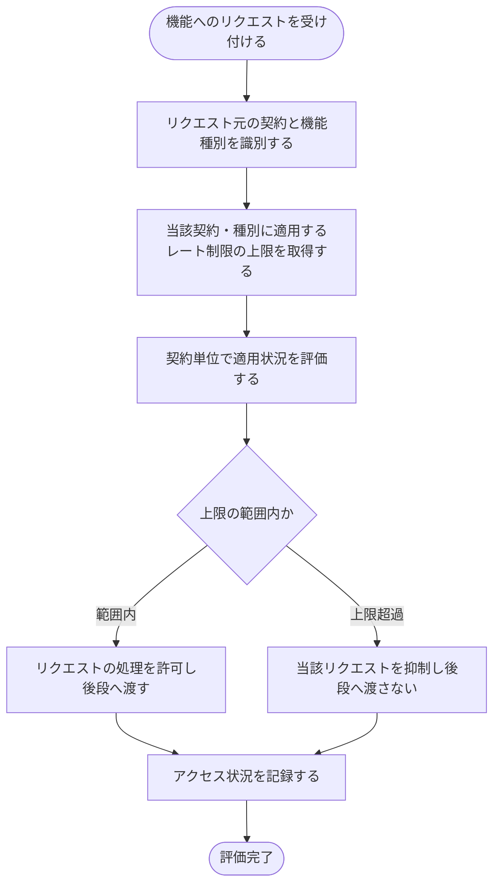

<!-- portal-top -->
[設計ポータル](../../../README.md) ／ [基本設計](../../index.md) ／ [バックエンド設計](../index.md) ／ [システム設計](index.md) ／ **SYS-010: 契約単位レート制限の適用**
<!-- /portal-top -->

# SYS-010: 契約単位レート制限の適用

> **このページは、各機能へのリクエストに契約・機能種別ごとのレート制限を契約単位で適用し、DDoS・Bot・暴走による過負荷から防御するシステム処理 SYS-010 を定義します。** 処理概要 / 処理フロー図 / 入出力 / 処理項目定義 / 入出力一覧 / システムイベント一覧 の 6 セクションで記述します。

*種別 システム設計 ・ 優先度 P0 ・ ステータス ドラフト*

## 1. 処理概要

サービスの可用性と契約間の公平な利用を守るため、システムは各機能へのリクエストが発生するたびに、契約・機能種別ごとに定めたレート制限を契約単位で評価する。リクエストを受け付けると、システムはリクエスト元の契約と機能種別を識別し、当該契約・種別に適用される上限を評価する。上限の範囲内であればリクエストの処理を許可し、上限を超過していれば当該リクエストを抑制して後段の業務処理へ渡さない。評価の都度アクセス状況を記録し、超過の抑制は記録として残して濫用の検知につなげる。本処理はゲートウェイ層で全 API 横断に作用し、特定の機能 API に結線しない。レート制限は契約単位での適用とし、プロジェクト単位化(月次の上限件数・無料枠を除く)の対象外とする。

| システム ID | 処理名 | 種別 | トリガー / スケジュール | 機能概要 |
|---|---|---|---|---|
| `SYS-010` | 契約単位レート制限の適用 | guard | 機能リクエスト受信時(全 API 横断・ゲートウェイ層) | 契約・機能種別ごとの上限を契約単位で評価し、上限内は許可・超過は抑制してアクセス状況を記録する |

| 関連 | 内容 |
|---|---|
| 機能要件 (FR) | [FR-095](../../../01_requirements/02_functional_requirement/03_usage-fr.md#FR-095) |
| 業務要件 (BR) | [BR-102](../../../01_requirements/01_business_requirement/06_security-br.md#BR-102) |
| 業務ルール (RULE) | — |
| 関連システム | — |
| 対応業務UC | [UC-076](../../../01_requirements/04_business_usecases/UC-076.md#UC-076) |

## 2. 処理フロー図

## 3. 入出力

| 区分 | 内容 |
|---|---|
| 入力ソース | 各機能へのリクエスト(リクエスト元の契約・機能種別)、契約・種別別に定めたレート制限の上限 |
| 出力先 | リクエスト処理の許可 / 抑制、アクセス状況(評価結果・超過抑制)の記録 |

## 4. 処理項目定義

| 項目 ID | ステップ | 説明 | 種別 | 実行条件 |
|---|---|---|---|---|
| `PR-01` | リクエスト識別 | 機能リクエストを受け付け、リクエスト元の契約と機能種別を識別する | 判定 | 機能リクエストの受信時 |
| `PR-02` | 上限取得 | 当該契約・種別に適用するレート制限の上限を取得する | 集計 | 契約・機能種別を識別できた場合 |
| `PR-03` | 制限評価 | 取得した上限に対し、契約単位で適用状況を評価して上限の範囲内か超過かを判定する | 判定 | 上限を取得できた場合 |
| `PR-04` | リクエスト許可 | 上限の範囲内であればリクエストの処理を許可し、後段の業務処理へ渡す | 更新 | 上限の範囲内と判定された場合 |
| `PR-05` | リクエスト抑制 | 上限を超過していれば当該リクエストを抑制し、後段へ渡さない | 例外 | 上限を超過したと判定された場合 |
| `PR-06` | アクセス記録 | 評価結果に応じてアクセス状況を記録し、超過の抑制を濫用検知につなげる | 記録 | 評価を行った場合 |

## 5. 入出力一覧

本処理はゲートウェイ層で全 API 横断に作用するため、特定の機能 API には結線しない。レート制限の上限はマスタを参照し、超過抑制とアクセス状況は記録先へ残す。

| 入出力 | 説明 | 種別 | I/O | CRUD | 参照 |
|---|---|---|---|---|---|
| 機能リクエスト | 各機能へのリクエストを受け付けて評価対象とする(全 API 横断のため特定 API に結線しない) | 横断 | 入力 | — | — |
| 契約別レート上書き | 契約・種別ごとに適用する上限の上書き設定を参照する | テーブル | 入力 | `- R - -` | [TBL-008](../04_database/TBL-008.md#TBL-008) |
| プロジェクト別利用設定 | 契約・種別ごとに定めた上限値の基礎設定を参照する | テーブル | 入力 | `- R - -` | [TBL-009](../04_database/TBL-009.md#TBL-009) |
| 監査ログ | 契約単位レート制限の評価結果(アクセス状況)を記録する | テーブル | 出力 | `C - - -` | [TBL-027](../04_database/TBL-027.md#TBL-027) |
| エラーログ | 上限超過によるリクエスト抑制を記録し濫用検知につなげる | テーブル | 出力 | `C - - -` | [TBL-028](../04_database/TBL-028.md#TBL-028) |

## 6. システムイベント一覧

| SEV-ID | イベント ID | 項目 ID | イベント | 処理 |
|---|---|---|---|---|
| [SEV-019](../02_system_events/SEV-019.md#SEV-019) | `SE-01` | [PR-03](#PR-03) | 契約単位レート制限の評価 | 当該契約・種別の上限を取得し、契約単位で適用状況を評価して上限の範囲内か超過かを判定する |
| [SEV-020](../02_system_events/SEV-020.md#SEV-020) | `SE-02` | [PR-05](#PR-05) | 上限超過リクエストの抑制 | 上限を超過したリクエストを抑制して後段へ渡さず、超過抑制をアクセス状況として記録する |

## 詳細設計への移管候補

- 契約・機能種別ごとの計数アルゴリズム(計数窓・カウント方式・カウンタの保持と失効・分散環境での整合)は詳細設計で定める。
- 上限の上書き設定(契約別)と基礎設定(種別別)の優先順位・合成規則は詳細設計で定める。
- 超過時の応答方法(抑制の通知形式・再試行可否の表現)と濫用検知への連携方式は詳細設計で定める。

---

<!-- portal-bottom -->
[← システム設計](index.md) ・ [基本設計](../../index.md) ・ [↑ 設計ポータル](../../../README.md)
<!-- /portal-bottom -->
