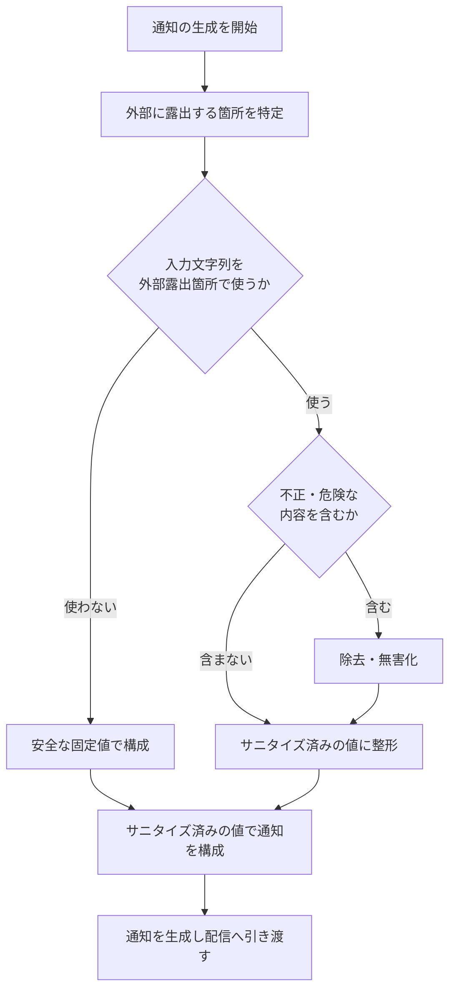

# SYS-011: 外部露出箇所の入力サニタイズ

> **このページは、ウィジェット利用者の入力を含む通知を生成する際、外部に露出する箇所(件名・送信元情報など)へ入力文字列をそのまま使わず安全な値で構成する横断的なシステム処理 SYS-011 を定義します。** 処理概要 / 処理フロー図 / 入出力 / 処理項目定義 / 入出力一覧 / システムイベント一覧 の 6 セクションで記述します。

*種別 システム設計 ・ 優先度 P0 ・ ステータス ドラフト*

## 1. 処理概要

ウィジェット利用者の入力を含む通知を組み立てる際、外部に露出する箇所(メール件名・送信元情報など)には入力文字列をそのまま流さず、安全な固定値またはサニタイズ済みの値で構成する。これにより、入力に紛れ込ませた不正な文字列によるスパム埋め込みやなりすましを防ぐ。特定の機能ではなく通知生成全体に適用される横断的なガード処理である。

| システム ID | 処理名 | 種別 | トリガー / スケジュール | 機能概要 |
|---|---|---|---|---|
| `SYS-011` | 外部露出箇所の入力サニタイズ | guard | ウィジェット利用者の入力を含む通知の生成時 | 外部露出箇所を特定し、入力文字列を安全な固定値・サニタイズ済みの値へ置き換えて通知を構成する |

| 関連 | 内容 |
|---|---|
| 機能要件 (FR) | [FR-118](../../../01_requirements/02_functional_requirement/05_notification-fr.md#FR-118) |
| 業務要件 (BR) | [BR-086](../../../01_requirements/01_business_requirement/05_notification-br.md#BR-086) |
| 業務ルール (RULE) | — |
| 関連システム | — |
| 対応業務UC | [UC-077](../../../01_requirements/04_business_usecases/UC-077.md#UC-077) |

## 2. 処理フロー図

## 3. 入出力

| 区分 | 内容 |
|---|---|
| 入力ソース | ウィジェット利用者の入力を含む通知生成要求(前段の通知生成処理) |
| 出力先 | 外部露出箇所が安全な値で構成された通知(配信処理へ引き渡し) |

## 4. 処理項目定義

| 項目 ID | ステップ | 説明 | 種別 | 実行条件 |
|---|---|---|---|---|
| `PR-01` | 外部露出箇所の特定 | 生成対象の通知から、件名・送信元情報など外部へ露出する箇所を特定する | 判定 | 通知生成時 |
| `PR-02` | 固定値での構成 | 入力文字列を露出させない箇所は、安全な固定値で構成する | 更新 | 入力を露出させない箇所 |
| `PR-03` | 不正内容の検出 | 露出箇所に入力を用いる場合、不正・危険とみなす内容の有無を判定する | 判定 | 入力を露出箇所に用いる場合 |
| `PR-04` | 除去・無害化 | 不正・危険とみなす内容を除去または無害化する | 更新 | `PR-03` で不正と判定 |
| `PR-05` | サニタイズ済み値での構成 | サニタイズ済みの値で外部露出箇所を構成する | 更新 | 入力を露出箇所に用いる場合 |
| `PR-06` | 通知の生成と引き渡し | 安全な値で構成した通知を生成し、配信処理へ引き渡す | 通知 | 露出箇所の構成完了後 |

## 5. 入出力一覧

本処理は特定テーブルへ結線せず、通知生成全体に適用される横断的なガードである。サニタイズ後の通知本文は外部露出時の出力エンコードを前提とし、配信は配信 IF へ委ねる。

| 入出力 | 説明 | 種別 | I/O | CRUD | 参照 |
|---|---|---|---|---|---|
| 外部露出箇所のサニタイズ | 件名・送信元情報などの露出箇所を安全な値で構成する(出力時の無害化・エンコード) | 横断 | — | — | — |
| メール配信IF | 安全な値で構成した通知の配信を委ねる | API | 出力 | — | [API-058](../03_apis/API-058.md#API-058) |

## 6. システムイベント一覧

| SEV-ID | イベント ID | 項目 ID | イベント | 処理 |
|---|---|---|---|---|
| [SEV-021](../02_system_events/SEV-021.md#SEV-021) | `SE-01` | [PR-05](#PR-05) | 外部露出箇所のサニタイズ完了 | 露出箇所を安全な固定値・サニタイズ済みの値で構成し、安全な通知を配信処理へ引き渡す |

## 詳細設計への移管候補

- 外部露出箇所ごとの無害化方式(固定値の採用範囲、サニタイズ対象文字種・出力エンコードの方式)の定義。
- 不正・危険とみなす内容の判定基準とその適用範囲(件名・送信元情報などの露出箇所別)。
