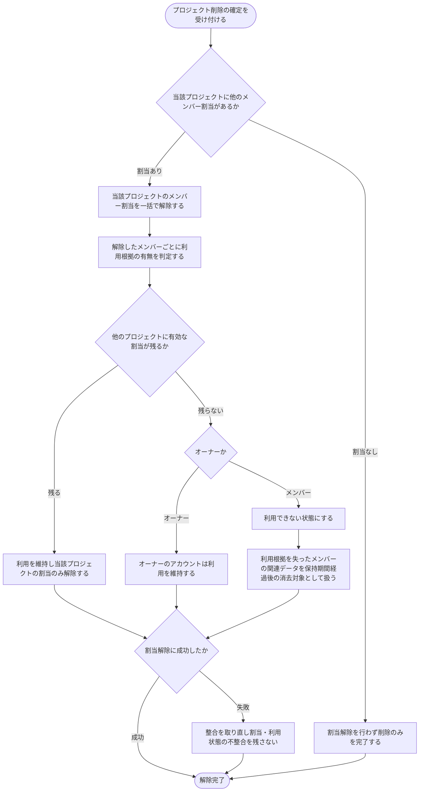

# SYS-012: プロジェクト削除に伴うメンバー割当解除

> **このページは、プロジェクト削除の確定を契機に当該プロジェクトのメンバー割当を一括で解除し、利用根拠を失ったメンバー(オーナーを除く)を利用できない状態にするシステム処理 SYS-012 を定義します。** 処理概要 / 処理フロー図 / 入出力 / 処理項目定義 / 入出力一覧 / システムイベント一覧 の 6 セクションで記述します。

*種別 システム設計 ・ 優先度 P0 ・ ステータス ドラフト*

## 1. 処理概要

利用根拠を失ったアクセス権や個人情報の滞留を防ぐため、システムはプロジェクト削除の確定を契機に、当該プロジェクトに紐づくメンバーの割当を一括で解除する。割当を解除したメンバーのうち、他のプロジェクトへ有効な割当を持たないメンバー(オーナーを除く)は利用できない状態にし、他のプロジェクトに有効な割当が残るメンバーは利用を維持して当該プロジェクトの割当のみを解除する。オーナーのアカウントは利用を維持する。当該プロジェクトに他のメンバー割当が存在しない場合は割当解除を行わず削除のみを完了する。割当解除に失敗した場合は整合を取り直し、割当と利用状態の不整合を残さない。利用根拠を失ったメンバーの関連データは、所定の保持期間の経過後に消去対象として扱う。本処理はプロジェクト削除に連鎖して起動する後段処理であり、削除そのものはプロジェクト削除の機能に委ねる。

| システム ID | 処理名 | 種別 | トリガー / スケジュール | 機能概要 |
|---|---|---|---|---|
| `SYS-012` | プロジェクト削除に伴うメンバー割当解除 | cascade | プロジェクト削除の確定時 | 当該プロジェクトのメンバー割当を一括解除し、他に有効な割当を持たないメンバー(オーナーを除く)を利用できない状態にする |

| 関連 | 内容 |
|---|---|
| 機能要件 (FR) | [FR-039](../../../01_requirements/02_functional_requirement/01_account-fr.md#FR-039) |
| 業務要件 (BR) | [BR-020](../../../01_requirements/01_business_requirement/01_account-br.md#BR-020) ・ [BR-139](../../../01_requirements/01_business_requirement/01_account-br.md#BR-139) |
| 業務ルール (RULE) | — |
| 関連システム | — |
| 対応業務UC | [UC-079](../../../01_requirements/04_business_usecases/UC-079.md#UC-079) |

## 2. 処理フロー図

## 3. 入出力

| 区分 | 内容 |
|---|---|
| 入力ソース | プロジェクト削除の確定(前段のプロジェクト削除処理)、当該プロジェクトのメンバー割当、各メンバーの他プロジェクトへの割当状況 |
| 出力先 | メンバー割当の解除、利用根拠を失ったメンバー(オーナーを除く)の利用停止、関連データの消去対象化 |

## 4. 処理項目定義

| 項目 ID | ステップ | 説明 | 種別 | 実行条件 |
|---|---|---|---|---|
| `PR-01` | 削除受付 | プロジェクト削除の確定を受け付け、当該プロジェクトに紐づくメンバー割当の有無を確認する | 判定 | プロジェクト削除が確定した場合 |
| `PR-02` | 割当一括解除 | 当該プロジェクトに紐づくメンバーの割当を一括で解除する | 更新 | 当該プロジェクトにメンバー割当が存在する場合 |
| `PR-03` | 利用根拠判定 | 解除したメンバーごとに、他のプロジェクトへ有効な割当が残るかを判定する | 判定 | メンバー割当を解除した場合 |
| `PR-04` | 利用維持 | 他のプロジェクトに有効な割当が残るメンバー、およびオーナーは利用を維持する | 更新 | 有効な割当が残る、またはオーナーの場合 |
| `PR-05` | 利用停止 | 利用根拠を失ったメンバー(オーナーを除く)を利用できない状態にする | 更新 | 有効な割当が残らずオーナーでない場合 |
| `PR-06` | 消去対象化 | 利用根拠を失ったメンバーの関連データを、所定の保持期間の経過後に消去対象として扱う | 記録 | 利用できない状態にしたメンバーがある場合 |
| `PR-07` | 整合回復 | 割当解除の処理に失敗した場合は整合を取り直し、割当・利用状態の不整合を残さない | 例外 | 割当解除の処理に失敗した場合 |

## 5. 入出力一覧

本処理はプロジェクト割当解除を通じてメンバー割当を解除し、利用根拠を失ったメンバーの利用状態を更新する。前段のプロジェクト削除を入力契機とする。

| 入出力 | 説明 | 種別 | I/O | CRUD | 参照 |
|---|---|---|---|---|---|
| プロジェクト削除 | プロジェクト削除の確定を入力契機として受け付ける | API | 入力 | — | [API-018](../03_apis/API-018.md#API-018) |
| プロジェクト割当解除 | 当該プロジェクトのメンバー割当を解除する | API | 出力 | — | [API-023](../03_apis/API-023.md#API-023) |
| メンバー割当 | 当該プロジェクトに紐づくメンバー割当を参照し、一括で解除する | テーブル | 出力 | `- R - D` | [TBL-003](../04_database/TBL-003.md#TBL-003) |
| プロジェクト | 削除対象のプロジェクトと所属メンバーの割当範囲を参照する | テーブル | 入力 | `- R - -` | [TBL-004](../04_database/TBL-004.md#TBL-004) |
| ユーザー | 利用根拠を失ったメンバー(オーナーを除く)の利用状態を更新する | テーブル | 出力 | `- R U -` | [TBL-001](../04_database/TBL-001.md#TBL-001) |

## 6. システムイベント一覧

| SEV-ID | イベント ID | 項目 ID | イベント | 処理 |
|---|---|---|---|---|
| [SEV-022](../02_system_events/SEV-022.md#SEV-022) | `SE-01` | [PR-02](#PR-02) | メンバー割当の一括解除 | プロジェクト削除の確定を契機に、当該プロジェクトに紐づくメンバーの割当を一括で解除する |
| [SEV-023](../02_system_events/SEV-023.md#SEV-023) | `SE-02` | [PR-05](#PR-05) | 利用根拠を失ったメンバーの利用停止 | 解除後に他プロジェクトへ有効な割当を持たないメンバー(オーナーを除く)を利用できない状態にし、関連データを保持期間経過後の消去対象として扱う |

## 詳細設計への移管候補

- 解除対象メンバーの抽出単位・件数規模に応じた処理方式(逐次・一括・分割)と、大量割当時の冪等性・再実行性は詳細設計で定める。
- 割当解除と利用状態更新を不整合なく確定する整合制御(原子性・部分失敗時の取り直し手順)は詳細設計で定める。
- 利用根拠を失ったメンバーの関連データの保持期間・消去対象範囲・消去の実行契機は詳細設計で定める。
