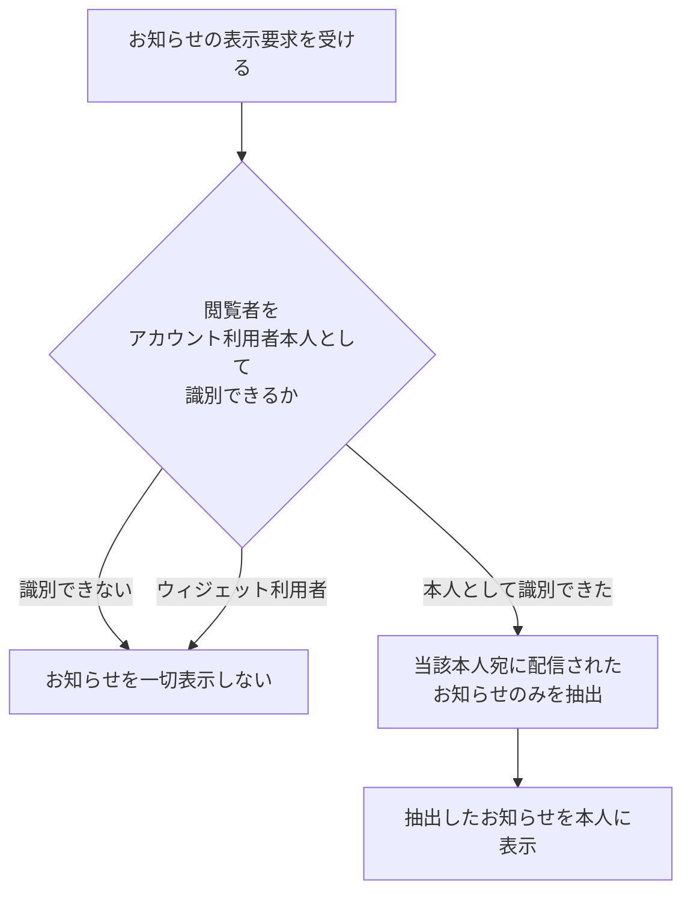

# SYS-013: お知らせ閲覧範囲のアカウント利用者限定

> **このページは、お知らせの表示要求を受けたとき、閲覧者がアカウント利用者本人であることを確認し、本人宛のお知らせのみを抽出して表示する横断的なガード処理 SYS-013 を定義します。** 処理概要 / 処理フロー図 / 入出力 / 処理項目定義 / 入出力一覧 / システムイベント一覧 の 6 セクションで記述します。

*種別 システム設計 ・ 優先度 P0 ・ ステータス ドラフト*

## 1. 処理概要

お知らせには契約の機微情報が含まれうるため、システムはお知らせの表示要求を受けたとき、まず閲覧者がアカウント利用者本人であることを確認し、本人宛に配信されたお知らせのみを抽出して表示する。ウィジェット利用者など本人として識別できない閲覧者にはお知らせを一切公開しない。特定機能ではなくお知らせ閲覧全体に適用される横断的なガード処理である。

| システム ID | 処理名 | 種別 | トリガー / スケジュール | 機能概要 |
|---|---|---|---|---|
| `SYS-013` | お知らせ閲覧範囲のアカウント利用者限定 | guard | お知らせ表示のアクセス時 | 閲覧者がアカウント利用者本人かを確認し、本人宛のお知らせのみを抽出して表示する |

| 関連 | 内容 |
|---|---|
| 関連システム | — |
| トレーサビリティID | [TR-085](../../00_traceability/index.md#TR-085) |

## 2. 処理フロー図

## 3. 入出力

| 区分 | 内容 |
|---|---|
| 入力ソース | お知らせの表示要求(閲覧者の身元情報を伴うアクセス) |
| 出力先 | 本人宛のお知らせの表示(識別できない場合は非公開) |

## 4. 処理項目定義

| 項目 ID | ステップ | 説明 | 種別 | 実行条件 |
|---|---|---|---|---|
| `PR-01` | 閲覧者の本人確認 | お知らせの表示要求の閲覧者が、アカウント利用者本人として識別できるかを確認する | 判定 | お知らせ表示のアクセス時 |
| `PR-02` | 非公開の決定 | アカウント利用者本人として識別できない閲覧者(ウィジェット利用者・第三者)にはお知らせを一切表示しない | 例外 | `PR-01` で本人と識別できない場合 |
| `PR-03` | 本人宛お知らせの抽出 | 当該アカウント利用者本人を宛先として配信されたお知らせのみを抽出する | 集計 | `PR-01` で本人と識別できた場合 |
| `PR-04` | 本人への表示 | 抽出したお知らせを本人に表示する | 通知 | `PR-03` の抽出完了後 |

## 5. 入出力一覧

本処理はお知らせ閲覧全体に適用される横断的なガードであり、本人宛のお知らせの抽出はお知らせ一覧の取得へ委ねる。お知らせ本体と宛先・受信箱の参照範囲を本人に限定する。

| 入出力 | 説明 | 種別 | I/O | CRUD | 参照 |
|---|---|---|---|---|---|
| お知らせ一覧 | 本人宛に配信されたお知らせのみを抽出して取得する | API | 入力 | — | [API-048](../03_apis/API-048.md#API-048) |
| お知らせ本体 | 配信されたお知らせの内容を本人の閲覧範囲で参照する | テーブル | 入力 | `- R - -` | [TBL-010](../04_database/TBL-010.md#TBL-010) |
| 受信箱 | アカウント利用者本人宛のお知らせの受信状況を本人の範囲で参照する | テーブル | 入力 | `- R - -` | [TBL-022](../04_database/TBL-022.md#TBL-022) |

## 6. システムイベント一覧

| SEV-ID | イベント ID | 項目 ID | イベント | 処理 |
|---|---|---|---|---|
| SEV-024 | `SE-01` | [PR-01](#PR-01) | お知らせ閲覧範囲の本人限定 | 閲覧者がアカウント利用者本人かを確認し、本人宛のお知らせのみを抽出して表示する。本人として識別できない閲覧者には一切公開しない |
