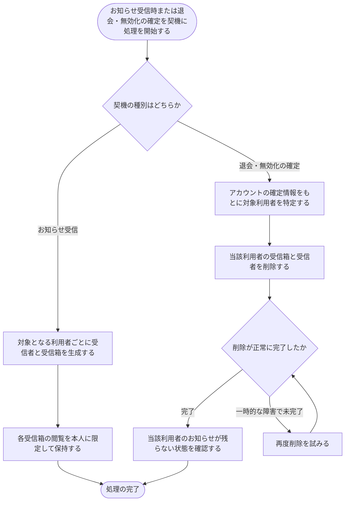

# SYS-014: お知らせ受信箱の利用者別保持と退会時削除

> **このページは、お知らせ受信箱をアカウント利用者ごとに本人専用で保持し、退会・無効化が確定したときに当該利用者の受信箱・受信者を削除して孤立した個人データを残さないシステム処理 SYS-014 を定義します。** 処理概要 / 処理フロー図 / 入出力 / 処理項目定義 / 入出力一覧 / システムイベント一覧 の 6 セクションで記述します。

*種別 システム設計 ・ 優先度 P0 ・ ステータス ドラフト*

## 1. 処理概要

システムは、お知らせ受信箱をアカウント利用者ごとに分けて保持し、各受信箱の閲覧を本人に限定して、本人以外のアカウント利用者やウィジェット利用者には公開しない。お知らせが配信されたときは、対象となる利用者ごとに受信者と受信箱を生成し、本人専用の受信状態として保持する。アカウント利用者の無効化・退会の確定を契機に、当該利用者の受信箱と受信者の記録を削除し、お知らせに含まれる契約の機微情報が退会後に残らない状態にする。利用者本人の情報源であるアカウントとの整合を保ち、削除後は当該利用者のお知らせが残らないようにする。削除処理が一時的な障害で完了しなかった場合は再度削除を試み、受信箱を残さない状態へ収束させる。

| システム ID | 処理名 | 種別 | トリガー / スケジュール | 機能概要 |
|---|---|---|---|---|
| `SYS-014` | お知らせ受信箱の利用者別保持と退会時削除 | cascade | お知らせ受信時 + 退会/無効化の確定時 | お知らせ受信箱を利用者ごとに本人専用で保持し、退会・無効化の確定時に当該利用者の受信箱・受信者を削除する |

| 関連 | 内容 |
|---|---|
| 関連システム | — |
| トレーサビリティID | [TR-085](../../00_traceability/index.md#TR-085) |

## 2. 処理フロー図

## 3. 入出力

| 区分 | 内容 |
|---|---|
| 入力ソース | お知らせ配信の発生、退会申請・アカウント無効化の確定通知、対象アカウント利用者の情報 |
| 出力先 | 利用者別の受信者・受信箱の生成と保持、退会・無効化確定時の受信者・受信箱の削除 |

## 4. 処理項目定義

| 項目 ID | ステップ | 説明 | 種別 | 実行条件 |
|---|---|---|---|---|
| `PR-01` | 受信箱生成 | お知らせ配信時に、対象となるアカウント利用者ごとに受信者と受信箱を生成する | 更新 | お知らせ受信時 |
| `PR-02` | 本人限定保持 | 各受信箱の閲覧を本人に限定して保持し、本人以外およびウィジェット利用者には公開しない | 記録 | 受信箱生成の完了後 |
| `PR-03` | 削除対象特定 | 退会・無効化の確定を契機に、確定したアカウント情報をもとに削除対象の利用者を特定する | 判定 | 退会・無効化の確定時 |
| `PR-04` | 受信箱削除 | 当該利用者の受信箱と受信者を削除し、孤立した個人データを残さない | 更新 | 削除対象の特定後 |
| `PR-05` | 削除完了確認 | 削除が完了し、当該利用者のお知らせが残らない状態であることを確認する | 判定 | 受信箱削除の実施後 |
| `PR-06` | 削除再試行 | 一時的な障害で削除が完了しなかった場合に、再度削除を試みて受信箱を残さない状態へ収束させる | 例外 | 削除が未完了の場合 |

## 5. 入出力一覧

本処理が参照・更新する主なテーブルと、退会・無効化の確定を伝える退会申請 API です。

| 入出力 | 説明 | 種別 | I/O | CRUD | 参照 |
|---|---|---|---|---|---|
| 退会申請 | 退会・アカウント無効化の確定を伝え、受信箱の削除を起動する契機とする | API | 入力 | — | [API-056](../03_apis/API-056.md#API-056) |
| ユーザー | お知らせ受信箱の保持・削除の単位となるアカウント利用者を特定し、確定情報を参照する | テーブル | 入力 | `- R - -` | [TBL-001](../04_database/TBL-001.md#TBL-001) |
| お知らせ受信者 | 利用者ごとに受信者を生成して保持し、退会・無効化の確定時に削除する | テーブル | 出力 | `C R - D` | [TBL-021](../04_database/TBL-021.md#TBL-021) |
| お知らせ受信箱 | 利用者ごとに本人専用の受信状態を生成して保持し、退会・無効化の確定時に削除する | テーブル | 出力 | `C R - D` | [TBL-022](../04_database/TBL-022.md#TBL-022) |

## 6. システムイベント一覧

| SEV-ID | イベント ID | 項目 ID | イベント | 処理 |
|---|---|---|---|---|
| SEV-025 | `SE-01` | [PR-01](#PR-01) | お知らせ受信箱の利用者別保持 | お知らせ配信時に対象となる利用者ごとに受信者と受信箱を生成し、各受信箱の閲覧を本人に限定して本人専用の受信状態として保持する |
| SEV-026 | `SE-02` | [PR-04](#PR-04) | 退会・無効化確定時の受信箱削除 | 退会・無効化の確定を契機に対象利用者を特定し、当該利用者の受信箱と受信者を削除して、孤立した個人データを残さない状態へ収束させる |
