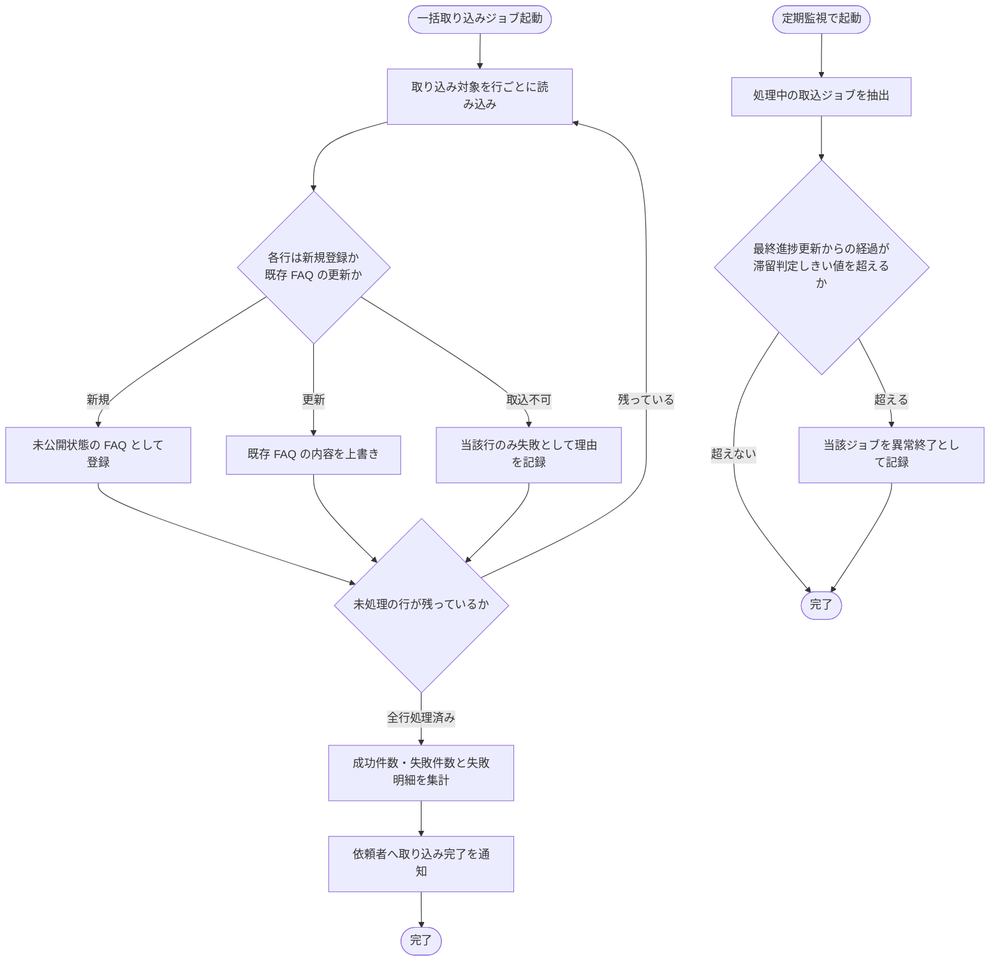

# SYS-014: FAQ一括取り込みジョブ非同期実行

> **このページは、受け付けた FAQ 一括取り込み依頼を画面応答を待たせずに行ごとに取り込み、成功・失敗件数を集計して依頼者へ完了を知らせるシステム処理 SYS-014 を定義します。**

*種別 システム設計 ・ 優先度 P0 ・ ステータス ドラフト*

| ID | 業務ユースケースID | API ID | テーブルID |
|----|----|----|----|
| SYS-014 | [UC-046](../../../01_requirements/04_business_usecases/UC-046.md#UC-046) | [API-028](../03_apis/API-028.md#API-028) ・ [API-067](../03_apis/API-067.md#API-067) | [TBL-006](../04_database/TBL-006.md#TBL-006) ・ [TBL-033](../04_database/TBL-033.md#TBL-033) |

| 処理名 | 種別 | トリガー / スケジュール |
|----|----|----|
| FAQ一括取り込みジョブ非同期実行 | async | FAQ 一括取り込み依頼の受付による取り込みジョブ起動。加えて、処理中ジョブの滞留を検出する定期監視(間隔は[システム仕様書 §7](../../07_system-spec.md#7-バッチ運用設計値)の FAQ 取込ジョブ 滞留監視間隔を参照) |

## 1. 処理概要

- アカウント利用者が大量の FAQ をまとめて取り込む依頼を受け付けたあと、システムが裏側でその取り込み処理を非同期に実行する。
- 取り込み対象を行ごとに読み、新規登録か既存 FAQ の上書きかを判定して反映し、全行の処理後に成功件数・失敗件数と失敗理由を集計して、依頼者へ完了を知らせる。
- 1 行の失敗は他の行の取り込みに影響しない。
- ジョブの状態・進捗・結果サマリは取込ジョブ(`TP_IMPORT_JOBS`)に記録し、画面のポーリングによる進捗表示に供する。完了通知はこの記録を[API-067](../03_apis/API-067.md#API-067)による画面ポーリングで参照する方式のみで行い、受信箱・メール等の別チャネル通知は行わない。
- 上記の行単位取り込みと並行して、システムは定期的に処理中の取込ジョブを監視し、最終進捗更新から所定時間が経過して滞留したジョブを異常終了として扱う(監視間隔・滞留判定しきい値は[システム仕様書 §7](../../07_system-spec.md#7-バッチ運用設計値)を参照)。

## 2. 処理フロー図

## 3. 入出力

| 区分 | 内容 |
|---|---|
| 入力ソース | 受け付けた FAQ 一括取り込み依頼(取り込み対象ファイルの各行。受付済みファイルは Cloudflare R2 に一時保管され、取込ジョブが保持するオブジェクトキーから取得する) |
| 出力先 | FAQ の登録・更新、成功・失敗件数と失敗明細の集計、依頼したアカウント利用者への完了通知 |

## 4. 処理項目定義

| 項目 ID | ステップ | 説明 | 種別 | 実行条件 |
|---|---|---|---|---|
| `PR-01` | 取り込み対象読み込み | 受け付けた取り込みジョブを起動し、取り込み対象を行ごとに読み込む | 入力 | — |
| `PR-02` | 新規 / 更新判定 | 各行について新規登録対象か既存 FAQ の更新対象かを判定する | 判定 | — |
| `PR-03` | 新規登録 | 新規登録対象を未公開状態の FAQ として登録する | 記録 | 新規登録対象と判定したとき |
| `PR-04` | 既存上書き | 既存 FAQ への更新対象は内容を上書きする | 記録 | 既存 FAQ の更新対象と判定したとき |
| `PR-05` | 行失敗記録 | 取り込めない行はその行のみ失敗として理由を記録し、他の行の取り込みは継続する | 例外 | 当該行が取り込めないとき |
| `PR-06` | 件数集計 | 全行の処理後、成功件数・失敗件数と失敗した行の番号・理由を集計する | 集計 | 全行の処理後 |
| `PR-07` | 完了通知 | 依頼したアカウント利用者へ取り込み完了を知らせる。その際、全件成功時と一部失敗時で通知の種別（件名やバッジ等）を明確に分け、成功・失敗の件数と部分失敗の明細を提示する。通知は[API-067](../03_apis/API-067.md#API-067)による画面ポーリングでの結果参照のみで行い、受信箱・メール等の別チャネル通知は行わない | 通知 | 件数集計後 |
| `PR-08` | 滞留監視 | 処理中の取込ジョブを定期的に抽出し、最終進捗更新からの経過が滞留判定しきい値を超えるジョブを異常終了として記録する | 判定 | 定期監視の起動時 |

## 5. 入出力一覧

本処理が参照・記録する FAQ と、取り込みジョブの受付契機となる API を示す。SEQ-087 の関連 API / 関連テーブルに準拠する。

| 入出力 | 説明 | 種別 | I/O | CRUD | 参照 |
|---|---|---|---|---|---|
| 取込要求(CSV) | 取り込みジョブの受付契機となる FAQ CSV インポート API | API | 入力 | — | [API-028](../03_apis/API-028.md#API-028) |
| FAQ | 行ごとに新規登録(未公開)または既存 FAQ の上書きを行う | テーブル | 入出力 | `C R U -` | [TBL-006](../04_database/TBL-006.md#TBL-006) |
| 取込ジョブ | ジョブ受付時に作成し、進捗・完了時に状態・件数・失敗明細を更新する。定期監視では処理中ジョブを参照し、滞留を検出したジョブの状態を異常終了へ更新する | テーブル | 入出力 | `C R U -` | [TBL-033](../04_database/TBL-033.md#TBL-033) |
| 完了通知参照(ポーリング) | 依頼したアカウント利用者が画面ポーリングで取込ジョブの状態・結果を参照する API。完了通知はこの参照のみで行う | API | 出力 | — | [API-067](../03_apis/API-067.md#API-067) |

## 6. システムイベント一覧

| SEV-ID | イベント ID | 項目 ID | イベント | 処理 |
|---|---|---|---|---|
| SEV-025 | `SE-01` | [PR-03](#PR-03) | 行単位取り込み | 取り込み対象を行ごとに新規登録 / 既存上書き / 行失敗で反映し、件数を集計する |
| SEV-026 | `SE-02` | [PR-07](#PR-07) | 完了通知 | 成功・失敗の件数と部分失敗の明細を、[API-067](../03_apis/API-067.md#API-067)による画面ポーリングでの結果参照のみで依頼したアカウント利用者へ知らせる（受信箱・メール等の別チャネル通知は行わない） |
| SEV-070 | `SE-03` | [PR-08](#PR-08) | 滞留ジョブの異常終了 | 定期監視で処理中の取込ジョブを抽出し、滞留判定しきい値を超えたジョブを異常終了として記録する |
