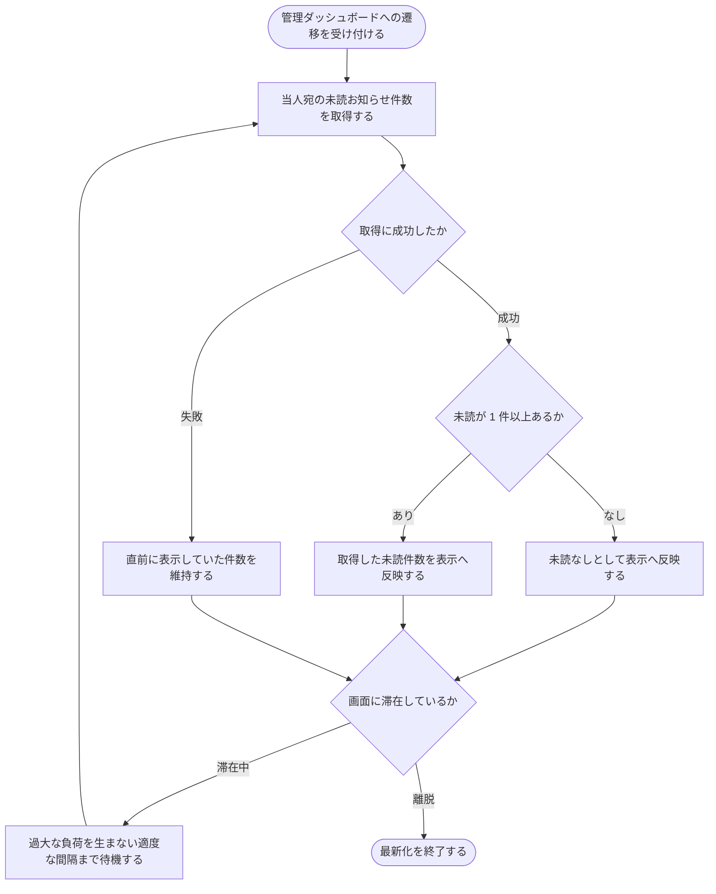

# SYS-015: 管理ダッシュボード遷移時の未読お知らせ件数取得・更新

> **このページは、アカウント利用者が管理ダッシュボードへ遷移した時点で当人宛の未読お知らせ件数を取得して表示へ反映し、画面滞在中も過大な負荷を生まない適度な間隔で取得し直して最新化するシステム処理 SYS-015 を定義します。**

*種別 システム設計 ・ 優先度 P0 ・ ステータス ドラフト*

| ID | 処理名 | 種別 | トリガー / スケジュール |
|----|----|----|----| 
| SYS-015 | 管理ダッシュボード遷移時の未読お知らせ件数取得・更新 | async | 管理ダッシュボードへの遷移時 + 定期間隔 |

| 関連項目 | 内容 |
|----|----| 
| 業務ユースケース | [UC-086](../../../01_requirements/04_business_usecases/UC-086.md#UC-086) |
| 関連システム | — |
| API | [API-051](../03_apis/API-051.md#API-051) |
| テーブル | [TBL-021](../04_database/TBL-021.md#TBL-021) / [TBL-022](../04_database/TBL-022.md#TBL-022) |

## 1. 処理概要

- アカウント利用者が日常の操作を中断せず未読のお知らせに気づける状態を保つため、システムは管理ダッシュボードへの遷移を契機に当人宛の未読お知らせ件数を取得して表示へ反映する。
- さらに画面に滞在している間も、過大な負荷を生まない適度な間隔で未読件数を取得し直し、最新の状態に保つ。
- 未読が 1 件もない場合は未読なしとして反映する。
- 未読件数の取得に一時的に失敗した場合は、直前に表示していた件数を維持し、次の取得タイミングで再取得して整合を取り直す。
- 本処理は遷移契機と定期契機の両方で起動する取得・反映処理であり、お知らせの既読化や配信そのものは別処理に委ねる。

## 2. 処理フロー図

## 3. 入出力

| 区分 | 内容 |
|---|---|
| 入力ソース | 管理ダッシュボードへの遷移、画面滞在中の定期取得タイミング、当人宛のお知らせ受信箱の未読状況 |
| 出力先 | 未読お知らせ件数の表示反映(未読なしを含む)、取得失敗時の直前件数の維持 |

## 4. 処理項目定義

| 項目 ID | ステップ | 説明 | 種別 | 実行条件 |
|---|---|---|---|---|
| `PR-01` | 遷移時取得 | 管理ダッシュボードへの遷移を契機に、当人宛の未読お知らせ件数を取得する | 集計 | 管理ダッシュボードへ遷移した場合 |
| `PR-02` | 表示反映 | 取得した未読件数を表示へ反映する(未読が無い場合は未読なしとして反映する) | 更新 | 未読件数の取得に成功した場合 |
| `PR-03` | 定期取得 | 画面滞在中も、過大な負荷を生まない適度な間隔で未読件数を取得し直す | 集計 | 画面に滞在し続けている場合 |
| `PR-04` | 失敗時維持 | 未読件数の取得に一時的に失敗した場合は、直前に表示していた件数を維持し、次の取得タイミングで再取得する | 例外 | 未読件数の取得に失敗した場合 |

## 5. 入出力一覧

本処理はお知らせ未読件数の取得 API を通じて当人宛の未読件数を集計し、表示へ反映する。受信箱と受信者の未読状況を入力として参照する。

| 入出力 | 説明 | 種別 | I/O | CRUD | 参照 |
|---|---|---|---|---|---|
| お知らせ未読件数 | 当人宛の未読お知らせ件数を取得する | API | 入力 | — | [API-051](../03_apis/API-051.md#API-051) |
| 受信箱 | 当人宛のお知らせ受信内容と未読状況を参照し件数を集計する | テーブル | 入力 | `- R - -` | [TBL-022](../04_database/TBL-022.md#TBL-022) |
| 受信者 | 当人宛のお知らせ受信者の対象範囲・既読状況を参照する | テーブル | 入力 | `- R - -` | [TBL-021](../04_database/TBL-021.md#TBL-021) |

## 6. システムイベント一覧

| SEV-ID | イベント ID | 項目 ID | イベント | 処理 |
|---|---|---|---|---|
| SEV-027 | `SE-01` | [PR-01](#PR-01) | 遷移時の未読件数取得・反映 | 管理ダッシュボードへの遷移を契機に当人宛の未読お知らせ件数を取得し、未読なしを含めて表示へ反映する |
| SEV-028 | `SE-02` | [PR-03](#PR-03) | 滞在中の定期的な未読件数最新化 | 画面滞在中も過大な負荷を生まない適度な間隔で未読件数を取得し直し、取得に失敗した場合は直前の件数を維持して次回再取得する |
