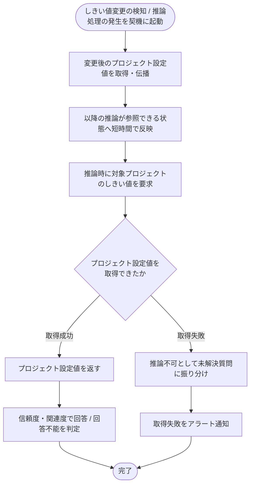

# SYS-015: AIしきい値変更の伝播・フォールバック

> **このページは、プロジェクトの回答可否しきい値の変更を以降の AI 推論へ伝播し、プロジェクト設定値を取得できない場合は推論不可として扱いアラートを上げるシステム処理 SYS-015 を定義します。**

*種別 システム設計 ・ 優先度 P0 ・ ステータス ドラフト*

| ID | 業務ユースケースID | API ID | テーブルID |
|----|----|----|----|
| SYS-015 | [UC-047](../../../01_requirements/04_business_usecases/UC-047.md#UC-047) | [API-057](../03_apis/API-057.md#API-057) | [TBL-004](../04_database/TBL-004.md#TBL-004) ・ [TBL-031](../04_database/TBL-031.md#TBL-031) |

| 処理名 | 種別 | トリガー / スケジュール |
|----|----|----|
| AIしきい値変更の伝播・フォールバック | cascade | 回答可否しきい値の変更検知 / 質問に伴う推論処理の発生 |

## 1. 処理概要

- プロジェクトの回答可否しきい値が変更されたことを契機に、変更後の値を以降の推論が参照できる状態へ短時間で伝播する。
- 推論時は対象プロジェクトの設定値を参照して回答 / 回答不能を判定する。
- しきい値はプロジェクト作成時に必ず設定されているため未登録状態は発生せず、グローバル既定値などのフォールバック先は持たない。
- プロジェクト設定値の取得に失敗した場合は、フォールバック先がないため回答可否判定を行わず推論不可として扱い(未解決質問として記録)、アラートを通知する。

## 2. 処理フロー図

## 3. 入出力

| 区分 | 内容 |
|---|---|
| 入力ソース | 回答可否しきい値の変更検知 / 推論処理からの最新しきい値要求(対象プロジェクト・変更後のプロジェクト設定値) |
| 出力先 | 以降の推論が参照するしきい値の反映、推論への回答可否判定基準の提供、取得失敗時の推論不可振り分けとアラート通知 |

## 4. 処理項目定義

| 項目 ID | ステップ | 説明 | 種別 | 実行条件 |
|---|---|---|---|---|
| `PR-01` | しきい値伝播 | 変更後のプロジェクト設定値を取得し、以降の推論が参照できる状態へ短時間で反映する | 記録 | しきい値の変更を検知したとき |
| `PR-02` | プロジェクト設定値提供 | 推論時に対象プロジェクトの設定値を参照して提供する | 判定 | プロジェクト設定値の取得に成功したとき |
| `PR-03` | 取得失敗時の推論不可処理 | プロジェクト設定値を取得できない場合、フォールバック先がないため回答可否判定を行わず推論不可として扱い未解決質問に振り分ける | 例外 | プロジェクト設定値を取得できないとき |
| `PR-04` | 取得失敗アラート通知 | 取得失敗により推論不可となった場合はアラートを通知する | 通知 | プロジェクト設定値の取得に失敗したとき |
| `PR-05` | 回答可否判定 | 参照したしきい値の信頼度・関連度で回答 / 回答不能を判定する | 判定 | プロジェクト設定値の取得に成功したとき |

## 5. 入出力一覧

本処理が参照するしきい値設定テーブルと、推論処理との連携 API を示す。

| 入出力 | 説明 | 種別 | I/O | CRUD | 参照 |
|---|---|---|---|---|---|
| AI 推論 | 推論処理へ回答可否判定基準を提供する連携 API | API | 入力 | — | [API-057](../03_apis/API-057.md#API-057) |
| 対象プロジェクト | 対象プロジェクトの存在と識別子を確認する | テーブル | 入力 | `- R - -` | [TBL-004](../04_database/TBL-004.md#TBL-004) |
| AI しきい値キャッシュ | 変更後のプロジェクト設定値を永続キャッシュへ書き込み、推論時に読み出す。取得に失敗した場合はフォールバック先がないため推論不可として扱う | テーブル | 入力 / 出力 | `C R U -` | [TBL-031](../04_database/TBL-031.md#TBL-031) |

## 6. システムイベント一覧

| SEV-ID | イベント ID | 項目 ID | イベント | 処理 |
|---|---|---|---|---|
| SEV-027 | `SE-01` | [PR-01](#PR-01) | しきい値変更伝播 | 変更後のプロジェクト設定値を取得し、以降の推論が参照できる状態へ短時間で反映する |
| SEV-028 | `SE-02` | [PR-04](#PR-04) | 取得失敗アラート通知 | プロジェクト設定値の取得に失敗し推論不可となった場合にアラートを通知する |
