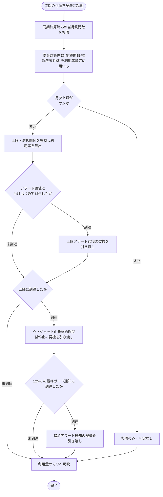

# SYS-016: 利用量リアルタイム集計・サマリ反映

> **このページは、ウィジェットへの質問到達を契機に、質問応答 API が同期加算した当月の利用量([`T_USAGE_METER`](../04_database/TBL-020.md#TBL-020))を参照して利用率を算出し、上限・アラート閾値の到達を判定して管理画面の利用量サマリへ反映するシステム処理 SYS-016 を定義します。本処理は利用量を加算しない(加算は質問応答 API が同期で行う)。**

*種別 システム設計 ・ 優先度 P0 ・ ステータス ドラフト*

| ID | 業務ユースケースID | API ID | テーブルID |
|----|----|----|----|
| SYS-016 | [UC-051](../../../01_requirements/04_business_usecases/UC-051.md#UC-051) | [API-040](../03_apis/API-040.md#API-040) ・ [API-041](../03_apis/API-041.md#API-041) | [TBL-006](../04_database/TBL-006.md#TBL-006) ・ [TBL-009](../04_database/TBL-009.md#TBL-009) ・ [TBL-017](../04_database/TBL-017.md#TBL-017) ・ [TBL-020](../04_database/TBL-020.md#TBL-020) ・ [TBL-025](../04_database/TBL-025.md#TBL-025) ・ [TBL-026](../04_database/TBL-026.md#TBL-026) |

| 処理名 | 種別 | トリガー / スケジュール |
|----|----|----|
| 利用量リアルタイム集計・サマリ反映 | async | ウィジェットへの質問がプロジェクトに到達した時 |

## 1. 処理概要

- ウィジェット利用者の質問が対象プロジェクトに到達すると、質問応答 API が同期トランザクション内で当月の質問数を加算する。本処理(SYS-016)は加算しない。
- 本処理は同期加算済みの利用量を非同期で参照し、上限オンのプロジェクトでは利用率を算出してアラート閾値・上限到達・最終ガード通知の各契機を判定し、それぞれの契機を担当する業務処理へ引き渡す。
- 参照した利用量は管理画面向けの利用量サマリへ短い遅延で反映する。

## 2. 処理フロー図

## 3. 入出力

| 区分 | 内容 |
|---|---|
| 入力ソース | ウィジェットへの質問到達を契機に、質問応答 API が同期加算した当月利用量([`T_USAGE_METER`](../04_database/TBL-020.md#TBL-020) の総質問数・推論失敗件数)、対象プロジェクトの月次上限件数・無料枠・アラート閾値設定 |
| 出力先 | アラート閾値到達・上限到達・125% 最終ガード通知到達の各契機の引き渡し、管理画面向け利用量サマリ |

## 4. 処理項目定義

| 項目 ID | ステップ | 説明 | 種別 | 実行条件 |
|---|---|---|---|---|
| `PR-01` | 利用量参照 | 質問応答 API が同期加算した当月利用量([`T_USAGE_METER`](../04_database/TBL-020.md#TBL-020) の総質問数・推論失敗件数)を参照する。本処理は加算しない | 取得 | — |
| `PR-02` | 利用率算出 | 月次上限件数とアラート閾値の設定を参照し、課金対象件数(総質問数から推論失敗件数を除いた件数)を分子に当月の利用率を算出する | 判定 | 月次上限がオンのとき |
| `PR-03` | アラート契機引き渡し | 利用率がアラート閾値に当月はじめて到達した場合、上限アラート通知の契機を担当処理へ引き渡す | 通知 | 月次上限がオンでアラート閾値に当月はじめて到達したとき |
| `PR-04` | 受付停止契機引き渡し | 利用率が上限に到達した場合、ウィジェットの新規質問受付を停止する契機を担当処理へ引き渡す | 通知 | 月次上限がオンで上限に到達したとき |
| `PR-05` | 最終ガード通知契機引き渡し | 利用率が 125% に到達した場合、追加アラート通知の契機を担当処理へ引き渡す | 通知 | 月次上限がオンで利用率が 125% に到達したとき |
| `PR-06` | サマリ反映 | 同期加算済みの利用量を管理画面向けの利用量サマリへ短い遅延で反映する | 記録 | — |

## 5. 入出力一覧

本処理が参照する利用量・課金関連データと、起点契機・参照契機となる API を示す。加算は質問応答 API が同期で行い、本処理は参照のみ。

| 入出力 | 説明 | 種別 | I/O | CRUD | 参照 |
|---|---|---|---|---|---|
| 質問応答 | 利用量参照の起点契機となる質問応答 API | API | 入力 | — | [API-040](../03_apis/API-040.md#API-040) |
| 利用量サマリ参照 | 管理画面が集計結果を参照する利用量サマリ API | API | 出力 | — | [API-041](../03_apis/API-041.md#API-041) |
| 利用量計測 | 質問応答 API が同期加算した当月利用量(総質問数・推論失敗件数)を参照する | テーブル | 入力 | `- R - -` | [TBL-020](../04_database/TBL-020.md#TBL-020) |
| 上限・閾値設定 | 月次上限件数・無料枠・アラート閾値の設定を参照する | テーブル | 入力 | `- R - -` | [TBL-009](../04_database/TBL-009.md#TBL-009) |

## 6. システムイベント一覧

| SEV-ID | イベント ID | 項目 ID | イベント | 処理 |
|---|---|---|---|---|
| SEV-029 | `SE-01` | [PR-01](#PR-01) | 利用量参照・閾値判定 | 同期加算済みの当月質問数を参照し、上限オン時は課金対象件数から利用率を算出してアラート閾値・上限到達・125% 最終ガード通知到達の各契機を担当処理へ引き渡す(本処理は加算しない) |
| SEV-030 | `SE-02` | [PR-06](#PR-06) | 利用量サマリ反映 | 同期加算済みの利用量を管理画面向けの利用量サマリへ短い遅延で反映する |
