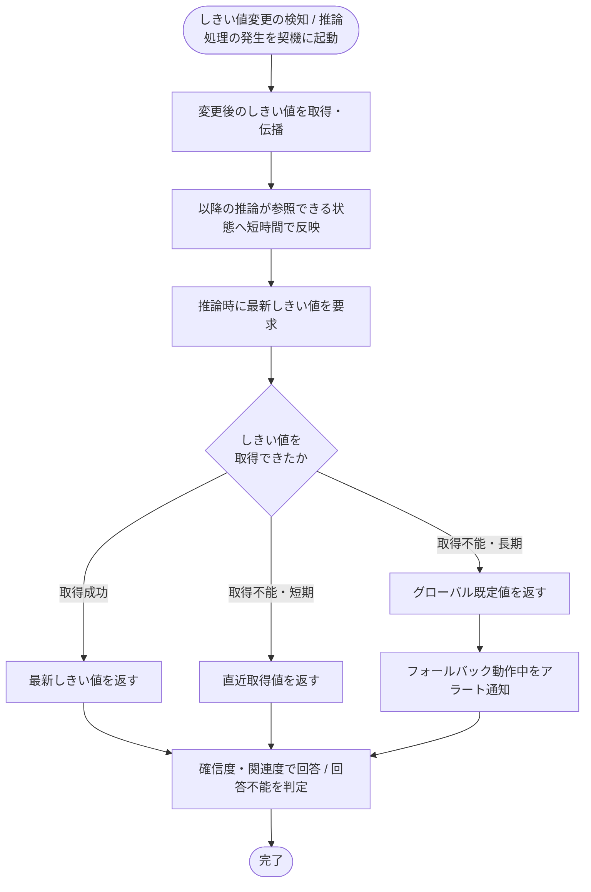

<!-- portal-top -->
[設計ポータル](../../../README.md) ／ [基本設計](../../index.md) ／ [バックエンド設計](../index.md) ／ [システム設計](index.md) ／ **SYS-017: AIしきい値変更の伝播・フォールバック**
<!-- /portal-top -->

# SYS-017: AIしきい値変更の伝播・フォールバック

> **このページは、プロジェクトの回答可否しきい値の変更を以降の AI 推論へ伝播し、しきい値の取得が長期に失敗しても既定値で推論を継続してアラートを上げるシステム処理 SYS-017 を定義します。** 処理概要 / 処理フロー図 / 入出力 / 処理項目定義 / 入出力一覧 / システムイベント一覧 の 6 セクションで記述します。

*種別 システム設計 ・ 優先度 P0 ・ ステータス ドラフト*

## 1. 処理概要

プロジェクトの回答可否しきい値が変更されたことを契機に、変更後の値を以降の推論が参照できる状態へ短時間で伝播する。推論時はしきい値を参照して回答 / 回答不能を判定し、しきい値の取得が短期に行えないときは直近取得値で、長期に行えないときはグローバル既定値で推論を継続する。フォールバックで動作している間はアラートを通知する。

| システム ID | 処理名 | 種別 | トリガー / スケジュール | 機能概要 |
|---|---|---|---|---|
| `SYS-017` | AIしきい値変更の伝播・フォールバック | cascade | 回答可否しきい値の変更検知 / 質問に伴う推論処理の発生 | 変更後のしきい値を以降の推論へ伝播し、取得失敗時は直近取得値または既定値で推論を継続してアラート通知する |

| 関連 | 内容 |
|---|---|
| 機能要件 (FR) | [FR-193](../../../01_requirements/02_FunctionalRequirement/02_faq-ai-fr.md#FR-193) |
| 業務要件 (BR) | — |
| 業務ルール (RULE) | — |
| 関連システム | — |
| 対応業務UC | [UC-052](../../../01_requirements/04_business_usecases/UC-052.md#UC-052) |

## 2. 処理フロー図

## 3. 入出力

| 区分 | 内容 |
|---|---|
| 入力ソース | 回答可否しきい値の変更検知 / 推論処理からの最新しきい値要求(対象プロジェクト・変更後のしきい値・グローバル既定値) |
| 出力先 | 以降の推論が参照するしきい値の反映、推論への回答可否判定基準の提供、フォールバック動作中のアラート通知 |

## 4. 処理項目定義

| 項目 ID | ステップ | 説明 | 種別 | 実行条件 |
|---|---|---|---|---|
| `PR-01` | しきい値伝播 | 変更後のしきい値を取得し、以降の推論が参照できる状態へ短時間で反映する | 記録 | しきい値の変更を検知したとき |
| `PR-02` | 最新しきい値提供 | 推論時に最新のしきい値を参照して提供する | 判定 | しきい値の取得に成功したとき |
| `PR-03` | 直近取得値フォールバック | しきい値の取得が短期に行えないとき、直近に取得できた値で推論を継続する | 例外 | 取得不能(短期)かつ直近取得値があるとき |
| `PR-04` | 既定値フォールバック | しきい値の取得が長期に行えず直近取得値も無いとき、グローバル既定値で推論を継続する | 例外 | 取得不能(長期)かつ直近取得値が無いとき |
| `PR-05` | フォールバックアラート通知 | フォールバックで動作している間はアラートを通知する | 通知 | フォールバックで動作している間 |
| `PR-06` | 回答可否判定 | 参照したしきい値の確信度・関連度で回答 / 回答不能を判定する | 判定 | — |

## 5. 入出力一覧

本処理が参照するしきい値設定テーブルと、推論処理との連携 API を示す。

| 入出力 | 説明 | 種別 | I/O | CRUD | 参照 |
|---|---|---|---|---|---|
| AI 推論 | 推論処理へ回答可否判定基準を提供する連携 API | API | 入力 | — | [API-057](../03_apis/API-057.md#API-057) |
| しきい値設定 | 回答可否しきい値を参照して以降の推論へ伝播する | テーブル | 入力 | `- R - -` | [TBL-004](../04_database/TBL-004.md#TBL-004) |

## 6. システムイベント一覧

| SEV-ID | イベント ID | 項目 ID | イベント | 処理 |
|---|---|---|---|---|
| [SEV-031](../02_system_events/SEV-031.md#SEV-031) | `SE-01` | [PR-01](#PR-01) | しきい値変更伝播 | 変更後のしきい値を取得し、以降の推論が参照できる状態へ短時間で反映する |
| [SEV-032](../02_system_events/SEV-032.md#SEV-032) | `SE-02` | [PR-05](#PR-05) | フォールバックアラート通知 | しきい値の取得が長期に失敗しフォールバックで動作している間にアラートを通知する |

## 詳細設計への移管候補

- しきい値キャッシュの具体的な伝播方式・反映遅延の上限。
- グローバル既定値の具体値・直近取得値の保持期間。

---

<!-- portal-bottom -->
[← システム設計](index.md) ・ [基本設計](../../index.md) ・ [↑ 設計ポータル](../../../README.md)
<!-- /portal-bottom -->
