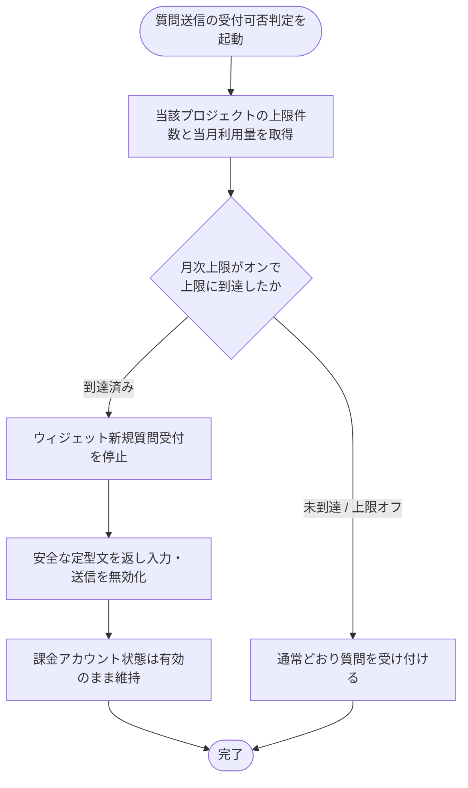

# SYS-018: 上限到達ウィジェット受付停止

> **このページは、ウィジェット利用者の質問送信時に、当該プロジェクトの当月質問数が月次上限件数に到達しているかを判定し、到達済みなら新規受付を停止して安全な定型文を返すシステム処理 SYS-018 を定義します。**

*種別 システム設計 ・ 優先度 P0 ・ ステータス ドラフト*

| ID | 処理名 | 種別 | トリガー / スケジュール |
|----|----|----|----| 
| SYS-018 | 上限到達ウィジェット受付停止 | monitor | ウィジェット利用者の質問送信を受け付けたとき(同期判定) |

| 関連項目 | 内容 |
|----|----| 
| 業務ユースケース | [UC-053](../../../01_requirements/04_business_usecases/UC-053.md#UC-053) |
| 関連システム | — |
| API | [API-046](../03_apis/API-046.md#API-046) |
| テーブル | [TBL-009](../04_database/TBL-009.md#TBL-009) / [TBL-020](../04_database/TBL-020.md#TBL-020) |

## 1. 処理概要

- ウィジェット利用者の質問送信を受け付ける際に、システムが当該プロジェクトの月次上限件数と当月の質問数を照合し、上限に到達しているかを同期で判定する。
- 到達済みであれば、支払方法の有無に関わらず当該プロジェクトのウィジェット新規質問受付を停止し、ウィジェット利用者には問い合わせ先を案内する安全な定型文を返して入力・送信を無効化する。
- 課金アカウント状態は有効のまま維持し、未到達・上限オフのときは通常どおり受け付ける。

## 2. 処理フロー図

## 3. 入出力

| 区分 | 内容 |
|---|---|
| 入力ソース | ウィジェット利用者の質問送信に伴う受付可否判定要求(プロジェクトの月次上限件数・当月の質問数) |
| 出力先 | ウィジェットへの受付停止応答(安全な定型文・送信無効化)または受付可応答 |

## 4. 処理項目定義

| 項目 ID | ステップ | 説明 | 種別 | 実行条件 |
|---|---|---|---|---|
| `PR-01` | 上限・利用量参照 | 当該プロジェクトの月次上限件数と当月の質問数を取得する | 取得 | — |
| `PR-02` | 到達判定 | 月次上限がオンで当月質問数が上限件数に到達しているかを判定する | 判定 | — |
| `PR-03` | 受付停止 | 到達済みのとき、支払方法の有無に関わらずウィジェット新規質問受付を停止する | 記録 | 上限に到達したとき |
| `PR-04` | 定型文応答 | 問い合わせ先を案内する安全な定型文を返し、入力・送信を無効化する | 通知 | 上限に到達したとき |
| `PR-05` | 通常受付 | 未到達または上限オフのとき、受付を停止せず通常どおり質問を受け付ける | 例外 | 未到達または上限オフのとき |

## 5. 入出力一覧

本処理が参照する利用量・プロジェクトのデータと、受付可否判定の付随契機となる API を示す。

| 入出力 | 説明 | 種別 | I/O | CRUD | 参照 |
|---|---|---|---|---|---|
| 受付可否判定 | 質問送信を契機に受付可否判定を起動する API | API | 入力 | — | [API-046](../03_apis/API-046.md#API-046) |
| 利用量 | 当月の質問数を参照し上限到達を判定する | テーブル | 入力 | `- R - -` | [TBL-020](../04_database/TBL-020.md#TBL-020) |
| プロジェクト | 月次上限の設定・上限件数を参照する | テーブル | 入力 | `- R - -` | [TBL-009](../04_database/TBL-009.md#TBL-009) |

## 6. システムイベント一覧

| SEV-ID | イベント ID | 項目 ID | イベント | 処理 |
|---|---|---|---|---|
| SEV-033 | `SE-01` | [PR-03](#PR-03) | 受付停止 | 上限到達時に当該プロジェクトのウィジェット新規質問受付を停止する |
| SEV-034 | `SE-02` | [PR-04](#PR-04) | 定型文応答 | 問い合わせ先を案内する安全な定型文を返し入力・送信を無効化する |
