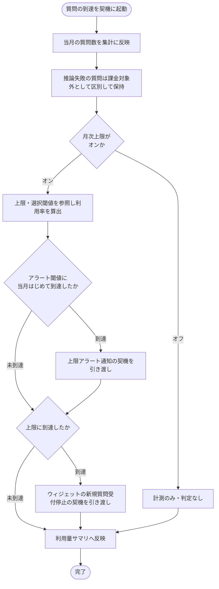

# SYS-018: 利用量リアルタイム集計・サマリ反映

> **このページは、ウィジェットへの質問到達を契機に当月の利用量をリアルタイムに集計し、上限・アラート閾値の到達を判定して管理画面の利用量サマリへ反映するシステム処理 SYS-018 を定義します。** 処理概要 / 処理フロー図 / 入出力 / 処理項目定義 / 入出力一覧 / システムイベント一覧 の 6 セクションで記述します。

*種別 システム設計 ・ 優先度 P0 ・ ステータス ドラフト*

## 1. 処理概要

ウィジェット利用者の質問が対象プロジェクトに到達すると、当月の質問数をリアルタイムに集計する。上限オンのプロジェクトでは利用率を算出してアラート閾値・上限到達の各契機を判定し、それぞれの契機を担当する業務処理へ引き渡す。集計結果は管理画面向けの利用量サマリへ短い遅延で反映する。

| システム ID | 処理名 | 種別 | トリガー / スケジュール | 機能概要 |
|---|---|---|---|---|
| `SYS-018` | 利用量リアルタイム集計・サマリ反映 | async | ウィジェットへの質問がプロジェクトに到達した時 | 当月利用量を発生時計測し、上限・アラート閾値の到達を判定して利用量サマリへ反映する |

| 関連 | 内容 |
|---|---|
| 機能要件 (FR) | [FR-087](../../../01_requirements/02_functional_requirement/03_usage-fr.md#FR-087) ・ [FR-093](../../../01_requirements/02_functional_requirement/03_usage-fr.md#FR-093) |
| 業務要件 (BR) | — |
| 業務ルール (RULE) | — |
| 関連システム | — |
| 対応業務UC | [UC-056](../../../01_requirements/04_business_usecases/UC-056.md#UC-056) |

## 2. 処理フロー図

## 3. 入出力

| 区分 | 内容 |
|---|---|
| 入力ソース | ウィジェットへの質問到達(対象プロジェクト・当月質問・推論成否)、対象プロジェクトの月次上限件数・無料枠・アラート閾値設定 |
| 出力先 | 当月利用量の計測結果、アラート閾値到達・上限到達の各契機の引き渡し、管理画面向け利用量サマリ |

## 4. 処理項目定義

| 項目 ID | ステップ | 説明 | 種別 | 実行条件 |
|---|---|---|---|---|
| `PR-01` | 利用量集計 | 質問の到達を契機に当月の質問数を集計に反映する。推論失敗の質問は件数に数えつつ課金対象外として区別して保持する | 集計 | — |
| `PR-02` | 利用率算出 | 月次上限件数とアラート閾値の設定を参照し当月の利用率を算出する | 判定 | 月次上限がオンのとき |
| `PR-03` | アラート契機引き渡し | 利用率がアラート閾値に当月はじめて到達した場合、上限アラート通知の契機を担当処理へ引き渡す | 通知 | 月次上限がオンでアラート閾値に当月はじめて到達したとき |
| `PR-04` | 受付停止契機引き渡し | 利用率が上限に到達した場合、ウィジェットの新規質問受付を停止する契機を担当処理へ引き渡す | 通知 | 月次上限がオンで上限に到達したとき |
| `PR-05` | サマリ反映 | 集計結果を管理画面向けの利用量サマリへ短い遅延で反映する | 記録 | — |

## 5. 入出力一覧

本処理が参照・記録する利用量サマリ・課金関連データと、起点契機・参照契機となる API を示す。

| 入出力 | 説明 | 種別 | I/O | CRUD | 参照 |
|---|---|---|---|---|---|
| 質問応答 | 利用量計測の起点契機となる質問応答 API | API | 入力 | — | [API-040](../03_apis/API-040.md#API-040) |
| 利用量サマリ参照 | 管理画面が集計結果を参照する利用量サマリ API | API | 出力 | — | [API-041](../03_apis/API-041.md#API-041) |
| 利用量集計 | 当月の利用量を計測し課金対象 / 対象外を区別して保持する | テーブル | 出力 | `C R U -` | [TBL-009](../04_database/TBL-009.md#TBL-009) |
| 上限・閾値設定 | 月次上限件数・無料枠・アラート閾値の設定を参照する | テーブル | 入力 | `- R - -` | [TBL-020](../04_database/TBL-020.md#TBL-020) |

## 6. システムイベント一覧

| SEV-ID | イベント ID | 項目 ID | イベント | 処理 |
|---|---|---|---|---|
| [SEV-033](../02_system_events/SEV-033.md#SEV-033) | `SE-01` | [PR-01](#PR-01) | 利用量集計・閾値判定 | 当月の質問数を集計し、上限オン時は利用率を算出してアラート閾値・上限到達の各契機を担当処理へ引き渡す |
| [SEV-034](../02_system_events/SEV-034.md#SEV-034) | `SE-02` | [PR-05](#PR-05) | 利用量サマリ反映 | 集計結果を管理画面向けの利用量サマリへ短い遅延で反映する |

## 詳細設計への移管候補

- アラート閾値「当月はじめて到達」の判定における重複通知抑止と冪等性の扱い。
- 利用量サマリへの反映遅延の上限値と、反映処理の再試行・整合性確保の方式。
