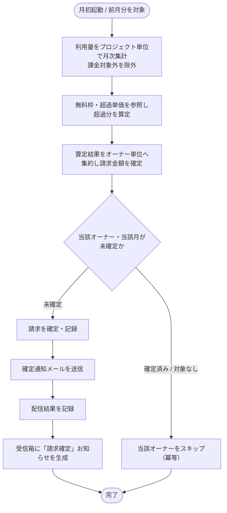

# SYS-019: 月次請求確定

> **このページは、月次の締め後にオーナー単位の利用量を集約して請求を確定し、オーナーへ確定通知を生成するシステム処理 SYS-019 を定義します。**

*種別 システム設計 ・ 優先度 P0 ・ ステータス ドラフト*

| ID | 業務ユースケースID | API ID | テーブルID |
|----|----|----|----|
| SYS-019 | [UC-054](../../../01_requirements/04_business_usecases/UC-054.md#UC-054) | [API-043](../03_apis/API-043.md#API-043) ・ [API-058](../03_apis/API-058.md#API-058) | [TBL-002](../04_database/TBL-002.md#TBL-002) ・ [TBL-009](../04_database/TBL-009.md#TBL-009) ・ [TBL-018](../04_database/TBL-018.md#TBL-018) ・ [TBL-019](../04_database/TBL-019.md#TBL-019) ・ [TBL-020](../04_database/TBL-020.md#TBL-020) ・ [TBL-022](../04_database/TBL-022.md#TBL-022) ・ [TBL-026](../04_database/TBL-026.md#TBL-026) |

| 処理名 | 種別 | トリガー / スケジュール |
|----|----|----|
| 月次請求確定 | batch | 月初に前月分を対象として定期起動 |

## 1. 処理概要

- 月初の起動契機により前月分を対象に、プロジェクト単位で計測した利用量を月次集計し、無料枠と超過単価から超過分を算定してオーナー単位(課金アカウント単位)へ集約し、請求を確定する。
- 確定後はオーナーへ請求確定メールを送信し配信結果を記録するとともに、受信箱へ「請求確定」のお知らせを生成する。
- 確定済みのオーナー・対象なしのオーナーは確定・通知を行わず冪等にスキップする。

## 2. 処理フロー図

## 3. 入出力

| 区分 | 内容 |
|---|---|
| 入力ソース | 月初の起動契機（対象月）・対象月にプロジェクト単位で計測した利用量・各プロジェクトの無料枠/超過単価・請求対象のオーナー(課金アカウント) |
| 出力先 | オーナー単位の確定請求の記録・確定通知メールの送信と配信結果の記録・受信箱への「請求確定」お知らせ生成 |

## 4. 処理項目定義

| 項目 ID | ステップ | 説明 | 種別 | 実行条件 |
|---|---|---|---|---|
| `PR-01` | 月次集計 | 対象月の利用量をプロジェクト単位で月次集計する。課金対象外と区別された計測は請求対象から除く | 集計 | — |
| `PR-02` | 超過分算定 | プロジェクトごとに無料枠と超過単価を参照し、超過分から課金額を算定する | 算定 | — |
| `PR-03` | オーナー集約 | プロジェクトごとの算定結果をオーナー単位(課金アカウント単位)へ集約し、オーナーが作成したプロジェクト全体の請求金額を確定する | 集計 | — |
| `PR-04` | 請求確定・記録 | 当該オーナー・当該月が未確定の場合に限り請求を確定し記録する | 記録 | 当該オーナー・当該月が未確定のとき |
| `PR-05` | 確定通知送信 | オーナーへ請求確定を通知するメールを送信し、配信結果を記録する | 通知 | 請求を確定したとき |
| `PR-06` | 受信箱お知らせ生成 | オーナーの受信箱へ「請求確定」のお知らせを生成する | 通知 | 請求を確定したとき |
| `PR-07` | 冪等スキップ | 確定済み・対象なしのオーナーは確定も通知も行わず当該オーナーをスキップする | 例外 | 確定済み / 対象なしのとき |

## 5. 入出力一覧

本処理が参照・記録する課金アカウント・利用量・請求書・受信箱・通知ログと、付随する API を示す。

| 入出力 | 説明 | 種別 | I/O | CRUD | 参照 |
|---|---|---|---|---|---|
| 請求サマリ | 確定した請求の集約・参照に用いる API | API | 入力 | — | [API-043](../03_apis/API-043.md#API-043) |
| メール配信 IF | 確定通知メールを送信する配信インタフェース | API | 出力 | — | [API-058](../03_apis/API-058.md#API-058) |
| 課金アカウント | 請求対象の課金アカウント・オーナーを参照する | テーブル | 入力 | `- R - -` | [TBL-002](../04_database/TBL-002.md#TBL-002) |
| プロジェクト別利用設定 | 無料枠・超過単価を参照する | テーブル | 入力 | `- R - -` | [TBL-009](../04_database/TBL-009.md#TBL-009) |
| 利用量計測 | 対象月の利用量を月次集計するため参照する | テーブル | 入力 | `- R - -` | [TBL-020](../04_database/TBL-020.md#TBL-020) |
| 請求書 | オーナー単位の確定請求を記録する | テーブル | 出力 | `C - - -` | [TBL-019](../04_database/TBL-019.md#TBL-019) |
| 受信箱 | 「請求確定」のお知らせを生成する | テーブル | 出力 | `C - - -` | [TBL-022](../04_database/TBL-022.md#TBL-022) |
| 通知ログ | 確定通知メールの配信結果を記録する | テーブル | 出力 | `C - - -` | [TBL-026](../04_database/TBL-026.md#TBL-026) |

## 6. システムイベント一覧

| SEV-ID | イベント ID | 項目 ID | イベント | 処理 |
|---|---|---|---|---|
| SEV-035 | `SE-01` | [PR-04](#PR-04) | 請求確定・記録 | オーナー単位に集約した請求金額を、当該オーナー・当該月が未確定の場合に限り確定し記録する |
| SEV-036 | `SE-02` | [PR-05](#PR-05) | 確定通知送信 | 確定した請求についてオーナーへ確定通知メールを送信し、配信結果を記録する |
