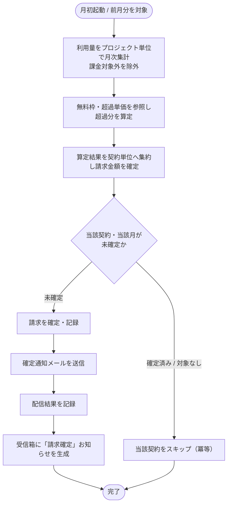

<!-- portal-top -->
[設計ポータル](../../../README.md) ／ [基本設計](../../index.md) ／ [バックエンド設計](../index.md) ／ [システム設計](index.md) ／ **SYS-021: 月次請求確定**
<!-- /portal-top -->

# SYS-021: 月次請求確定

> **このページは、月次の締め後に契約単位の利用量を集約して請求を確定し、オーナーへ確定通知を生成するシステム処理 SYS-021 を定義します。** 処理概要 / 処理フロー図 / 入出力 / 処理項目定義 / 入出力一覧 / システムイベント一覧 の 6 セクションで記述します。

*種別 システム設計 ・ 優先度 P0 ・ ステータス ドラフト*

## 1. 処理概要

月初の起動契機により前月分を対象に、プロジェクト単位で計測した利用量を月次集計し、無料枠と超過単価から超過分を算定して契約単位へ集約し、請求を確定する。確定後はオーナーへ請求確定メールを送信し配信結果を記録するとともに、受信箱へ「請求確定」のお知らせを生成する。確定済みの契約・対象なしの契約は確定・通知を行わず冪等にスキップする。

| システム ID | 処理名 | 種別 | トリガー / スケジュール | 機能概要 |
|---|---|---|---|---|
| `SYS-021` | 月次請求確定 | batch | 月初に前月分を対象として定期起動 | 計測した利用量を契約単位の請求額として確定し、オーナーへ確定通知を生成する |

| 関連 | 内容 |
|---|---|
| 機能要件 (FR) | [FR-087](../../../01_requirements/02_FunctionalRequirement/03_usage-fr.md#FR-087) ・ [FR-121](../../../01_requirements/02_FunctionalRequirement/05_notification-fr.md#FR-121) |
| 業務要件 (BR) | — |
| 業務ルール (RULE) | — |
| 関連システム | — |
| 対応業務UC | [UC-059](../../../01_requirements/04_business_usecases/UC-059.md#UC-059) |

## 2. 処理フロー図

## 3. 入出力

| 区分 | 内容 |
|---|---|
| 入力ソース | 月初の起動契機（対象月）・対象月にプロジェクト単位で計測した利用量・各プロジェクトの無料枠/超過単価・請求対象の契約 |
| 出力先 | 契約単位の確定請求の記録・確定通知メールの送信と配信結果の記録・受信箱への「請求確定」お知らせ生成 |

## 4. 処理項目定義

| 項目 ID | ステップ | 説明 | 種別 | 実行条件 |
|---|---|---|---|---|
| `PR-01` | 月次集計 | 対象月の利用量をプロジェクト単位で月次集計する。課金対象外と区別された計測は請求対象から除く | 集計 | — |
| `PR-02` | 超過分算定 | プロジェクトごとに無料枠と超過単価を参照し、超過分から課金額を算定する | 算定 | — |
| `PR-03` | 契約集約 | プロジェクトごとの算定結果を契約単位へ集約し、契約全体の請求金額を確定する | 集計 | — |
| `PR-04` | 請求確定・記録 | 当該契約・当該月が未確定の場合に限り請求を確定し記録する | 記録 | 当該契約・当該月が未確定のとき |
| `PR-05` | 確定通知送信 | オーナーへ請求確定を通知するメールを送信し、配信結果を記録する | 通知 | 請求を確定したとき |
| `PR-06` | 受信箱お知らせ生成 | オーナーの受信箱へ「請求確定」のお知らせを生成する | 通知 | 請求を確定したとき |
| `PR-07` | 冪等スキップ | 確定済み・対象なしの契約は確定も通知も行わず当該契約をスキップする | 例外 | 確定済み / 対象なしのとき |

## 5. 入出力一覧

本処理が参照・記録する契約・利用量・請求書・受信箱・通知ログと、付随する API を示す。

| 入出力 | 説明 | 種別 | I/O | CRUD | 参照 |
|---|---|---|---|---|---|
| 請求サマリ | 確定した請求の集約・参照に用いる API | API | 入力 | — | [API-043](../03_apis/API-043.md#API-043) |
| メール配信 IF | 確定通知メールを送信する配信インタフェース | API | 出力 | — | [API-058](../03_apis/API-058.md#API-058) |
| 契約 | 請求対象の契約・オーナーを参照する | テーブル | 入力 | `- R - -` | [TBL-002](../04_database/TBL-002.md#TBL-002) |
| プロジェクト別利用設定 | 無料枠・超過単価を参照する | テーブル | 入力 | `- R - -` | [TBL-009](../04_database/TBL-009.md#TBL-009) |
| 利用量計測 | 対象月の利用量を月次集計するため参照する | テーブル | 入力 | `- R - -` | [TBL-020](../04_database/TBL-020.md#TBL-020) |
| 請求書 | 契約単位の確定請求を記録する | テーブル | 出力 | `C - - -` | [TBL-019](../04_database/TBL-019.md#TBL-019) |
| 受信箱 | 「請求確定」のお知らせを生成する | テーブル | 出力 | `C - - -` | [TBL-022](../04_database/TBL-022.md#TBL-022) |
| 通知ログ | 確定通知メールの配信結果を記録する | テーブル | 出力 | `C - - -` | [TBL-026](../04_database/TBL-026.md#TBL-026) |

## 6. システムイベント一覧

| SEV-ID | イベント ID | 項目 ID | イベント | 処理 |
|---|---|---|---|---|
| [SEV-039](../02_system_events/SEV-039.md#SEV-039) | `SE-01` | [PR-04](#PR-04) | 請求確定・記録 | 契約単位に集約した請求金額を、当該契約・当該月が未確定の場合に限り確定し記録する |
| [SEV-040](../02_system_events/SEV-040.md#SEV-040) | `SE-02` | [PR-05](#PR-05) | 確定通知送信 | 確定した請求についてオーナーへ確定通知メールを送信し、配信結果を記録する |

## 詳細設計への移管候補

- 契約単位の処理ループ・対象走査(基本設計では契約 1 件の流れに抽象化しており、対象集合の反復は実装詳細のため)。
- 二重確定防止の冪等性キー(同一契約・同一月の一意制約とキー設計は実装レベルの詳細のため)。

---

<!-- portal-bottom -->
[← システム設計](index.md) ・ [基本設計](../../index.md) ・ [↑ 設計ポータル](../../../README.md)
<!-- /portal-bottom -->
