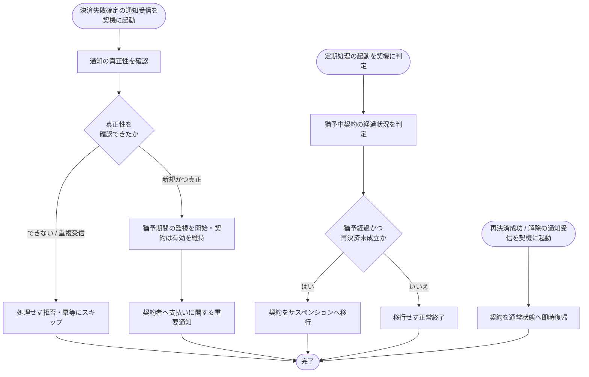

# SYS-022: 決済失敗猶予・サスペンション移行

> **このページは、決済失敗確定の通知を起点に猶予期間を監視し、猶予中に支払いが回復しなければ契約をサスペンションへ移行し、回復すれば通常状態へ復帰させるシステム処理 SYS-022 を定義します。** 処理概要 / 処理フロー図 / 入出力 / 処理項目定義 / 入出力一覧 / システムイベント一覧 の 6 セクションで記述します。

*種別 システム設計 ・ 優先度 P0 ・ ステータス ドラフト*

## 1. 処理概要

課金プロバイダからの決済失敗確定通知を起点に猶予期間の監視を開始し、契約は通常利用可能な状態のまま維持する。定期処理が猶予の経過を判定し、猶予期間を過ぎても再決済が成立しない契約をサスペンションへ移行する。猶予中・サスペンション中のいずれであっても、再決済成功または解除の通知を受けた時点で契約を通常状態へ即時復帰させる。通知の真正性が確認できない場合は処理せず拒否し、同一通知の重複受信は冪等に扱う。

| システム ID | 処理名 | 種別 | トリガー / スケジュール | 機能概要 |
|---|---|---|---|---|
| `SYS-022` | 決済失敗猶予・サスペンション移行 | monitor | 決済失敗確定 / 再決済成功 / 解除の通知受信、および猶予経過を判定する定期起動 | 猶予期間を監視し、未回復契約をサスペンションへ移行し、回復契約を通常状態へ復帰させる |

| 関連 | 内容 |
|---|---|
| 関連システム | — |
| トレーサビリティID | [TR-059](../../00_traceability/index.md#TR-059) |

## 2. 処理フロー図

## 3. 入出力

| 区分 | 内容 |
|---|---|
| 入力ソース | 課金プロバイダからの決済失敗確定 / 再決済成功 / 解除の通知、および猶予経過を判定する定期処理の起動 |
| 出力先 | 契約状態・猶予期間の記録、契約者への支払いに関する重要通知 |

## 4. 処理項目定義

| 項目 ID | ステップ | 説明 | 種別 | 実行条件 |
|---|---|---|---|---|
| `PR-01` | 通知真正性確認 | 受信した通知の真正性を確認し、不正・重複受信は処理せず冪等に扱う | 判定 | 通知受信時 |
| `PR-02` | 猶予監視開始 | 受信時点を起点に猶予期間の監視を開始し、契約を有効のまま維持する | 記録 | 真正な新規の決済失敗確定通知のとき |
| `PR-03` | 支払い重要通知 | 契約者へ支払いに関する重要通知を行う | 通知 | 猶予監視を開始したとき |
| `PR-04` | 猶予経過判定 | 定期処理が猶予中の各契約について経過状況を判定する | 判定 | 定期起動時 |
| `PR-05` | サスペンション移行 | 猶予経過かつ再決済未成立の契約をサスペンションへ移行する | 記録 | 猶予経過かつ再決済未成立のとき |
| `PR-06` | 通常状態復帰 | 再決済成功または解除の通知を受けた契約を通常状態へ即時復帰させる | 記録 | 再決済成功 / 解除の通知を受けたとき |

## 5. 入出力一覧

本処理が起点とする通知の受領 API と、契約状態・猶予期間を記録するテーブルを示す。

| 入出力 | 説明 | 種別 | I/O | CRUD | 参照 |
|---|---|---|---|---|---|
| 決済通知受領 | 決済失敗確定 / 再決済成功 / 解除の通知を受領する付随契機 | API | 入力 | — | [API-045](../03_apis/API-045.md#API-045) |
| 契約 | 契約状態・猶予期間を更新する | テーブル | 出力 | `- - U -` | [TBL-002](../04_database/TBL-002.md#TBL-002) |

## 6. システムイベント一覧

| SEV-ID | イベント ID | 項目 ID | イベント | 処理 |
|---|---|---|---|---|
| SEV-041 | `SE-01` | [PR-05](#PR-05) | サスペンション移行 | 猶予経過かつ再決済未成立の契約をサスペンションへ移行する |
| SEV-042 | `SE-02` | [PR-06](#PR-06) | 通常状態復帰 | 再決済成功または解除の通知を受けた契約を通常状態へ即時復帰させる |

## 詳細設計への移管候補

- 通知の冪等性キーによる重複排除方式
- 猶予経過判定の対象抽出条件・定期処理の実行間隔
