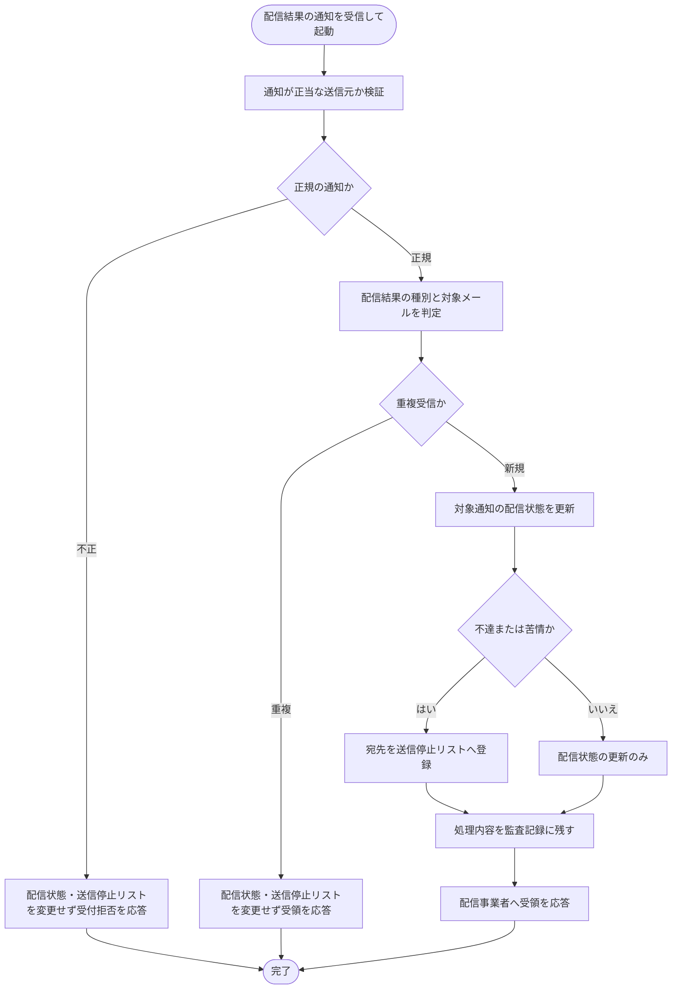

# SYS-023: メール配信状態Webhook処理

> **このページは、メール配信事業者から通知される配信結果を受け取り、対象通知の配信状態を更新し、不達・苦情の宛先への送信を停止するシステム処理 SYS-023 を定義します。** 処理概要 / 処理フロー図 / 入出力 / 処理項目定義 / 入出力一覧 / システムイベント一覧 の 6 セクションで記述します。

*種別 システム設計 ・ 優先度 P0 ・ ステータス ドラフト*

## 1. 処理概要

メール配信事業者から非同期に届く配信結果の通知を受け取り、正当な送信元から発行された正規の通知であることを検証したうえで、対象通知の配信状態(到達・不達・苦情・遅延)を更新する。不達(バウンス)・苦情と判定された宛先は全契約横断の送信停止リストへ登録して以降の送信を抑制し、不正な送信元・重複受信は状態を変更せず冪等に扱う。処理内容は監査記録に残す。

| システム ID | 処理名 | 種別 | トリガー / スケジュール | 機能概要 |
|---|---|---|---|---|
| `SYS-023` | メール配信状態Webhook処理 | async | メール配信事業者から配信結果の通知を受信したとき | 通知を検証して対象通知の配信状態を更新し、不達・苦情の宛先を送信停止リストへ登録する |

| 関連 | 内容 |
|---|---|
| 機能要件 (FR) | [FR-115](../../../01_requirements/02_functional_requirement/05_notification-fr.md#FR-115) ・ [FR-124](../../../01_requirements/02_functional_requirement/05_notification-fr.md#FR-124) |
| 業務要件 (BR) | — |
| 業務ルール (RULE) | — |
| 関連システム | — |
| 対応業務UC | [UC-063](../../../01_requirements/04_business_usecases/UC-063.md#UC-063) |

## 2. 処理フロー図

## 3. 入出力

| 区分 | 内容 |
|---|---|
| 入力ソース | メール配信事業者から受信する配信結果の通知(配信結果の種別・対象メール・宛先・送信元検証情報) |
| 出力先 | 対象通知の配信状態更新、不達・苦情宛先の送信停止リスト登録、監査記録、配信事業者への受領応答 |

## 4. 処理項目定義

| 項目 ID | ステップ | 説明 | 種別 | 実行条件 |
|---|---|---|---|---|
| `PR-01` | 送信元検証 | 通知が正当な送信元から発行された正規の通知であることを検証する | 判定 | — |
| `PR-02` | 結果種別判定 | 通知の内容から配信結果の種別(到達・不達・苦情・遅延)と対象メールを判定する | 判定 | 正規の通知のとき |
| `PR-03` | 重複判定 | 同一の配信結果通知を重複受信していないか判定し、重複時は状態を変更せず受領応答する | 判定 | 正規の通知のとき |
| `PR-04` | 配信状態更新 | 対象通知の配信状態を、判定した配信結果へ更新する | 記録 | 新規の通知のとき |
| `PR-05` | 送信停止登録 | 不達・苦情と判定した宛先を全契約横断の送信停止リストへ登録し以降の送信を抑制する | 記録 | 配信結果が不達または苦情のとき |
| `PR-06` | 監査記録 | 処理内容を監査記録に残す | 記録 | 正規の通知を処理したとき |
| `PR-07` | 受領応答 | 配信事業者へ受領した旨を応答する(不正な送信元には受付拒否を応答) | 通知 | — |

## 5. 入出力一覧

本処理が受け付ける配信結果の通知と、配信状態の更新・送信停止リスト登録・監査記録の対象を示す。

| 入出力 | 説明 | 種別 | I/O | CRUD | 参照 |
|---|---|---|---|---|---|
| 配信結果Webhook受信 | メール配信事業者からの配信結果通知を受け付ける契機となる API | API | 入力 | — | [API-059](../03_apis/API-059.md#API-059) |
| 通知ログ | 対象通知の配信状態を更新する | テーブル | 出力 | `- R U -` | [TBL-026](../04_database/TBL-026.md#TBL-026) |
| メールサプレスリスト | 不達・苦情の宛先を送信停止リストへ登録する | テーブル | 出力 | `C - - -` | [TBL-007](../04_database/TBL-007.md#TBL-007) |
| 監査ログ | 処理内容を監査記録に残す | テーブル | 出力 | `C - - -` | [TBL-027](../04_database/TBL-027.md#TBL-027) |

## 6. システムイベント一覧

| SEV-ID | イベント ID | 項目 ID | イベント | 処理 |
|---|---|---|---|---|
| SEV-043 | `SE-01` | [PR-04](#PR-04) | 配信状態更新 | 正規かつ新規の通知について対象通知の配信状態を判定した配信結果へ更新する |
| SEV-044 | `SE-02` | [PR-05](#PR-05) | 送信停止リスト登録 | 不達・苦情と判定した宛先を全契約横断の送信停止リストへ登録し以降の送信を抑制する |

## 詳細設計への移管候補

- 配信結果通知の送信元検証方式と、重複受信を冪等に判定するための一意キーの扱い。
- 配信結果の種別ごとの配信状態マッピングと、送信停止リスト登録の対象判定条件の詳細。
