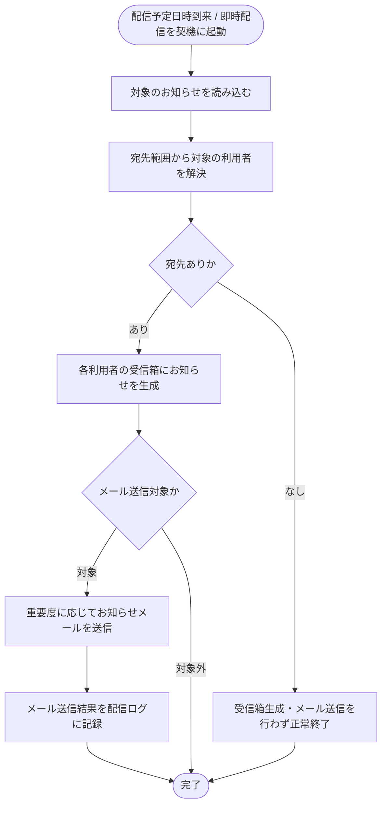

# SYS-024: 運営お知らせ配信

> **このページは、配信予定日時の到来または即時配信を契機に、運営お知らせを対象範囲のアカウント利用者へ受信箱お知らせとして生成し、重要度に応じてメールを送信するシステム処理 SYS-024 を定義します。** 処理概要 / 処理フロー図 / 入出力 / 処理項目定義 / 入出力一覧 / システムイベント一覧 の 6 セクションで記述します。

*種別 システム設計 ・ 優先度 P0 ・ ステータス ドラフト*

## 1. 処理概要

配信予定日時の到来または即時配信の指示を契機に、運営お知らせを読み込み、宛先範囲(全アカウント / 特定オーナー / 特定プロジェクト)から対象のアカウント利用者を解決する。解決した各利用者の受信箱にお知らせを生成し、重要度に応じてメールを送信して送信結果を配信ログに記録する。対象が存在しない場合は受信箱生成・メール送信を行わず正常終了する。

| システム ID | 処理名 | 種別 | トリガー / スケジュール | 機能概要 |
|---|---|---|---|---|
| `SYS-024` | 運営お知らせ配信 | batch | 配信予定日時の到来 / 運営による即時配信の指示 | 運営お知らせを対象範囲の利用者へ受信箱生成・メール送信し配信ログを記録する |

| 関連 | 内容 |
|---|---|
| 関連システム | — |
| トレーサビリティID | [TR-063](../../00_traceability/index.md#TR-063) |

## 2. 処理フロー図

## 3. 入出力

| 区分 | 内容 |
|---|---|
| 入力ソース | 配信予定日時の到来 / 即時配信の指示、対象のお知らせ(宛先範囲・件名・本文・重要度) |
| 出力先 | 対象のアカウント利用者の受信箱お知らせ生成、メール配信、配信ログの記録 |

## 4. 処理項目定義

| 項目 ID | ステップ | 説明 | 種別 | 実行条件 |
|---|---|---|---|---|
| `PR-01` | お知らせ読み込み | 配信契機を検知し、対象のお知らせ(宛先範囲・件名・本文・重要度)を読み込む | 取得 | — |
| `PR-02` | 宛先解決 | 宛先範囲(全アカウント / 特定オーナー / 特定プロジェクト)から配信対象のアカウント利用者を解決する | 判定 | — |
| `PR-03` | 受信箱お知らせ生成 | 解決した各アカウント利用者の受信箱にお知らせを生成する | 記録 | 宛先が存在するとき |
| `PR-04` | お知らせメール送信 | 重要度を判定し、メール送信対象の宛先へお知らせメールを送信する。最上位の重要度は強制送信、通常はオプトアウト設定に従う | 通知 | メール送信対象の宛先があるとき |
| `PR-05` | 配信ログ記録 | メールの送信結果を配信ログとして記録する | 記録 | メール送信を行ったとき |
| `PR-06` | 宛先なし正常終了 | 該当する利用者が存在しない場合は受信箱生成・メール送信を行わず正常終了する | 例外 | 宛先が存在しないとき |

## 5. 入出力一覧

本処理が読み込む運営お知らせ、生成する受信箱お知らせ、記録する配信ログと、付随する API を示す。

| 入出力 | 説明 | 種別 | I/O | CRUD | 参照 |
|---|---|---|---|---|---|
| お知らせ | 配信対象の運営お知らせ(宛先範囲・件名・本文・重要度)を読み込む | テーブル | 入力 | `- R - -` | [TBL-010](../04_database/TBL-010.md#TBL-010) |
| 受信箱 | 解決した各利用者の受信箱にお知らせを生成する | テーブル | 出力 | `C - - -` | [TBL-022](../04_database/TBL-022.md#TBL-022) |
| 通知ログ | メールの送信結果を配信ログとして記録する | テーブル | 出力 | `C - - -` | [TBL-026](../04_database/TBL-026.md#TBL-026) |
| お知らせ一覧 | 対象の利用者がお知らせを確認する一覧取得 API | API | 出力 | — | [API-048](../03_apis/API-048.md#API-048) |
| メール配信 IF | お知らせメールを送信する外部メール配信インタフェース | API | 出力 | — | [API-058](../03_apis/API-058.md#API-058) |

## 6. システムイベント一覧

| SEV-ID | イベント ID | 項目 ID | イベント | 処理 |
|---|---|---|---|---|
| SEV-045 | `SE-01` | [PR-03](#PR-03) | 受信箱お知らせ生成 | 解決した各アカウント利用者の受信箱にお知らせを生成する |
| SEV-046 | `SE-02` | [PR-05](#PR-05) | 配信ログ記録 | お知らせメールの送信結果を配信ログとして記録する |

## 詳細設計への移管候補

- 抑制リスト(バウンス / 苦情)該当宛先への送信スキップ判定と、受信箱お知らせのみ生成する分岐の詳細。
- メール送信失敗時の配信ログへの失敗記録と、再送(別ユースケース)への引き渡し条件。
