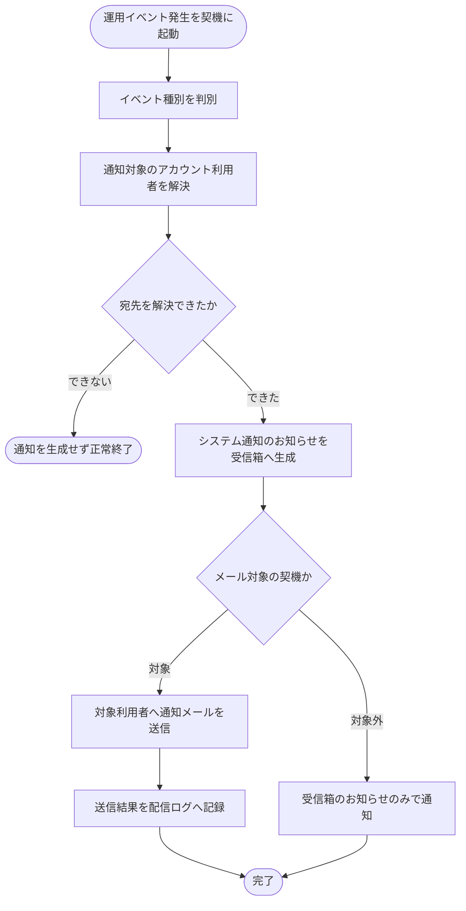

# SYS-025: 運用イベントのシステム通知自動生成

> **このページは、運用イベントの発生を契機に対象アカウント利用者へシステム通知を自動生成し、メール対象の契機では通知メールを送信して配信ログを記録するシステム処理 SYS-025 を定義します。** 処理概要 / 処理フロー図 / 入出力 / 処理項目定義 / 入出力一覧 / システムイベント一覧 の 6 セクションで記述します。

*種別 システム設計 ・ 優先度 P0 ・ ステータス ドラフト*

## 1. 処理概要

利用上限への接近・到達、通知失敗の急増、サスペンション、復元、規約改定、価格改定などの運用イベントの発生を契機に、システムが対象アカウント利用者を解決し、受信箱へ「システム通知」のお知らせを自動生成する。メール対象の契機では通知メールを送信して配信ログを記録し、メール対象外の契機では受信箱のお知らせのみで通知する。宛先を解決できない場合は通知を生成せず正常終了する。

| システム ID | 処理名 | 種別 | トリガー / スケジュール | 機能概要 |
|---|---|---|---|---|
| `SYS-025` | 運用イベントのシステム通知自動生成 | async | 運用イベント(利用上限接近・到達・通知失敗急増・サスペンション・復元・規約改定・価格改定 等)の発生時 | 対象利用者を解決し受信箱へシステム通知を生成、メール対象契機では通知メールを送信し配信ログを記録する |

| 関連 | 内容 |
|---|---|
| 関連システム | — |
| トレーサビリティID | [TR-064](../../00_traceability/index.md#TR-064) |

## 2. 処理フロー図

## 3. 入出力

| 区分 | 内容 |
|---|---|
| 入力ソース | 運用イベント発生元からのイベント発生通知(イベント種別・対象となるオーナーやプロジェクト) |
| 出力先 | 対象利用者の受信箱への「システム通知」お知らせ生成、メール対象契機での通知メール送信および配信ログ記録 |

## 4. 処理項目定義

| 項目 ID | ステップ | 説明 | 種別 | 実行条件 |
|---|---|---|---|---|
| `PR-01` | イベント種別判別 | 発生した運用イベントの種別を判別する | 判定 | — |
| `PR-02` | 宛先解決 | 通知の対象となるアカウント利用者を解決する | 判定 | — |
| `PR-03` | システム通知生成 | イベント種別に応じた内容で受信箱へシステム通知のお知らせを生成する | 記録 | 宛先を解決できたとき |
| `PR-04` | メール送信 | メール対象の契機で対象利用者へ通知メールを送信する | 通知 | メール対象の契機のとき |
| `PR-05` | 配信ログ記録 | 通知メールの送信結果を配信ログとして記録する | 記録 | メール対象の契機のとき |
| `PR-06` | 受信箱のみ通知 | メール対象外の契機では受信箱のお知らせのみで通知する | 通知 | メール対象外の契機のとき |
| `PR-07` | 宛先なし終了 | 宛先を解決できない場合は通知を生成せず正常終了する | 例外 | 宛先を解決できないとき |

## 5. 入出力一覧

本処理が生成・記録する受信箱のお知らせ・通知ログと、付随契機となる API を示す。

| 入出力 | 説明 | 種別 | I/O | CRUD | 参照 |
|---|---|---|---|---|---|
| お知らせ一覧 | 受信箱のお知らせを参照・提示する付随契機の API | API | 入力 | — | [API-048](../03_apis/API-048.md#API-048) |
| メール配信IF | メール対象契機で通知メールを送信する配信 IF | API | 出力 | — | [API-058](../03_apis/API-058.md#API-058) |
| 受信箱 | システム通知のお知らせを対象利用者の受信箱へ生成する | テーブル | 出力 | `C - - -` | [TBL-022](../04_database/TBL-022.md#TBL-022) |
| 通知ログ | 通知メールの送信結果を配信ログとして記録する | テーブル | 出力 | `C - - -` | [TBL-026](../04_database/TBL-026.md#TBL-026) |

## 6. システムイベント一覧

| SEV-ID | イベント ID | 項目 ID | イベント | 処理 |
|---|---|---|---|---|
| SEV-047 | `SE-01` | [PR-03](#PR-03) | システム通知生成 | イベント種別に応じたシステム通知のお知らせを対象利用者の受信箱へ生成する |
| SEV-048 | `SE-02` | [PR-05](#PR-05) | 通知メール送信・配信ログ記録 | メール対象契機で通知メールを送信し、送信結果を配信ログとして記録する |
