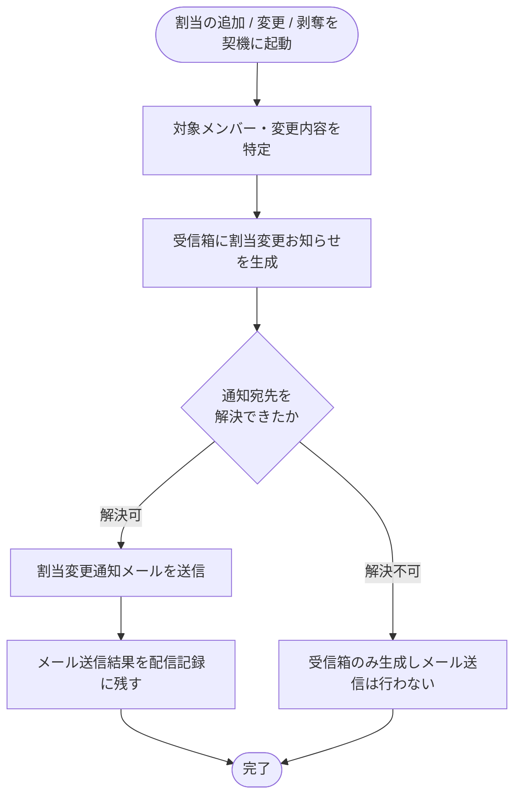

<!-- portal-top -->
[設計ポータル](../../../README.md) ／ [基本設計](../../index.md) ／ [バックエンド設計](../index.md) ／ [システム設計](index.md) ／ **SYS-026: メンバー割当変更通知**
<!-- /portal-top -->

# SYS-026: メンバー割当変更通知

> **このページは、メンバーのプロジェクト別役割割当が追加・変更・剥奪されたことを契機に、当該メンバーへお知らせ受信箱とメールで変更を通知するシステム処理 SYS-026 を定義します。** 処理概要 / 処理フロー図 / 入出力 / 処理項目定義 / 入出力一覧 / システムイベント一覧 の 6 セクションで記述します。

*種別 システム設計 ・ 優先度 P0 ・ ステータス ドラフト*

## 1. 処理概要

メンバーのプロジェクト別役割割当が追加・変更・剥奪されたことを契機に、対象メンバーへお知らせ受信箱(「運営お知らせ」種別・「通常」重要度)とメールで変更を通知する。宛先を解決できない場合は受信箱のお知らせのみ生成し、メール送信は行わない。

| システム ID | 処理名 | 種別 | トリガー / スケジュール | 機能概要 |
|---|---|---|---|---|
| `SYS-026` | メンバー割当変更通知 | async | メンバーのプロジェクト別役割割当の追加 / 変更 / 剥奪を契機に起動 | 対象メンバーと変更内容を特定し、受信箱お知らせ生成と変更通知メール送信・配信記録を行う |

| 関連 | 内容 |
|---|---|
| 機能要件 (FR) | [FR-125](../../../01_requirements/02_FunctionalRequirement/05_notification-fr.md#FR-125) ・ [FR-014](../../../01_requirements/02_FunctionalRequirement/01_account-fr.md#FR-014) ・ [FR-013](../../../01_requirements/02_FunctionalRequirement/01_account-fr.md#FR-013) ・ [FR-016](../../../01_requirements/02_FunctionalRequirement/01_account-fr.md#FR-016) ・ [FR-017](../../../01_requirements/02_FunctionalRequirement/01_account-fr.md#FR-017) ・ [FR-035](../../../01_requirements/02_FunctionalRequirement/01_account-fr.md#FR-035) |
| 業務要件 (BR) | — |
| 業務ルール (RULE) | — |
| 関連システム | — |
| 対応業務UC | [UC-066](../../../01_requirements/04_business_usecases/UC-066.md#UC-066) |

## 2. 処理フロー図

## 3. 入出力

| 区分 | 内容 |
|---|---|
| 入力ソース | メンバーのプロジェクト別役割割当の追加 / 変更 / 剥奪イベント(対象メンバー・対象プロジェクト・割当変更の別) |
| 出力先 | 対象メンバーの受信箱お知らせ生成、対象メンバーへの変更通知メール送信、メール配信記録 |

## 4. 処理項目定義

| 項目 ID | ステップ | 説明 | 種別 | 実行条件 |
|---|---|---|---|---|
| `PR-01` | 対象特定 | 通知対象のメンバーと変更内容(対象プロジェクトと割当の追加・変更・剥奪の別)を特定する | 判定 | — |
| `PR-02` | 受信箱お知らせ生成 | 対象メンバーの受信箱に運営お知らせ種別・通常重要度の割当変更お知らせを生成する | 記録 | — |
| `PR-03` | 通知メール送信 | 対象メンバーへ割当変更を知らせる通知メールを送信する | 通知 | 通知宛先を解決できたとき |
| `PR-04` | 配信記録 | メールの送信結果を配信記録として残す | 記録 | 通知宛先を解決できたとき |
| `PR-05` | メール送信省略 | 宛先を解決できない場合は受信箱お知らせのみ生成しメール送信を行わない | 例外 | 通知宛先を解決できないとき |

## 5. 入出力一覧

本処理が記録するお知らせ・配信記録と、付随する API を示す。SEQ-096 に現れるテーブル・API のみを掲載する。

| 入出力 | 説明 | 種別 | I/O | CRUD | 参照 |
|---|---|---|---|---|---|
| 割当変更通知 | 割当変更の通知処理に関わる API | API | 入力 | — | [API-020](../03_apis/API-020.md#API-020) |
| 通知メール送信 | 変更通知メールの送信に関わる API | API | 出力 | — | [API-058](../03_apis/API-058.md#API-058) |
| お知らせ | 受信箱に運営お知らせ種別の割当変更お知らせを生成する | テーブル | 出力 | `C - - -` | [TBL-022](../04_database/TBL-022.md#TBL-022) |
| メール配信記録 | メール送信結果を配信記録として残す | テーブル | 出力 | `C - - -` | [TBL-026](../04_database/TBL-026.md#TBL-026) |

## 6. システムイベント一覧

| SEV-ID | イベント ID | 項目 ID | イベント | 処理 |
|---|---|---|---|---|
| [SEV-049](../02_system_events/SEV-049.md#SEV-049) | `SE-01` | [PR-02](#PR-02) | 受信箱お知らせ生成 | 対象メンバーの受信箱に運営お知らせ種別・通常重要度の割当変更お知らせを生成する |
| [SEV-050](../02_system_events/SEV-050.md#SEV-050) | `SE-02` | [PR-04](#PR-04) | 通知メール送信・配信記録 | 対象メンバーへ割当変更通知メールを送信し、その送信結果を配信記録として残す |

## 詳細設計への移管候補

- メール配信失敗時の配信記録への失敗記録および再送(通知再送ユースケース)との連携手順。

---

<!-- portal-bottom -->
[← システム設計](index.md) ・ [基本設計](../../index.md) ・ [↑ 設計ポータル](../../../README.md)
<!-- /portal-bottom -->
