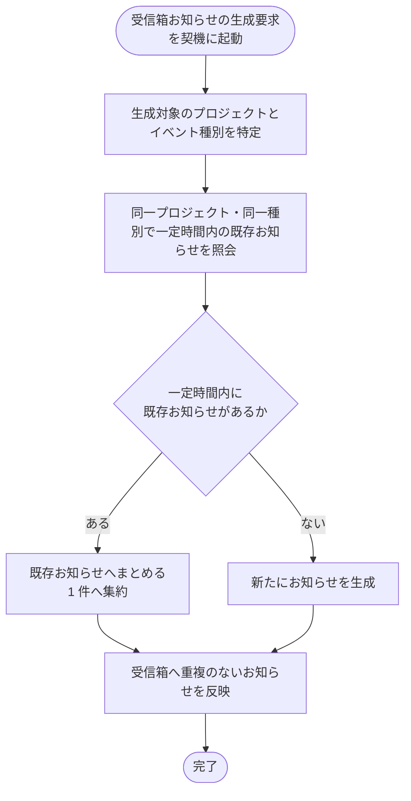

# SYS-026: 受信箱お知らせ重複集約

> **このページは、同一プロジェクト・同一イベント種別で一定時間内に連続発火した受信箱お知らせを 1 件にまとめるシステム処理 SYS-026 を定義します。**

*種別 システム設計 ・ 優先度 P0 ・ ステータス ドラフト*

| ID | 業務ユースケースID | API ID | テーブルID |
|----|----|----|----|
| SYS-026 | [UC-063](../../../01_requirements/04_business_usecases/UC-063.md#UC-063) | — | [TBL-022](../04_database/TBL-022.md#TBL-022) |

| 処理名 | 種別 | トリガー / スケジュール |
|----|----|----|
| 受信箱お知らせ重複集約 | async | 受信箱お知らせの生成要求(プロジェクト / イベント種別)発生時 |

## 1. 処理概要

- 受信箱お知らせの生成要求が発生したとき、同一プロジェクト・同一イベント種別で一定時間内に発生した既存のお知らせがあるかを確認し、ある場合は新規生成せず既存のお知らせへまとめる。
- 一定時間の窓を外れた発火や異なるイベント種別は、別のお知らせとして新規に生成する。
- 集約の時間窓は [システム仕様書 §3](../../07_system-spec.md#3-タイムアウトセッション認証) のお知らせ集約時間窓に従う。これは受信箱 [TBL-022](../04_database/TBL-022.md#TBL-022) `T_INBOX_MSG` の `dedup_key`(`created_at` を集約時間窓単位に切り捨てたスロットを含む集約キー)と整合する。
- 同一プロジェクト・同一イベント種別・同一の集約時間窓スロットに既存お知らせがある場合は、本文を上書きするのではなく、最新の発火内容で件数(発生回数)を加算して 1 件へ集約表示する。

## 2. 処理フロー図

## 3. 入出力

| 区分 | 内容 |
|---|---|
| 入力ソース | 受信箱お知らせの生成要求(対象プロジェクト・イベント種別) |
| 出力先 | 受信箱お知らせの集約または新規生成(対象アカウント利用者の受信箱への反映) |

## 4. 処理項目定義

| 項目 ID | ステップ | 説明 | 種別 | 実行条件 |
|---|---|---|---|---|
| `PR-01` | 対象特定 | 生成対象のプロジェクトとイベント種別を特定する | 判定 | — |
| `PR-02` | 既存照会 | 同一プロジェクト・同一イベント種別で時間窓([システム仕様書 §3](../../07_system-spec.md#3-タイムアウトセッション認証) のお知らせ集約時間窓。TBL-022 `dedup_key` のスロットと整合)内に発生した既存のお知らせがあるかを `dedup_key` で確認する | 判定 | — |
| `PR-03` | 集約 | 集約時間窓内の既存お知らせへまとめる(本文を上書きせず最新内容で件数を加算し 1 件へ集約表示。既読日時は変更せず既読状態を維持し、既読化は利用者の明示操作のみで行う) | 記録 | 集約時間窓内の既存お知らせがあるとき |
| `PR-04` | 新規生成 | 一定時間内の既存お知らせが無い場合は新たにお知らせを生成する | 記録 | 一定時間内の既存お知らせが無いとき |
| `PR-05` | 受信箱反映 | 集約または生成の結果を対象アカウント利用者の受信箱へ重複なく反映する | 通知 | — |

## 5. 入出力一覧

本処理が照会・記録する受信箱お知らせのテーブルを示す。

| 入出力 | 説明 | 種別 | I/O | CRUD | 参照 |
|---|---|---|---|---|---|
| 受信箱お知らせ(照会) | 同一プロジェクト・同一イベント種別で一定時間内の既存お知らせを照会する | テーブル | 入力 | `- R - -` | [TBL-022](../04_database/TBL-022.md#TBL-022) |
| 受信箱お知らせ(集約) | 一定時間内の既存お知らせへまとめる(1 件へ集約) | テーブル | 出力 | `- - U -` | [TBL-022](../04_database/TBL-022.md#TBL-022) |
| 受信箱お知らせ(新規) | 一定時間内の既存お知らせが無い場合に新たに生成する | テーブル | 出力 | `C - - -` | [TBL-022](../04_database/TBL-022.md#TBL-022) |

## 6. システムイベント一覧

| SEV-ID | イベント ID | 項目 ID | イベント | 処理 |
|---|---|---|---|---|
| SEV-049 | `SE-01` | [PR-03](#PR-03) | 既存お知らせへ集約 | 同一プロジェクト・同一イベント種別で一定時間内の既存お知らせへまとめ、1 件へ集約する |
| SEV-050 | `SE-02` | [PR-04](#PR-04) | お知らせ新規生成 | 一定時間内の既存お知らせが無い場合に新たにお知らせを生成し受信箱へ反映する |
