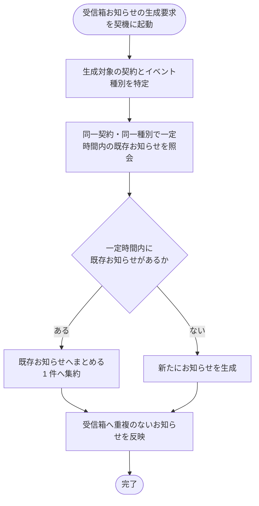

# SYS-028: 受信箱お知らせ重複集約

> **このページは、同一契約・同一イベント種別で一定時間内に連続発火した受信箱お知らせを 1 件にまとめるシステム処理 SYS-028 を定義します。** 処理概要 / 処理フロー図 / 入出力 / 処理項目定義 / 入出力一覧 / システムイベント一覧 の 6 セクションで記述します。

*種別 システム設計 ・ 優先度 P0 ・ ステータス ドラフト*

## 1. 処理概要

受信箱お知らせの生成要求が発生したとき、同一契約・同一イベント種別で一定時間内に発生した既存のお知らせがあるかを確認し、ある場合は新規生成せず既存のお知らせへまとめる。一定時間の窓を外れた発火や異なるイベント種別は、別のお知らせとして新規に生成する。

集約の時間窓は 60 分(設計値)とする。これは受信箱 [TBL-022](../04_database/TBL-022.md#TBL-022) `T_INBOX_MSG` の `dedup_key`(`created_at` を 60 分単位に切り捨てたスロットを含む集約キー)と整合する。同一契約・同一イベント種別・同一 60 分スロットに既存お知らせがある場合は、本文を上書きするのではなく、最新の発火内容で件数(発生回数)を加算して 1 件へ集約表示する。

| システム ID | 処理名 | 種別 | トリガー / スケジュール | 機能概要 |
|---|---|---|---|---|
| `SYS-028` | 受信箱お知らせ重複集約 | async | 受信箱お知らせの生成要求(契約 / イベント種別)発生時 | 同一契約・同一イベント種別で一定時間内の既存お知らせへ集約し、無ければ新規生成する |

| 関連 | 内容 |
|---|---|
| 関連システム | — |
| トレーサビリティID | [TR-067](../../00_traceability/index.md#TR-067) |

## 2. 処理フロー図

## 3. 入出力

| 区分 | 内容 |
|---|---|
| 入力ソース | 受信箱お知らせの生成要求(対象契約・イベント種別) |
| 出力先 | 受信箱お知らせの集約または新規生成(対象アカウント利用者の受信箱への反映) |

## 4. 処理項目定義

| 項目 ID | ステップ | 説明 | 種別 | 実行条件 |
|---|---|---|---|---|
| `PR-01` | 対象特定 | 生成対象の契約とイベント種別を特定する | 判定 | — |
| `PR-02` | 既存照会 | 同一契約・同一イベント種別で時間窓(60 分。設計値。TBL-022 `dedup_key` の 60 分スロットと整合)内に発生した既存のお知らせがあるかを `dedup_key` で確認する | 判定 | — |
| `PR-03` | 集約 | 60 分窓内の既存お知らせへまとめる(本文を上書きせず最新内容で件数を加算し 1 件へ集約表示) | 記録 | 60 分窓内の既存お知らせがあるとき |
| `PR-04` | 新規生成 | 一定時間内の既存お知らせが無い場合は新たにお知らせを生成する | 記録 | 一定時間内の既存お知らせが無いとき |
| `PR-05` | 受信箱反映 | 集約または生成の結果を対象アカウント利用者の受信箱へ重複なく反映する | 通知 | — |

## 5. 入出力一覧

本処理が照会・記録する受信箱お知らせのテーブルを示す。

| 入出力 | 説明 | 種別 | I/O | CRUD | 参照 |
|---|---|---|---|---|---|
| 受信箱お知らせ(照会) | 同一契約・同一イベント種別で一定時間内の既存お知らせを照会する | テーブル | 入力 | `- R - -` | [TBL-022](../04_database/TBL-022.md#TBL-022) |
| 受信箱お知らせ(集約) | 一定時間内の既存お知らせへまとめる(1 件へ集約) | テーブル | 出力 | `- - U -` | [TBL-022](../04_database/TBL-022.md#TBL-022) |
| 受信箱お知らせ(新規) | 一定時間内の既存お知らせが無い場合に新たに生成する | テーブル | 出力 | `C - - -` | [TBL-022](../04_database/TBL-022.md#TBL-022) |

## 6. システムイベント一覧

| SEV-ID | イベント ID | 項目 ID | イベント | 処理 |
|---|---|---|---|---|
| SEV-053 | `SE-01` | [PR-03](#PR-03) | 既存お知らせへ集約 | 同一契約・同一イベント種別で一定時間内の既存お知らせへまとめ、1 件へ集約する |
| SEV-054 | `SE-02` | [PR-04](#PR-04) | お知らせ新規生成 | 一定時間内の既存お知らせが無い場合に新たにお知らせを生成し受信箱へ反映する |

## 詳細設計への移管候補

- 集約の窓は 60 分(設計値。TBL-022 `dedup_key` の 60 分スロットと整合)を基本設計で定める。`dedup_key` の生成詳細([TBL-022](../04_database/TBL-022.md#TBL-022) を正本)と、スロット境界近くでの同時到達時(ほぼ同時の生成要求)の競合制御・件数加算の原子性は詳細設計で定める。
