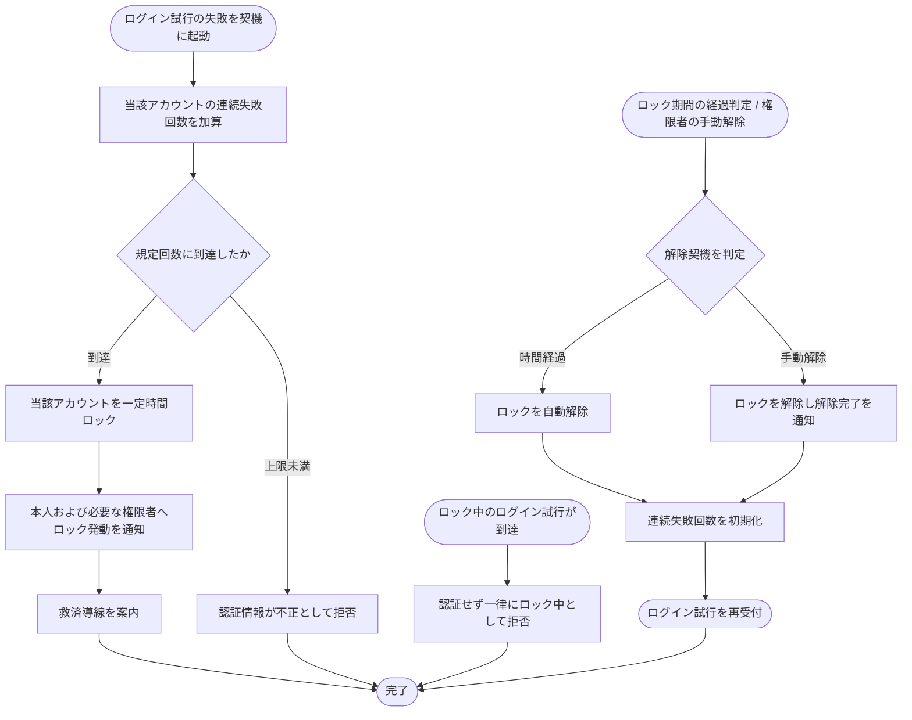

# SYS-029: ログイン失敗ロックアウト・解除

> **このページは、ログイン失敗が連続して規定回数に達した利用者を一定時間ロックし、時間経過または権限者の操作でロックを解除するシステム処理 SYS-029 を定義します。**

*種別 システム設計 ・ 優先度 P0 ・ ステータス ドラフト*

| ID | 業務ユースケースID | API ID | テーブルID |
|----|----|----|----|
| SYS-029 | [UC-068](../../../01_requirements/04_business_usecases/UC-068.md#UC-068) | [API-002](../03_apis/API-002.md#API-002) ・ [API-070](../03_apis/API-070.md#API-070) | [TBL-002](../04_database/TBL-002.md#TBL-002) ・ [TBL-003](../04_database/TBL-003.md#TBL-003) ・ [TBL-013](../04_database/TBL-013.md#TBL-013) |

| 処理名 | 種別 | トリガー / スケジュール |
|----|----|----|
| ログイン失敗ロックアウト・解除 | monitor | ログイン試行の失敗 / ロック期間の経過判定スケジュール / 権限者による手動解除 |

## 1. 処理概要

- 連続したログイン失敗による総当たり試行を抑止するため、ログイン失敗が続けて規定回数に達した利用者アカウントを一定時間ロックする。
- ロック中の到達は認証せず一律に拒否し、ロックは時間経過による自動解除または権限者の手動解除で解く。
- 解除後は失敗回数を初期化してログイン試行を再受付する。
- 連続失敗カウンタのリセット契機は次のとおり(業務ルール [RULE-001](../../../01_requirements/01_business_requirement/08_rule.md#RULE-001):ロックアウト条件到達で ロックアウト・時間経過または権限者の解除で復旧、と整合):
  - **ログイン成功時に即リセット**: 認証に成功した時点で当該アカウントの連続失敗カウンタを 0 に初期化する(連続失敗が規定回数に達する前に成功すれば、それまでの失敗はロック判定に持ち越さない)。
  - **ロック解除時にリセット**: 時間経過による自動解除・権限者の手動解除のいずれでも、解除に伴い連続失敗カウンタを初期化する(PR-07)。

## 2. 処理フロー図

## 3. 入出力

| 区分 | 内容 |
|---|---|
| 入力ソース | ログイン試行(認証情報)・ロック期間の経過判定スケジュール・権限者による手動解除操作 |
| 出力先 | 連続失敗回数・ロック状態の更新、本人および必要な権限者へのロック発動通知・解除完了通知、ログイン試行への拒否応答 |

## 4. 処理項目定義

| 項目 ID | ステップ | 説明 | 種別 | 実行条件 |
|---|---|---|---|---|
| `PR-01` | 失敗回数加算 | 認証情報の不一致で失敗したとき、当該アカウントの連続失敗回数を加算する | 記録 | ログイン試行が認証不一致で失敗したとき |
| `PR-02` | ロック発動 | 連続失敗回数が規定回数に到達したアカウントを一定時間ロックする | 記録 | 連続失敗回数が規定回数に到達したとき |
| `PR-03` | ロック通知 | 本人および必要な権限者へロック発動を通知し救済導線を案内する | 通知 | ロックを発動したとき |
| `PR-04` | 到達拒否 | ロック中に到達したログイン試行を認証せず一律に拒否する | 例外 | ロック中にログイン試行が到達したとき |
| `PR-05` | 自動解除 | ロック期間が経過したアカウントのロックを自動で解除する | 判定 | ロック期間が経過したとき |
| `PR-06` | 手動解除 | 権限者の操作でロックを解除し解除完了を通知する | 通知 | 権限者が手動解除を実行したとき |
| `PR-07` | 失敗回数初期化 | ロック解除後に連続失敗回数を初期化しログイン試行を再受付する | 記録 | ロックを解除したとき |
| `PR-08` | 成功時リセット | ログイン認証に成功したとき、当該アカウントの連続失敗回数を即座に 0 へ初期化する([RULE-001](../../../01_requirements/01_business_requirement/08_rule.md#RULE-001) と整合) | 記録 | ログイン試行が認証成功したとき |

## 5. 入出力一覧

本処理の契機となるログイン認証 API と、権限者による手動解除の入力経路 API を示す。連続失敗回数・ロック状態の保持先テーブルは詳細設計で確定する。

| 入出力 | 説明 | 種別 | I/O | CRUD | 参照 |
|---|---|---|---|---|---|
| ログイン認証 | ログイン失敗・成功の契機となる認証 API | API | 入力 | — | [API-002](../03_apis/API-002.md#API-002) |
| ログイン失敗ロック解除 | 権限者による手動解除の入力経路 API | API | 入力 | — | [API-070](../03_apis/API-070.md#API-070) |

## 6. システムイベント一覧

| SEV-ID | イベント ID | 項目 ID | イベント | 処理 |
|---|---|---|---|---|
| SEV-055 | `SE-01` | [PR-02](#PR-02) | ロック発動 | 連続失敗が規定回数に到達したアカウントを一定時間ロックし、本人および必要な権限者へ通知する |
| SEV-056 | `SE-02` | [PR-05](#PR-05) | ロック解除 | 時間経過または権限者の操作でロックを解除し、連続失敗回数を初期化してログイン試行を再受付する |
