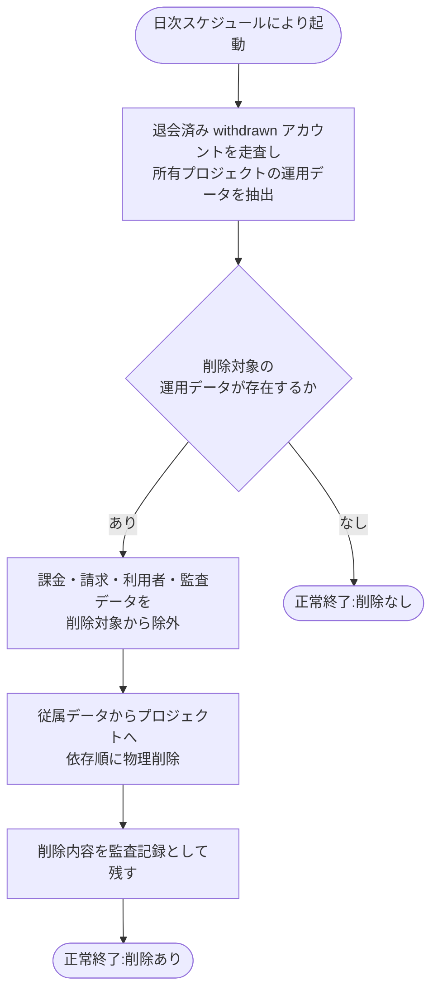

# SYS-029: 退会済みアカウント・論理削除データの物理削除

> **このページは、退会済み(`withdrawn`)になったアカウントが所有する(自分が作成した)プロジェクトの運用データを速やかに(日次)物理削除し、あわせて退会以外で論理削除(`valid=0`)された行を猶予期間(90 日)経過後に物理削除し、削除内容を監査記録として残すシステム処理 SYS-029 を定義します。** 処理概要 / 処理フロー図 / 入出力 / 処理項目定義 / 入出力一覧 / システムイベント一覧 の 6 セクションで記述します。

*種別 システム設計 ・ 優先度 P0 ・ ステータス ドラフト*

## 1. 処理概要

アカウントが退会済み(`status='withdrawn'`)へ移行したとき、当該アカウントが所有する(自分が作成した=オーナーである)プロジェクトに属する運用データ(FAQ・プロジェクト・許可ドメイン・質問ログ・未解決質問・利用量・通知・お知らせ受信箱など)を、日次で走査し、退会済みになったアカウントを対象に速やかに依存関係の順序に従って物理削除する。削除は従属する関連データから先に進め、削除内容を監査記録として残す。退会済みアカウントが無い、または対象の運用データが無い場合は削除を行わず正常終了する。

加えて、退会以外の事由で論理削除(`valid=0`)された行(プロジェクト削除・アカウント無効化・保持期間超過で論理削除された質問ログ / 未解決質問など)を、論理削除から猶予期間(90 日・[NFR-048](../../../01_requirements/03_non_functional_requirement/07_nfr.md#NFR-048))を経過した時点で物理削除する。退会済みアカウントの運用データ削除には猶予を設けず速やかに行い、退会以外の一般の論理削除データは猶予 90 日経過後に物理削除する(両者を同一バッチで処理する)。

**課金関連データ(課金アカウント `M_BILLING_ACCOUNT`・サブスクリプション・請求書・支払方法・課金関連の監査記録)および利用者・認証従属(`M_USER` とその従属)は本処理の削除対象外**とし、保持期間(7 年・[RULE-022](../../../01_requirements/01_business_requirement/08_rule.md#RULE-022))にわたり別途保持する。保持期間を経過した課金・請求・利用者データの物理削除は [SYS-036](SYS-036.md#SYS-036) が担う。また、保持期間(1 年)超過による日次削除は [SYS-034](SYS-034.md#SYS-034) が別途担う。

削除順序は、外部キー(FK)の親子関係に基づき**子(参照する側)→親(参照される側)**の順とする([DB 設計の ER 図](../04_database/index.md) を正本)。参照される側のテーブルを後に削除し、FK 制約違反を避ける。対象は退会済みアカウントが所有するプロジェクトに紐づく運用データに限定し、削除順序は次のとおり(設計値・詳細は詳細設計で確定。テーブル網羅範囲・物理名・段階順は基本設計の方針として示すものであり、テーブルごとの個別削除手順・最終確定は詳細設計に委ねる):

1. プロジェクト配下の従属データ: 許可ドメイン(TBL-005)/ 旧鍵(TBL-015)/ 未解決質問(TBL-017)/ 質問ログ(TBL-025)/ 利用量メータ(TBL-020)/ FAQ(TBL-006)・FAQ化履歴(TBL-029)/ AI しきい値キャッシュ(TBL-031)。
2. プロジェクト配下の運用系従属データ: お知らせ受信状況(TBL-021)/ 受信箱(TBL-022)/ 通知ログ(TBL-026)/ エラーログ(TBL-028)。オーナー単位のレート上書き(TBL-008)・プロジェクト単位のクォータ上限(TBL-009)。お知らせ定義は運営所有の全体配信データでありプロジェクト従属ではないため削除対象外。
3. プロジェクトメンバー割当(TBL-003)。
4. プロジェクト(TBL-004)。**最後に削除する**(運用系従属テーブルの参照先のため)。

上記は基本設計時点での網羅順序(設計値)であり、テーブルごとの個別削除手順・FK 制約の `ON DELETE` 設定は詳細設計で確定する。**課金アカウント(TBL-002)・利用者(TBL-001)・課金/請求/監査の各データは本処理では削除しない**(保持対象。[SYS-036](SYS-036.md#SYS-036) が保持期間経過後に物理削除する)。

| システム ID | 処理名 | 種別 | トリガー / スケジュール | 機能概要 |
|---|---|---|---|---|
| `SYS-029` | 退会済みアカウント・論理削除データの物理削除 | batch | 日次の実行スケジュールによる自動起動 | 退会済み(`withdrawn`)アカウントが所有するプロジェクトの運用データを依存順に速やかに物理削除し、あわせて退会以外で論理削除(`valid=0`)された行を猶予 90 日経過後に物理削除する。課金・請求・利用者・監査データは対象外(7 年保持) |

| 関連 | 内容 |
|---|---|
| 関連システム | [SYS-034](SYS-034.md#SYS-034)(保持期間 1 年超過データ削除)・[SYS-036](SYS-036.md#SYS-036)(保持期間 7 年経過アカウントの物理削除) |
| トレーサビリティID | [TR-070](../../00_traceability/index.md#TR-070) |

## 2. 処理フロー図

## 3. 入出力

| 区分 | 内容 |
|---|---|
| 入力ソース | 日次の実行スケジュール(自動起動)、退会済み(`withdrawn`)状態のアカウントとそれが所有するプロジェクトに紐づく運用データ |
| 出力先 | 物理削除された運用データ(不可逆)、削除内容の監査記録 |

## 4. 処理項目定義

| 項目 ID | ステップ | 説明 | 種別 | 実行条件 |
|---|---|---|---|---|
| `PR-01` | 削除対象走査 | 退会済み(`status='withdrawn'`)アカウントを走査し、それらが所有するプロジェクトに属する運用データを物理削除の対象として抽出する | 判定 | — |
| `PR-02` | 保持対象除外 | 課金関連データ(課金アカウント・請求書・サブスク・支払方法・課金関連監査)および利用者・認証従属を削除対象から除外する(7 年保持) | 判定 | 削除対象が存在するとき |
| `PR-03` | 依存順物理削除 | 抽出した運用データを依存関係の順序に従って物理削除する(従属する関連データから先に削除し、プロジェクトへと進める) | 更新 | 削除対象が存在するとき |
| `PR-04` | 監査記録 | 削除した内容を監査記録として残す | 記録 | 削除を実施したとき |
| `PR-05` | 対象なし正常終了 | 削除対象の運用データが存在しない場合は削除を行わず正常終了する | 例外 | 削除対象が存在しないとき |

## 5. 入出力一覧

本処理が走査・物理削除の対象とする運用データと、削除内容を残す監査記録のテーブルを示す。課金・請求・利用者・監査データは対象外(7 年保持。[SYS-036](SYS-036.md#SYS-036) が担当)。

| 入出力 | 説明 | 種別 | I/O | CRUD | 参照 |
|---|---|---|---|---|---|
| 利用者(M_USER) | 退会済み(`status='withdrawn'`)アカウントを走査の起点として参照する(削除はしない) | テーブル | 入力 | `- R - -` | [TBL-001](../04_database/TBL-001.md#TBL-001) |
| プロジェクト(M_PROJECTS) | 退会済みアカウントが所有する(`owner_user_id` 一致)プロジェクトを依存順(最後)に物理削除する | テーブル | 出力 | `- R - D` | [TBL-004](../04_database/TBL-004.md#TBL-004) |
| プロジェクト従属の運用データ | 許可ドメイン・旧鍵・未解決質問・質問ログ・利用量・FAQ・FAQ化履歴・AIしきい値キャッシュ等を依存順(プロジェクトより先)に物理削除する | テーブル | 出力 | `- R - D` | [TBL-005](../04_database/TBL-005.md#TBL-005) [TBL-006](../04_database/TBL-006.md#TBL-006) [TBL-015](../04_database/TBL-015.md#TBL-015) [TBL-017](../04_database/TBL-017.md#TBL-017) [TBL-020](../04_database/TBL-020.md#TBL-020) [TBL-025](../04_database/TBL-025.md#TBL-025) [TBL-029](../04_database/TBL-029.md#TBL-029) [TBL-031](../04_database/TBL-031.md#TBL-031) |
| プロジェクト従属の運用データ | お知らせ・受信箱・通知ログ・利用設定・エラーログ等を依存順に物理削除する | テーブル | 出力 | `- R - D` | [TBL-008](../04_database/TBL-008.md#TBL-008) [TBL-009](../04_database/TBL-009.md#TBL-009) [TBL-021](../04_database/TBL-021.md#TBL-021) [TBL-022](../04_database/TBL-022.md#TBL-022) [TBL-026](../04_database/TBL-026.md#TBL-026) [TBL-028](../04_database/TBL-028.md#TBL-028) |
| プロジェクトメンバー割当(M_PRJ_USERS) | 退会済みアカウントが所有するプロジェクトのメンバー割当を依存順に物理削除する | テーブル | 出力 | `- R - D` | [TBL-003](../04_database/TBL-003.md#TBL-003) |
| 監査記録 | 削除した内容を監査記録として残す | テーブル | 出力 | `C - - -` | [TBL-027](../04_database/TBL-027.md#TBL-027) |

## 6. システムイベント一覧

| SEV-ID | イベント ID | 項目 ID | イベント | 処理 |
|---|---|---|---|---|
| SEV-055 | `SE-01` | [PR-03](#PR-03) | 依存順物理削除 | 退会済みアカウントが所有するプロジェクトの運用データを依存関係の順序に従って物理削除する |
| SEV-056 | `SE-02` | [PR-04](#PR-04) | 監査記録 | 削除した内容を監査記録として残す |
