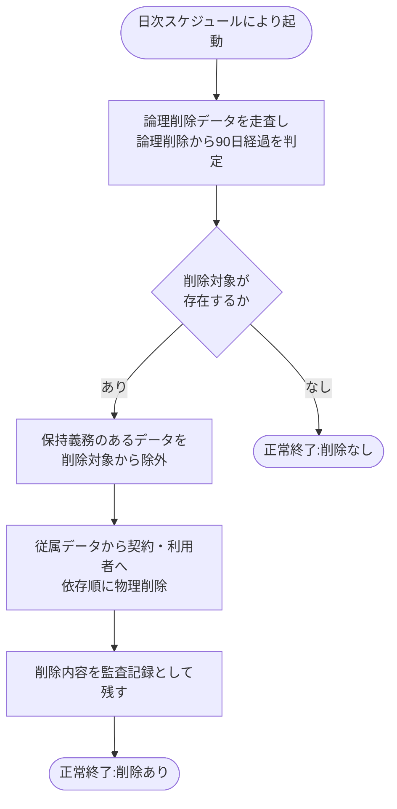

# SYS-029: 90日経過データ物理削除

> **このページは、論理削除から猶予期間(90 日)を経過したデータを依存関係の順序に従って物理削除し、削除内容を監査記録として残すシステム処理 SYS-029 を定義します。** 処理概要 / 処理フロー図 / 入出力 / 処理項目定義 / 入出力一覧 / システムイベント一覧 の 6 セクションで記述します。

*種別 システム設計 ・ 優先度 P0 ・ ステータス ドラフト*

## 1. 処理概要

退会などにより論理削除された契約・利用者・関連データのうち、論理削除日から猶予期間(90 日)を経過したものを日次で走査し、依存関係の順序に従って物理削除する。削除は従属する関連データから契約・利用者へと進め、削除内容を監査記録として残す。保持義務のあるデータは削除対象から除外し、猶予期間を経過したデータが無い場合は削除を行わず正常終了する。なお、論理削除列を持たない追記専用の従属テーブル(受信箱 `T_INBOX_MSG`・通知ログ `H_NOTIF_LOGS` 等)は自身の論理削除日を持たないため、起点となる親(契約・利用者)の論理削除日から猶予期間を経過した時点で、親のカスケードの一部として物理削除する(保持期間超過による日次削除は [SYS-034](SYS-034.md#SYS-034) が別途担う)。

削除順序は、外部キー(FK)の親子関係に基づき**子(参照する側)→親(参照される側)**の順とする([DB 設計の ER 図](../04_database/index.md)の `M_USER ||--o| M_CONTRACT` / `M_CONTRACT ||--o{ M_PROJECTS` / `M_PROJECTS ||--o{ M_PRJ_USERS` を正本)。参照される側(`M_CONTRACT` → `M_USER`)を後に削除し、FK 制約違反を避ける。対象テーブルと削除順序は次のとおり(設計値。退会した契約・利用者に紐づくデータを対象とし、保持義務のある監査ログ `H_AUDIT_LOGS`(TBL-027)は削除対象外):

1. プロジェクト配下の従属データ: 許可ドメイン `M_ALLOWED_DOMAINS`(TBL-005)/ 旧鍵 `T_PRJ_LEGACY_KEYS`(TBL-015)/ 未解決質問 `T_INQUIRIES`(TBL-017)/ 質問ログ `H_QUESTION_LOGS`(TBL-025)/ 利用量メータ `T_USAGE_METER`(TBL-020)/ FAQ `M_FAQS`(TBL-006)・FAQ化履歴 `H_INQUIRY_FAQ`(TBL-029)/ AI しきい値キャッシュ `TP_AI_THRESH_CACHE`(TBL-031)。
2. 契約配下の従属データ: サブスクリプション `T_BILL_SUBS`(TBL-018)/ 請求書 `T_BILL_INVOICES`(TBL-019)/ 課金Webhook受信ログ `T_BILLING_WEBHOOK_LOG`(TBL-032)/ お知らせ系 `M_SERVICE_ANNOUNCE`(TBL-010)・`M_ANNOUNCE_AUD`(TBL-011)・`T_ANNOUNCE_RCPT`(TBL-021)/ 受信箱 `T_INBOX_MSG`(TBL-022)/ 退会申請 `T_WITHDRAW_REQ`(TBL-023)/ 通知ログ `H_NOTIF_LOGS`(TBL-026)/ 利用設定 `M_OWNER_QUOTA_OVR`(TBL-008)・`M_PRJ_QUOTA_LIMITS`(TBL-009)/ エラーログ `H_ERROR_LOGS`(TBL-028)。
3. プロジェクトメンバー割当 `M_PRJ_USERS`(TBL-003)。
4. プロジェクト `M_PROJECTS`(TBL-004)。
5. 契約 `M_CONTRACT`(TBL-002)。
6. 利用者 `M_USER`(TBL-001)。**最後に削除する**(他テーブルの参照先のため)。
7. ユーザー認証の従属データ(セッション `T_SESSIONS`(TBL-013)/ アクセストークン `T_ACCESS_TOKENS`(TBL-014)/ 規約同意 `T_TERMS_AGREE`(TBL-024))は `M_USER` を参照するため、6 の `M_USER` 削除より前に削除する。

上記は基本設計時点での網羅順序(設計値)であり、テーブルごとの個別削除手順・FK 制約の `ON DELETE` 設定は詳細設計で確定する。

| システム ID | 処理名 | 種別 | トリガー / スケジュール | 機能概要 |
|---|---|---|---|---|
| `SYS-029` | 90日経過データ物理削除 | batch | 日次の実行スケジュールによる自動起動 | 論理削除から 90 日を経過したデータを依存順に物理削除し、削除内容を監査記録に残す |

| 関連 | 内容 |
|---|---|
| 関連システム | — |
| トレーサビリティID | [TR-070](../../00_traceability/index.md#TR-070) |

## 2. 処理フロー図

## 3. 入出力

| 区分 | 内容 |
|---|---|
| 入力ソース | 日次の実行スケジュール(自動起動)、論理削除済みで論理削除日が記録されたデータ |
| 出力先 | 物理削除されたデータ(不可逆)、削除内容の監査記録 |

## 4. 処理項目定義

| 項目 ID | ステップ | 説明 | 種別 | 実行条件 |
|---|---|---|---|---|
| `PR-01` | 削除対象走査 | 論理削除済みデータを走査し、論理削除から猶予期間(90 日)を経過したものを物理削除の対象として抽出する | 判定 | — |
| `PR-02` | 保持義務除外 | 法令・運用上の保持義務があるデータを削除対象から除外する | 判定 | 削除対象が存在するとき |
| `PR-03` | 依存順物理削除 | 抽出した対象を依存関係の順序に従って物理削除する(従属する関連データから先に削除し、利用者・契約へと進める) | 更新 | 削除対象が存在するとき |
| `PR-04` | 監査記録 | 削除した内容を監査記録として残す | 記録 | 削除を実施したとき |
| `PR-05` | 対象なし正常終了 | 猶予期間を経過したデータが存在しない場合は削除を行わず正常終了する | 例外 | 削除対象が存在しないとき |

## 5. 入出力一覧

本処理が走査・物理削除の対象とするデータと、削除内容を残す監査記録のテーブルを示す。SEQ-092 に対応する関連テーブルを参照として示す。

| 入出力 | 説明 | 種別 | I/O | CRUD | 参照 |
|---|---|---|---|---|---|
| 利用者(M_USER) | 論理削除から90日経過した利用者を依存順(最後)に物理削除する | テーブル | 出力 | `- R - D` | [TBL-001](../04_database/TBL-001.md#TBL-001) |
| 契約(M_CONTRACT) | 論理削除から90日経過した契約を依存順(利用者より先)に物理削除する | テーブル | 出力 | `- R - D` | [TBL-002](../04_database/TBL-002.md#TBL-002) |
| 監査記録 | 削除した内容を監査記録として残す | テーブル | 出力 | `C - - -` | [TBL-027](../04_database/TBL-027.md#TBL-027) |

## 6. システムイベント一覧

| SEV-ID | イベント ID | 項目 ID | イベント | 処理 |
|---|---|---|---|---|
| SEV-055 | `SE-01` | [PR-03](#PR-03) | 依存順物理削除 | 90 日を経過した対象を依存関係の順序に従って物理削除する |
| SEV-056 | `SE-02` | [PR-04](#PR-04) | 監査記録 | 削除した内容を監査記録として残す |

## 詳細設計への移管候補

- 子→親の削除順序とテーブル網羅範囲は §1 で示す(設計値)。テーブルごとの個別削除手順・FK 制約の `ON DELETE` 設定・1 トランザクションの分割粒度は詳細設計で定める。
- 保持義務のあるデータの除外判定ロジック(削除対象外の条件判定。監査ログ等)。
- 対象の削除が失敗した場合の中止・再評価のリトライ方式。
