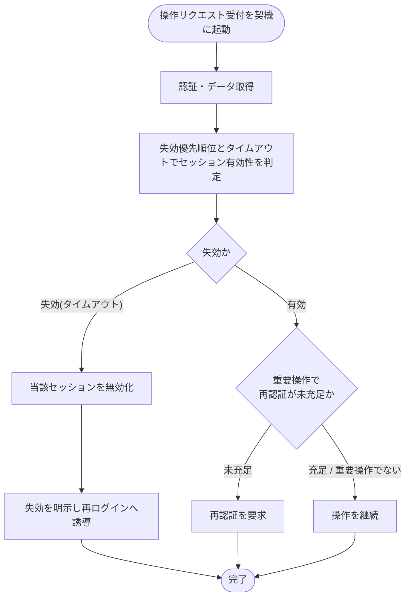

# SYS-030: セッション失効判定・再認証誘導

> **このページは、操作のたびにログイン状態の有効性を判定し、失効済みセッションを無効化して再ログインへ誘導し、重要操作では再認証を要求するシステム処理 SYS-030 を定義します。** 処理概要 / 処理フロー図 / 入出力 / 処理項目定義 / 入出力一覧 / システムイベント一覧 の 6 セクションで記述します。

*種別 システム設計 ・ 優先度 P0 ・ ステータス ドラフト*

## 1. 処理概要

アカウント利用者の操作リクエストを契機に、失効の優先順位とタイムアウト(無操作・絶対)に従ってセッションの有効性を判定する。失効済みのセッションは無効化して再ログインへ誘導し、有効でも重要操作で直近の本人確認が未充足な場合は再認証を要求する。

| システム ID | 処理名 | 種別 | トリガー / スケジュール | 機能概要 |
|---|---|---|---|---|
| `SYS-030` | セッション失効判定・再認証誘導 | monitor | アカウント利用者の操作リクエスト受付時 / 経過時間の上限を評価する定期的なタイミング | 失効優先順位とタイムアウトに従いセッション有効性を判定し、失効は無効化して再ログインへ誘導、重要操作の本人確認未充足は再認証を要求する |

| 関連 | 内容 |
|---|---|
| 機能要件 (FR) | [FR-005](../../../01_requirements/02_functional_requirement/01_account-fr.md#FR-005) ・ [FR-008](../../../01_requirements/02_functional_requirement/01_account-fr.md#FR-008) |
| 業務要件 (BR) | — |
| 業務ルール (RULE) | — |
| 関連システム | — |
| 対応業務UC | [UC-072](../../../01_requirements/04_business_usecases/UC-072.md#UC-072) |

## 2. 処理フロー図

## 3. 入出力

| 区分 | 内容 |
|---|---|
| 入力ソース | アカウント利用者の操作リクエスト(認証情報・操作対象)、経過時間の上限を評価する定期的な契機 |
| 出力先 | セッション状態の無効化、再ログイン誘導の明示メッセージ、重要操作での再認証要求、操作継続 |

## 4. 処理項目定義

| 項目 ID | ステップ | 説明 | 種別 | 実行条件 |
|---|---|---|---|---|
| `PR-01` | 認証・データ取得 | 操作リクエストの認証情報を確認し判定に要するデータを取得する | 取得 | — |
| `PR-02` | 有効性判定 | 失効優先順位とタイムアウト(無操作・絶対)に従いセッションの有効性を判定する | 判定 | — |
| `PR-03` | セッション無効化 | 失効に該当するセッションを無効化する | 記録 | タイムアウトで失効に該当したとき |
| `PR-04` | 再ログイン誘導 | 失効を明示するメッセージで再ログインへ誘導する | 通知 | セッションを無効化したとき |
| `PR-05` | 再認証要求 | 重要操作で再認証が未充足な場合に再認証を要求する | 通知 | 有効かつ重要操作で再認証が未充足のとき |
| `PR-06` | 操作継続 | 有効かつ再認証が不要または充足の場合は操作を継続する | 例外 | 有効かつ再認証が不要または充足のとき |

## 5. 入出力一覧

本処理が契機とする操作 API と、セッション状態の判定・無効化のため参照・更新するテーブルを示す。

| 入出力 | 説明 | 種別 | I/O | CRUD | 参照 |
|---|---|---|---|---|---|
| 操作リクエスト | 有効性判定の契機となる操作 API | API | 入力 | — | [API-002](../03_apis/API-002.md#API-002) |
| 操作リクエスト | 有効性判定の契機となる操作 API | API | 入力 | — | [API-003](../03_apis/API-003.md#API-003) |
| セッション | セッションの有効性を判定し、失効時に無効化する | テーブル | 入出力 | `- R U -` | [TBL-013](../04_database/TBL-013.md#TBL-013) |

## 6. システムイベント一覧

| SEV-ID | イベント ID | 項目 ID | イベント | 処理 |
|---|---|---|---|---|
| SEV-057 | `SE-01` | [PR-03](#PR-03) | セッション無効化 | タイムアウトで失効に該当したセッションを無効化する |
| SEV-058 | `SE-02` | [PR-04](#PR-04) | 再ログイン誘導 | 失効を明示するメッセージでアカウント利用者を再ログインへ誘導する |

## 詳細設計への移管候補

- 失効優先順位(強制ログアウト・絶対タイムアウト・無操作タイムアウト・有効)の評価順序と各しきい値の具体値
- 重要操作の判定基準と再認証の有効期間・1 回消費の冪等性
- 操作実行中に失効した場合の同時失効の扱い
