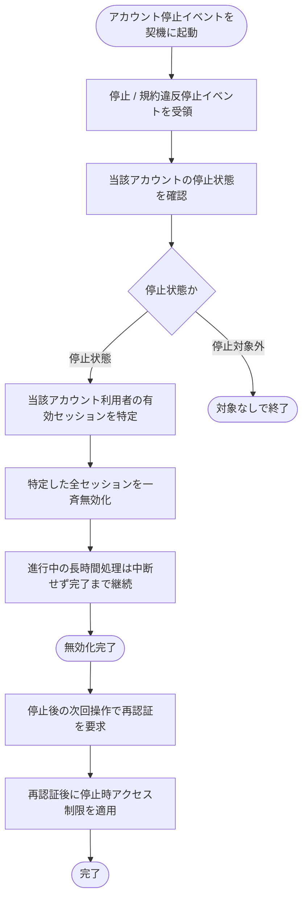

# SYS-030: アカウント停止時セッション一斉無効化

> **このページは、アカウントが停止された時に当該アカウント利用者の全セッションを速やかに一斉無効化し、停止後の操作に再認証と停止時アクセス制限を適用するシステム処理 SYS-030 を定義します。**

*種別 システム設計 ・ 優先度 P0 ・ ステータス ドラフト*

| ID | 業務ユースケースID | API ID | テーブルID |
|----|----|----|----|
| SYS-030 | [UC-069](../../../01_requirements/04_business_usecases/UC-069.md#UC-069) | [API-003](../03_apis/API-003.md#API-003) | [TBL-002](../04_database/TBL-002.md#TBL-002) ・ [TBL-013](../04_database/TBL-013.md#TBL-013) |

| 処理名 | 種別 | トリガー / スケジュール |
|----|----|----|
| アカウント停止時セッション一斉無効化 | cascade | 対象アカウントが停止(手動停止 / 規約違反停止)状態へ遷移した時 |

## 1. 処理概要

- アカウントの停止(手動停止 / 規約違反による停止)イベントを契機に起動し、当該アカウント利用者の有効なセッションを速やかに一斉無効化する。
- 無効化時点で進行中の長時間処理は中断せず完了まで継続させる。
- 停止後の次回操作では再認証を要求し停止時のアクセス制限を適用する。

## 2. 処理フロー図

## 3. 入出力

| 区分 | 内容 |
|---|---|
| 入力ソース | アカウント管理からの停止 / 規約違反停止イベント連携(対象アカウント・停止状態) |
| 出力先 | 当該アカウント利用者の全セッション無効化、停止後操作への再認証要求および停止時アクセス制限の適用 |

## 4. 処理項目定義

| 項目 ID | ステップ | 説明 | 種別 | 実行条件 |
|---|---|---|---|---|
| `PR-01` | 停止状態判定 | 連携されたアカウントが停止(手動停止 / 規約違反停止)状態かを判定する | 判定 | — |
| `PR-02` | 対象セッション特定 | 当該アカウント利用者の有効なセッションを特定する | 判定 | 停止状態のとき |
| `PR-03` | セッション一斉無効化 | 特定した全セッションを速やかに一斉無効化する | 更新 | 停止状態のとき |
| `PR-04` | 長時間処理の継続 | 無効化時点で進行中の長時間処理は中断せず完了まで継続させる | 例外 | 進行中の長時間処理があるとき |
| `PR-05` | 再認証・制限適用 | 停止後の次回操作で再認証を要求し、停止時のアクセス制限を適用する | 通知 | 無効化後に操作が到達したとき |

## 5. 入出力一覧

本処理が参照するアカウントおよび無効化対象とするセッションと、付随する認証 API を示す。

| 入出力 | 説明 | 種別 | I/O | CRUD | 参照 |
|---|---|---|---|---|---|
| アカウント | 当該アカウントの停止状態を確認するため参照する | テーブル | 入力 | `- R - -` | [TBL-001](../04_database/TBL-001.md#TBL-001) |
| セッション | 当該アカウント利用者の有効セッションを特定し一斉無効化する | テーブル | 出力 | `- R U -` | [TBL-013](../04_database/TBL-013.md#TBL-013) |
| ログアウト | 停止後操作で再認証を要求する関連認証 API | API | 入力 | — | [API-003](../03_apis/API-003.md#API-003) |

## 6. システムイベント一覧

| SEV-ID | イベント ID | 項目 ID | イベント | 処理 |
|---|---|---|---|---|
| SEV-057 | `SE-01` | [PR-03](#PR-03) | セッション一斉無効化 | 停止されたアカウント利用者の全有効セッションを特定し速やかに一斉無効化する |
| SEV-058 | `SE-02` | [PR-05](#PR-05) | 再認証・停止時制限適用 | 無効化後の次回操作で再認証を要求し、停止時のアクセス制限を適用する |
