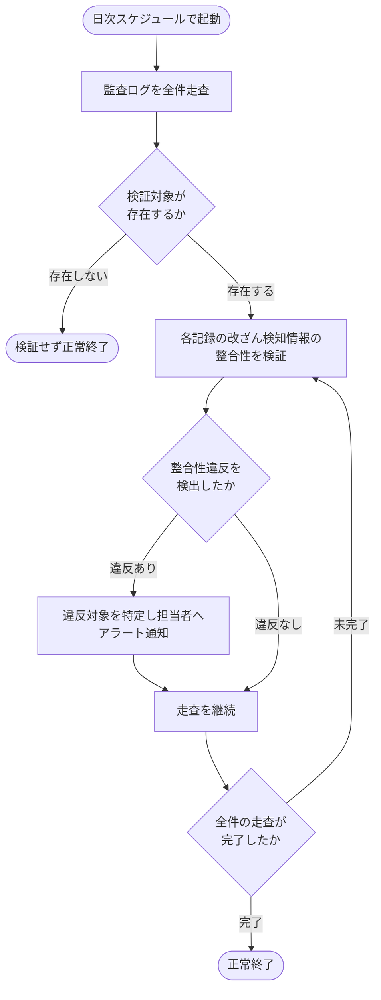

# SYS-031: 監査ログ整合性検証(日次)

> **このページは、日次の定期処理として監査ログを全件走査し、改ざん検知情報の整合性を検証して違反を検出した対象を担当者へ通知するシステム処理 SYS-031 を定義します。**

*種別 システム設計 ・ 優先度 P0 ・ ステータス ドラフト*

| ID | 処理名 | 種別 | トリガー / スケジュール |
|----|----|----|----| 
| SYS-031 | 監査ログ整合性検証(日次) | batch | 日次の定期処理(1 日 1 回・スケジューラ起動) |

| 関連項目 | 内容 |
|----|----| 
| 業務ユースケース | [UC-070](../../../01_requirements/04_business_usecases/UC-070.md#UC-070) |
| 関連システム | — |
| API | — |
| テーブル | [TBL-027](../04_database/TBL-027.md#TBL-027) |

## 1. 処理概要

- スケジューラが日次で整合性検証バッチを起動し、保持されている監査ログを全件走査して改ざん検知情報の整合性を検証する。
- 検証では各行について `row_hash = SHA-256(prev_hash + 正規化行内容)` を全件再計算し、保持されている `row_hash` と突合する。不一致を改ざん(または欠落)として検出する。
- 整合性違反を検出した対象はアラート通知し、違反が無ければ正常終了する。
- 検証は読み取りのみで監査ログ自体は変更しない。

## 2. 処理フロー図

## 3. 入出力

| 区分 | 内容 |
|---|---|
| 入力ソース | 日次スケジューラの起動契機、保持されている監査ログ全件(改ざん検知情報を含む) |
| 出力先 | 整合性違反を検出した対象の担当者向けアラート通知 |

## 4. 処理項目定義

| 項目 ID | ステップ | 説明 | 種別 | 実行条件 |
|---|---|---|---|---|
| `PR-01` | 全件走査 | 保持されている監査ログを全件読み取り、点検対象とする | 取得 | — |
| `PR-02` | 整合性検証 | 各記録について `row_hash = SHA-256(prev_hash + 正規化行内容)` を再計算し保持値と突合、不一致を改ざん(欠落含む)として検出する | 判定 | 検証対象が存在するとき |
| `PR-03` | 違反通知 | 整合性違反を検出した対象を特定し担当者へアラート通知する(走査は中断せず継続) | 通知 | 整合性違反を検出したとき |
| `PR-04` | 正常終了 | 全件走査の完了後、または検証対象が存在しない場合に正常終了する | 完了 | — |

## 5. 入出力一覧

本処理が走査・検証する監査ログを示す。検証は読み取りのみで監査ログ自体は変更しない。

| 入出力 | 説明 | 種別 | I/O | CRUD | 参照 |
|---|---|---|---|---|---|
| 監査ログ | 改ざん検知情報を含む監査ログを全件走査し整合性を検証する(読み取りのみ) | テーブル | 入力 | `- R - -` | [TBL-027](../04_database/TBL-027.md#TBL-027) |

## 6. システムイベント一覧

| SEV-ID | イベント ID | 項目 ID | イベント | 処理 |
|---|---|---|---|---|
| SEV-059 | `SE-01` | [PR-02](#PR-02) | 監査ログ整合性検証 | 監査ログを全件走査し各記録の改ざん検知情報の整合性を検証する |
| SEV-060 | `SE-02` | [PR-03](#PR-03) | 整合性違反通知 | 整合性違反を検出した対象を特定し担当者へアラート通知する(走査は継続) |
