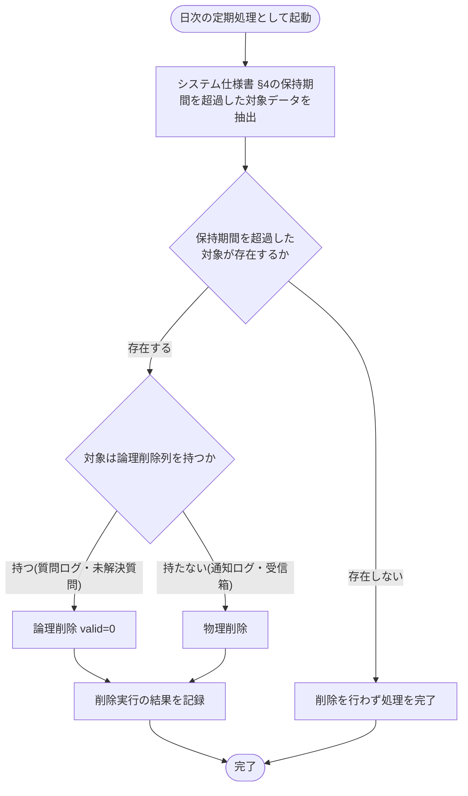

# SYS-032: 保持期間超過データの自動削除

> **このページは、データ保持期間（[システム仕様書 §4](../../07_system-spec.md#4-データ保持期間削除猶予)）を超過した質問ログ・未解決質問・通知ログ・お知らせ受信箱を日次で抽出し、対象に応じて論理削除または物理削除するシステム処理 SYS-032 を定義します。**

*種別 システム設計 ・ 優先度 P0 ・ ステータス ドラフト*

| ID | 業務ユースケースID | API ID | テーブルID |
|----|----|----|----|
| SYS-032 | [UC-066](../../../01_requirements/04_business_usecases/UC-066.md#UC-066) | — | [TBL-001](../04_database/TBL-001.md#TBL-001) ・ [TBL-002](../04_database/TBL-002.md#TBL-002) ・ [TBL-003](../04_database/TBL-003.md#TBL-003) ・ [TBL-004](../04_database/TBL-004.md#TBL-004) ・ [TBL-005](../04_database/TBL-005.md#TBL-005) ・ [TBL-006](../04_database/TBL-006.md#TBL-006) ・ [TBL-008](../04_database/TBL-008.md#TBL-008) ・ [TBL-009](../04_database/TBL-009.md#TBL-009) ・ [TBL-013](../04_database/TBL-013.md#TBL-013) ・ [TBL-014](../04_database/TBL-014.md#TBL-014) ・ [TBL-015](../04_database/TBL-015.md#TBL-015) ・ [TBL-017](../04_database/TBL-017.md#TBL-017) ・ [TBL-018](../04_database/TBL-018.md#TBL-018) ・ [TBL-019](../04_database/TBL-019.md#TBL-019) ・ [TBL-020](../04_database/TBL-020.md#TBL-020) ・ [TBL-021](../04_database/TBL-021.md#TBL-021) ・ [TBL-022](../04_database/TBL-022.md#TBL-022) ・ [TBL-023](../04_database/TBL-023.md#TBL-023) ・ [TBL-024](../04_database/TBL-024.md#TBL-024) ・ [TBL-025](../04_database/TBL-025.md#TBL-025) ・ [TBL-026](../04_database/TBL-026.md#TBL-026) ・ [TBL-027](../04_database/TBL-027.md#TBL-027) ・ [TBL-028](../04_database/TBL-028.md#TBL-028) ・ [TBL-029](../04_database/TBL-029.md#TBL-029) ・ [TBL-031](../04_database/TBL-031.md#TBL-031) ・ [TBL-032](../04_database/TBL-032.md#TBL-032) |

| 処理名 | 種別 | トリガー / スケジュール |
|----|----|----|
| 保持期間超過データの自動削除 | batch | 日次の定期処理 |

## 1. 処理概要

- 本処理は業務ユースケース [UC-066](../../../01_requirements/04_business_usecases/UC-066.md#UC-066) として定義し、データ保持期間（[システム仕様書 §4](../../07_system-spec.md#4-データ保持期間削除猶予)）の非機能要件 [NFR-045](../../../01_requirements/03_non_functional_requirement/07_nfr.md#NFR-045) / [NFR-049](../../../01_requirements/03_non_functional_requirement/07_nfr.md#NFR-049) を根拠とする保持削除バッチである。
- システムは日次の定期処理として、保持期間（[システム仕様書 §4](../../07_system-spec.md#4-データ保持期間削除猶予)）を超過した質問ログ・未解決質問・通知ログ・お知らせ受信箱を抽出し、**対象テーブルの削除方式に従って削除する**。
- 削除実行の結果は記録し、対象が存在しない場合は何も削除せず処理を完了する。
- 保持期限の判定に用いる基準カラムは、各対象とも作成日時 `created_at` 起点を原則(設計値)とする。保持期間の具体値は [システム仕様書 §4](../../07_system-spec.md#4-データ保持期間削除猶予) を参照する。
- **削除方式は対象テーブルが論理削除列(`valid`)を持つかで決まる**: 論理削除列を持つ対象は論理削除(`valid=0`)し、その後 [SYS-027](SYS-027.md#SYS-027) が [システム仕様書 §4](../../07_system-spec.md#4-データ保持期間削除猶予) の猶予期間に従って物理削除する。論理削除列を持たない追記専用の対象は本処理で直接物理削除する。
- 対象テーブル・基準カラム・削除方式は次のとおり:

| 対象 | テーブル | 基準カラム(設計値) | 削除方式 |
|---|---|---|---|
| 質問ログ | [TBL-025](../04_database/TBL-025.md#TBL-025) `H_QUESTION_LOGS` | `created_at` | 論理削除(`valid=0`) |
| 未解決質問 | [TBL-017](../04_database/TBL-017.md#TBL-017) `T_INQUIRIES` | `created_at` | 論理削除(`valid=0`) |
| 通知ログ | [TBL-026](../04_database/TBL-026.md#TBL-026) `H_NOTIF_LOGS` | `created_at` | 物理削除(追記専用・論理削除列なし) |
| お知らせ受信箱 | [TBL-022](../04_database/TBL-022.md#TBL-022) `T_INBOX_MSG` | `created_at` | 物理削除(追記専用・論理削除列なし) |

- 例外的に作成日時以外を起点とすべき対象が判明した場合は、当該対象の基準カラムを個別に定める(現時点では全対象 `created_at` 起点。設計値)。

## 2. 処理フロー図

## 3. 入出力

| 区分 | 内容 |
|---|---|
| 入力ソース | 保持期間（[システム仕様書 §4](../../07_system-spec.md#4-データ保持期間削除猶予)）を超過した質問ログ・未解決質問・通知ログ・お知らせ受信箱の各データ |
| 出力先 | 論理削除列を持つ対象への論理削除(`valid=0`)反映、追記専用対象の物理削除、削除実行結果の記録 |

## 4. 処理項目定義

| 項目 ID | ステップ | 説明 | 種別 | 実行条件 |
|---|---|---|---|---|
| `PR-01` | 超過データ抽出 | 各対象の基準カラム `created_at` 起点(設計値)で保持期間（[システム仕様書 §4](../../07_system-spec.md#4-データ保持期間削除猶予)）を超過した質問ログ・未解決質問・通知ログ・お知らせ受信箱を抽出する | 判定 | 日次の定期処理として起動した場合 |
| `PR-02` | 論理削除 | 論理削除列を持つ対象(質問ログ・未解決質問)を論理削除(`valid=0`)する。物理削除は後続の [SYS-027](SYS-027.md#SYS-027) に委ね、猶予期間は [システム仕様書 §4](../../07_system-spec.md#4-データ保持期間削除猶予) を参照する | 更新 | 保持期間を超過した論理削除対象が存在する場合 |
| `PR-03` | 物理削除 | 追記専用で論理削除列を持たない対象(通知ログ・お知らせ受信箱)を物理削除する | 更新 | 保持期間を超過した物理削除対象が存在する場合 |
| `PR-04` | 削除結果記録 | 論理削除・物理削除を実行した結果を記録する | 記録 | 削除を実行した場合 |

## 5. 入出力一覧

本処理は保持期間を超過したデータを、対象テーブルの削除方式(論理削除 / 物理削除)に従って削除する。

| 入出力 | 説明 | 種別 | I/O | CRUD | 参照 |
|---|---|---|---|---|---|
| 質問ログ | 保持期間([システム仕様書 §4](../../07_system-spec.md#4-データ保持期間削除猶予) 参照。起算点は作成日時)を超過した質問ログを論理削除(`valid=0`)する | テーブル | 出力 | `- - U -` | [TBL-025](../04_database/TBL-025.md#TBL-025) |
| 未解決質問 | 保持期間([システム仕様書 §4](../../07_system-spec.md#4-データ保持期間削除猶予) 参照。起算点は作成日時)を超過した未解決質問を論理削除(`valid=0`)する | テーブル | 出力 | `- - U -` | [TBL-017](../04_database/TBL-017.md#TBL-017) |
| 通知ログ | 保持期間([システム仕様書 §4](../../07_system-spec.md#4-データ保持期間削除猶予) 参照。起算点は作成日時)を超過した通知ログを物理削除する(追記専用・論理削除列なし) | テーブル | 出力 | `- - - D` | [TBL-026](../04_database/TBL-026.md#TBL-026) |
| お知らせ受信箱 | 保持期間([システム仕様書 §4](../../07_system-spec.md#4-データ保持期間削除猶予) 参照。起算点は作成日時)を超過したお知らせ受信箱を物理削除する(追記専用・論理削除列なし) | テーブル | 出力 | `- - - D` | [TBL-022](../04_database/TBL-022.md#TBL-022) |

## 6. システムイベント一覧

| SEV-ID | イベント ID | 項目 ID | イベント | 処理 |
|---|---|---|---|---|
| SEV-061 | `SE-01` | [PR-02](#PR-02) | 保持期間超過データの論理削除 | 論理削除列を持つ対象(質問ログ・未解決質問)を論理削除(`valid=0`)する |
| SEV-062 | `SE-02` | [PR-03](#PR-03) | 保持期間超過データの物理削除 | 追記専用の対象(通知ログ・お知らせ受信箱)を物理削除する |
| SEV-063 | `SE-03` | [PR-04](#PR-04) | 削除実行結果の記録 | 論理削除・物理削除を実行した結果を記録する |
