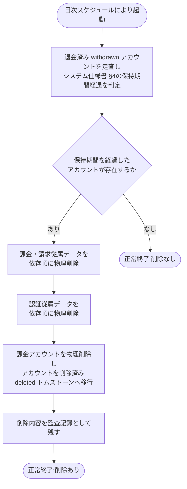

# SYS-034: 保持期間経過アカウントの物理削除

> **このページは、退会日(`withdrawn_at`)から保持期間（[システム仕様書 §4](../../07_system-spec.md#4-データ保持期間削除猶予)）を経過した退会済みアカウントの課金・請求関連データおよび認証従属を依存関係の順序に従って物理削除し、アカウントを削除済み(`deleted`)へ移行して以後ログイン不可とするシステム処理 SYS-034 を定義します。**

*種別 システム設計 ・ 優先度 P0 ・ ステータス ドラフト*

| ID | 業務ユースケースID | API ID | テーブルID |
|----|----|----|----|
| SYS-034 | [UC-066](../../../01_requirements/04_business_usecases/UC-066.md#UC-066) | — | [TBL-001](../04_database/TBL-001.md#TBL-001) ・ [TBL-002](../04_database/TBL-002.md#TBL-002) ・ [TBL-003](../04_database/TBL-003.md#TBL-003) ・ [TBL-004](../04_database/TBL-004.md#TBL-004) ・ [TBL-005](../04_database/TBL-005.md#TBL-005) ・ [TBL-006](../04_database/TBL-006.md#TBL-006) ・ [TBL-008](../04_database/TBL-008.md#TBL-008) ・ [TBL-009](../04_database/TBL-009.md#TBL-009) ・ [TBL-013](../04_database/TBL-013.md#TBL-013) ・ [TBL-014](../04_database/TBL-014.md#TBL-014) ・ [TBL-015](../04_database/TBL-015.md#TBL-015) ・ [TBL-017](../04_database/TBL-017.md#TBL-017) ・ [TBL-018](../04_database/TBL-018.md#TBL-018) ・ [TBL-019](../04_database/TBL-019.md#TBL-019) ・ [TBL-020](../04_database/TBL-020.md#TBL-020) ・ [TBL-021](../04_database/TBL-021.md#TBL-021) ・ [TBL-022](../04_database/TBL-022.md#TBL-022) ・ [TBL-023](../04_database/TBL-023.md#TBL-023) ・ [TBL-024](../04_database/TBL-024.md#TBL-024) ・ [TBL-025](../04_database/TBL-025.md#TBL-025) ・ [TBL-026](../04_database/TBL-026.md#TBL-026) ・ [TBL-027](../04_database/TBL-027.md#TBL-027) ・ [TBL-028](../04_database/TBL-028.md#TBL-028) ・ [TBL-029](../04_database/TBL-029.md#TBL-029) ・ [TBL-031](../04_database/TBL-031.md#TBL-031) ・ [TBL-032](../04_database/TBL-032.md#TBL-032) |

| 処理名 | 種別 | トリガー / スケジュール |
|----|----|----|
| 保持期間経過アカウントの物理削除 | batch | 日次の実行スケジュールによる自動起動 |

## 1. 処理概要

- 退会済み(`status='withdrawn'`)アカウントのうち、退会日 `withdrawn_at` から [システム仕様書 §4](../../07_system-spec.md#4-データ保持期間削除猶予) の保持期間を経過したものを、日次で走査して抽出する。
- 抽出したアカウントの課金・請求関連データ(課金アカウント・サブスクリプション・請求書・課金Webhook受信ログ・退会記録・支払方法・課金関連の監査記録)および当該アカウントに紐づく認証従属(セッション・アクセストークン・規約同意)を依存関係の順序に従って物理削除し、アカウントは識別子の再利用防止(NFR-051)のため最小限のトムストーンへ移行する。
- 課金・認証の従属データの物理削除と退会済み・削除済み状態により、当該アカウント保有者は以後ログインできない。
- 削除内容は監査記録として残す。
- 保持期間を経過したアカウントが無い場合は削除を行わず正常終了する。
- 退会済みアカウントの**運用データ**(FAQ・プロジェクト・質問ログ・利用量・通知・お知らせ受信箱など)は退会時に速やかに削除済みであり([SYS-027](SYS-027.md#SYS-027) が担当)、本処理は課金・請求・認証の保持対象データを保持期間経過後に確定削除する役割を担う。
- なお保持期間（[システム仕様書 §4](../../07_system-spec.md#4-データ保持期間削除猶予)）超過のログ系データ削除は [SYS-032](SYS-032.md#SYS-032) が別途担う。
- 削除順序は、外部キー(FK)の親子関係に基づき**子(参照する側)→親(参照される側)**の順とする([DB 設計の ER 図](../04_database/index.md) を正本)。参照される側のテーブルを最後に扱い、FK 制約違反を避ける。
- 対象テーブルと削除順序は次のとおり(設計値):
  - 課金アカウント配下の課金・請求従属データ: サブスクリプション(TBL-018)/ 請求書(TBL-019)/ 課金Webhook受信ログ(TBL-032)/ 退会記録(TBL-023)/ 支払方法・課金関連の監査記録。
  - アカウント配下の認証従属データ: セッション(TBL-013)/ アクセストークン(TBL-014)/ 規約同意(TBL-024)。
  - 課金アカウント(TBL-002)。**物理削除する**(課金・請求の従属データを物理削除した後に削除する)。
  - アカウント(利用者)(TBL-001)。**最後に扱う**(他テーブルの参照先のため)。**削除済み(deleted)へ移行し、識別子非再利用(NFR-051)のため最小限のトムストーンとして残す**。
- 上記は基本設計時点での網羅順序(設計値)であり、テーブルごとの個別削除手順・FK 制約の `ON DELETE` 設定・アカウント状態の `deleted` 移行と物理削除の前後関係は詳細設計で確定する。
- 課金関連を含む監査記録(TBL-027)のうち削除内容の記録は保持し、保持義務を満たす範囲で扱う。

## 2. 処理フロー図

## 3. 入出力

| 区分 | 内容 |
|---|---|
| 入力ソース | 日次の実行スケジュール(自動起動)、退会済み(`withdrawn`)状態かつ退会日 `withdrawn_at` から保持期間（[システム仕様書 §4](../../07_system-spec.md#4-データ保持期間削除猶予)）を経過したアカウントとそれに紐づく課金・請求・認証データ |
| 出力先 | 物理削除された課金・請求・認証データ(不可逆)、アカウント状態の削除済み(`deleted`)への移行、削除内容の監査記録 |

## 4. 処理項目定義

| 項目 ID | ステップ | 説明 | 種別 | 実行条件 |
|---|---|---|---|---|
| `PR-01` | 削除対象走査 | 退会済み(`status='withdrawn'`)アカウントを走査し、退会日 `withdrawn_at` から保持期間（[システム仕様書 §4](../../07_system-spec.md#4-データ保持期間削除猶予)）を経過したものを物理削除の対象として抽出する | 判定 | — |
| `PR-02` | 課金・請求従属の物理削除 | 抽出したアカウントの課金・請求従属データ(サブスク・請求書・課金Webhook受信ログ・退会記録・支払方法・課金関連監査)を依存順に物理削除する | 更新 | 削除対象が存在するとき |
| `PR-03` | 認証従属の物理削除 | 当該アカウントに紐づく認証従属データ(セッション・アクセストークン・規約同意)を依存順に物理削除する | 更新 | 削除対象が存在するとき |
| `PR-04` | 課金アカウント・アカウントの確定 | 課金アカウントを物理削除のうえ、アカウント(利用者)を削除済み(`status='deleted'`)のトムストーンへ移行する(依存順: 課金アカウント → アカウント) | 更新 | 削除対象が存在するとき |
| `PR-05` | 監査記録 | 削除した内容を監査記録として残す | 記録 | 削除を実施したとき |
| `PR-06` | 対象なし正常終了 | 保持期間を経過したアカウントが存在しない場合は削除を行わず正常終了する | 例外 | 削除対象が存在しないとき |

## 5. 入出力一覧

本処理が走査・物理削除の対象とする課金・請求・認証データと、削除内容を残す監査記録のテーブルを示す。運用データは [SYS-027](SYS-027.md#SYS-027) が退会時に削除済み。

| 入出力 | 説明 | 種別 | I/O | CRUD | 参照 |
|---|---|---|---|---|---|
| 利用者(M_USER) | 退会日 `withdrawn_at` から [システム仕様書 §4](../../07_system-spec.md#4-データ保持期間削除猶予) の保持期間を経過した退会済みアカウントを走査・抽出し、削除済み(`deleted`)のトムストーンへ移行する(識別子非再利用のため物理削除はしない) | テーブル | 出力 | `- R U -` | [TBL-001](../04_database/TBL-001.md#TBL-001) |
| 課金アカウント(M_BILLING_ACCOUNT) | 当該アカウントの課金アカウントを依存順(課金・請求従属の後)に物理削除する | テーブル | 出力 | `- R - D` | [TBL-002](../04_database/TBL-002.md#TBL-002) |
| 課金・請求従属データ | サブスク・請求書・課金Webhook受信ログ・退会記録を依存順(課金アカウントより先)に物理削除する | テーブル | 出力 | `- R - D` | [TBL-018](../04_database/TBL-018.md#TBL-018) [TBL-019](../04_database/TBL-019.md#TBL-019) [TBL-023](../04_database/TBL-023.md#TBL-023) [TBL-032](../04_database/TBL-032.md#TBL-032) |
| 認証従属データ | セッション・アクセストークン・規約同意を依存順(アカウントより先)に物理削除する | テーブル | 出力 | `- R - D` | [TBL-013](../04_database/TBL-013.md#TBL-013) [TBL-014](../04_database/TBL-014.md#TBL-014) [TBL-024](../04_database/TBL-024.md#TBL-024) |
| 監査記録 | 削除した内容を監査記録として残す(課金関連監査は保持義務の範囲で扱う) | テーブル | 出力 | `C - - -` | [TBL-027](../04_database/TBL-027.md#TBL-027) |

## 6. システムイベント一覧

| SEV-ID | イベント ID | 項目 ID | イベント | 処理 |
|---|---|---|---|---|
| SEV-066 | `SE-01` | [PR-02](#PR-02) | 課金・請求従属の物理削除 | 保持期間経過アカウントの課金・請求従属データを依存順に物理削除する |
| SEV-067 | `SE-02` | [PR-03](#PR-03) | 認証従属の物理削除 | 当該アカウントの認証従属データを依存順に物理削除する |
| SEV-068 | `SE-03` | [PR-04](#PR-04) | 課金アカウント・アカウントの確定 | 課金アカウントを物理削除のうえ、アカウントを削除済み(`deleted`)のトムストーンへ移行する |
| SEV-069 | `SE-04` | [PR-05](#PR-05) | 監査記録 | 削除した内容を監査記録として残す |
