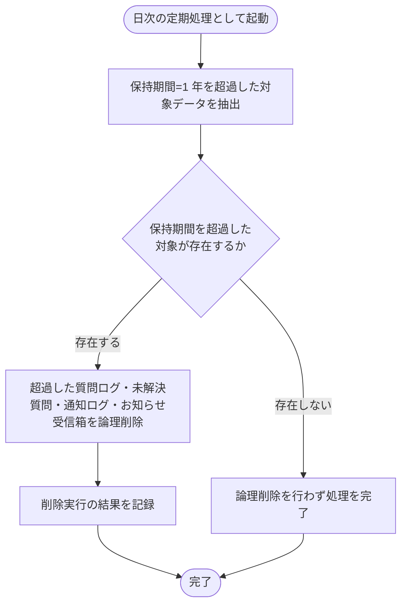

# SYS-034: 保持期間超過データの自動論理削除

> **このページは、データ保持期間(1 年)を超過した質問ログ・未解決質問・通知ログ・お知らせ受信箱を日次で抽出し自動で論理削除するシステム処理 SYS-034 を定義します。** 処理概要 / 処理フロー図 / 入出力 / 処理項目定義 / 入出力一覧 / システムイベント一覧 の 6 セクションで記述します。

*種別 システム設計 ・ 優先度 P0 ・ ステータス ドラフト*

## 1. 処理概要

本処理は対応業務UCを持たず、データ保持期間(1 年)の非機能要件 NFR-045 / NFR-049 を根拠とする保持削除バッチである。システムは日次の定期処理として、保持期間(1 年)を超過した質問ログ・未解決質問・通知ログ・お知らせ受信箱を抽出し、これらを論理削除する。削除実行の結果は記録し、対象が存在しない場合は何も削除せず処理を完了する。

| システム ID | 処理名 | 種別 | トリガー / スケジュール | 機能概要 |
|---|---|---|---|---|
| `SYS-034` | 保持期間超過データの自動論理削除 | batch | 日次の定期処理 | 保持期間(1 年)を超過した質問ログ・未解決質問・通知ログ・お知らせ受信箱を抽出して論理削除し、削除結果を記録する |

| 関連 | 内容 |
|---|---|
| 機能要件 (FR) | — |
| 業務要件 (BR) | — |
| 業務ルール (RULE) | — |
| 非機能要件 (NFR) | [NFR-045](../../../01_requirements/03_non_functional_requirement/07_nfr.md#NFR-045) ・ [NFR-049](../../../01_requirements/03_non_functional_requirement/07_nfr.md#NFR-049) |
| 関連システム | — |
| 対応業務UC | — |

## 2. 処理フロー図

## 3. 入出力

| 区分 | 内容 |
|---|---|
| 入力ソース | 保持期間(1 年)を超過した質問ログ・未解決質問・通知ログ・お知らせ受信箱の各履歴データ |
| 出力先 | 対象データへの論理削除の反映、削除実行結果の記録 |

## 4. 処理項目定義

| 項目 ID | ステップ | 説明 | 種別 | 実行条件 |
|---|---|---|---|---|
| `PR-01` | 超過データ抽出 | 保持期間(1 年)を超過した質問ログ・未解決質問・通知ログ・お知らせ受信箱を抽出する | 判定 | 日次の定期処理として起動した場合 |
| `PR-02` | 論理削除 | 抽出した保持期間超過データを論理削除する | 更新 | 保持期間を超過した対象が存在する場合 |
| `PR-03` | 削除結果記録 | 論理削除を実行した結果を記録する | 記録 | 論理削除を実行した場合 |

## 5. 入出力一覧

本処理は保持期間を超過した質問ログ・通知ログを論理削除する。対象テーブルへの反映を通じて保持期間超過データを利用できない状態にする。

| 入出力 | 説明 | 種別 | I/O | CRUD | 参照 |
|---|---|---|---|---|---|
| 質問ログ | 保持期間(1 年)を超過した質問ログ・未解決質問を抽出し論理削除する | テーブル | 出力 | `- - U -` | [TBL-025](../04_database/TBL-025.md#TBL-025) |
| 通知ログ | 保持期間(1 年)を超過した通知ログを抽出し論理削除する | テーブル | 出力 | `- - U -` | [TBL-026](../04_database/TBL-026.md#TBL-026) |

## 6. システムイベント一覧

| SEV-ID | イベント ID | 項目 ID | イベント | 処理 |
|---|---|---|---|---|
| SEV-065 | `SE-01` | [PR-02](#PR-02) | 保持期間超過データの論理削除 | 保持期間(1 年)を超過した質問ログ・未解決質問・通知ログ・お知らせ受信箱を論理削除する |
| SEV-066 | `SE-02` | [PR-03](#PR-03) | 削除実行結果の記録 | 論理削除を実行した結果を記録する |

## 詳細設計への移管候補

- 保持期間(1 年)を超過する対象テーブルの網羅範囲(質問ログ・通知ログ以外を含む全体)と、対象ごとの保持期間起点の確定は詳細設計で定める。
- 1 回の実行で処理する削除単位(逐次・一括・分割)と、大量データ時の冪等性・再実行性は詳細設計で定める。
- 論理削除から物理削除へ移行する契機・猶予期間との関係は詳細設計で定める。
- 日次の定期処理の実行スケジュール詳細(実行時刻・多重起動防止・失敗時の再実行)は詳細設計で定める。
