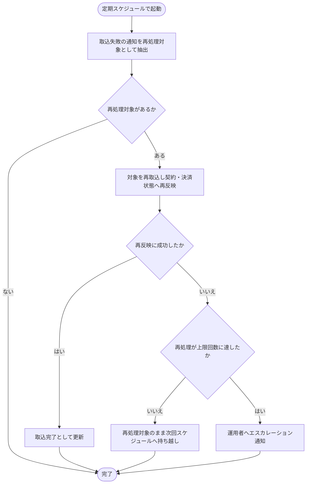

# SYS-035: 課金通知 取込失敗の再処理

> **このページは、課金プロバイダ通知の取込に失敗して再処理対象となった分を、定期スケジュールで拾って再取込・再反映し、再処理が上限回数に達した分を運用者へエスカレーションするシステム処理 SYS-035 を定義します。** 処理概要 / 処理フロー図 / 入出力 / 処理項目定義 / 入出力一覧 / システムイベント一覧 の 6 セクションで記述します。

*種別 システム設計 ・ 優先度 P0 ・ ステータス ドラフト*

## 1. 処理概要

[SYS-006](SYS-006.md#SYS-006) が取込に失敗した通知を再処理対象として記録するのに対し、本処理はその失敗分を定期スケジュールで拾い直し、再取込して契約・決済状態へ再反映する後段バッチである。再反映に成功した分は取込完了として更新し、再処理を繰り返しても成功せず上限回数に達した分は運用者へエスカレーション通知する。

| システム ID | 処理名 | 種別 | トリガー / スケジュール | 機能概要 |
|---|---|---|---|---|
| `SYS-035` | 課金通知 取込失敗の再処理 | batch | 定期スケジュール | 取込失敗として記録された通知を定期的に抽出し、再取込して契約・決済状態へ再反映する。成功分は取込完了として更新し、再処理が上限回数に達した分は運用者へエスカレーション通知する |

| 関連 | 内容 |
|---|---|
| 関連システム | [SYS-006](SYS-006.md#SYS-006) |
| トレーサビリティID | [TR-060](../../00_traceability/index.md#TR-060) |

## 2. 処理フロー図

## 3. 入出力

| 区分 | 内容 |
|---|---|
| 入力ソース | 定期スケジュール起動と、取込失敗として記録された受信ログ(再処理対象) |
| 出力先 | 受信ログの取込状態の更新、再処理上限到達時の運用通知 |

## 4. 処理項目定義

| 項目 ID | ステップ | 説明 | 種別 | 実行条件 |
|---|---|---|---|---|
| `PR-01` | 再処理対象の抽出 | 取込失敗として記録された通知を再処理対象として抽出する | 判定 | 定期スケジュール起動時 |
| `PR-02` | 再取込・再反映 | 抽出した対象を再取込し、契約・決済状態へ再反映する | 更新 | 再処理対象があるとき |
| `PR-03` | 取込完了への更新 | 再反映に成功した通知を取込完了として更新する | 記録 | 再反映に成功 |
| `PR-04` | 上限到達エスカレーション | 再処理を繰り返しても成功せず上限回数に達した通知を運用者へエスカレーション通知する | 例外 | 再処理が上限回数に達したとき |

## 5. 入出力一覧

各処理項目が読み書きする外部 IF・テーブルの対応を示す。

| 入出力 | 説明 | 種別 | I/O | CRUD | 参照 |
|---|---|---|---|---|---|
| 受信ログ | 取込失敗の通知を再処理対象として参照し、再反映の結果に応じて取込状態を更新する | テーブル | 入出力 | `- R U -` | [TBL-032](../04_database/TBL-032.md#TBL-032) |
| 再処理上限到達の運用通知 | 再処理が上限回数に達した通知を運用者へ知らせる | 横断 | 出力 | — | [MSG-013](../../06_messages/MSG-013.md#MSG-013) |

## 6. システムイベント一覧

| SEV-ID | イベント ID | 項目 ID | イベント | 処理 |
|---|---|---|---|---|
| SEV-068 | `SE-01` | [PR-02](#PR-02) | 取込失敗通知の再処理 | 取込失敗として記録された通知を抽出し、再取込して契約・決済状態へ再反映し、成功分を取込完了として更新する |
| SEV-069 | `SE-02` | [PR-04](#PR-04) | 再処理上限到達のエスカレーション | 再処理を繰り返しても成功せず上限回数に達した通知を運用者へエスカレーション通知する |

## 詳細設計への移管候補

- 再試行間隔・最大再処理回数・バックオフ方式などの再処理パラメータ。
- 再取込・再反映の冪等性確保(重複反映の防止)。
- 再処理対象の抽出範囲(保持期間・件数上限・優先順位)。
- 上限到達エスカレーションの通知先・通知抑止(同一対象の重複通知防止)。
