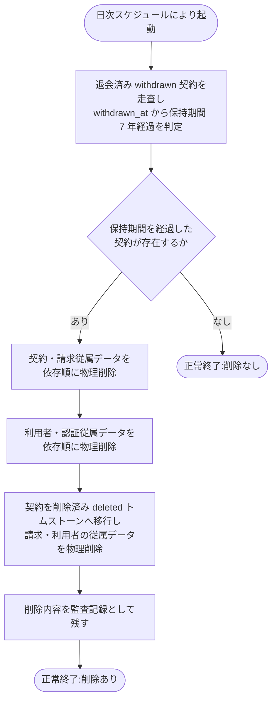

# SYS-036: 保持期間経過契約の物理削除

> **このページは、退会日(`withdrawn_at`)から保持期間(7 年)を経過した退会済み契約の契約・請求関連データおよび利用者・認証従属を依存関係の順序に従って物理削除し、契約を削除済み(`deleted`)へ移行して以後ログイン不可とするシステム処理 SYS-036 を定義します。** 処理概要 / 処理フロー図 / 入出力 / 処理項目定義 / 入出力一覧 / システムイベント一覧 の 6 セクションで記述します。

*種別 システム設計 ・ 優先度 P0 ・ ステータス ドラフト*

## 1. 処理概要

退会済み(`status='withdrawn'`)契約のうち、退会日 `withdrawn_at` から契約・請求関連データの保持期間(7 年・[RULE-022](../../../01_requirements/01_business_requirement/08_rule.md#RULE-022))を経過したものを、日次で走査して抽出する。抽出した契約の契約・請求関連データ(契約 `M_CONTRACT`・サブスクリプション・請求書・課金Webhook受信ログ・退会記録・支払方法・課金関連の監査記録)および当該契約に紐づく利用者・認証従属(利用者 `M_USER`・セッション・アクセストークン・規約同意)のうち請求・利用者・認証の従属データを依存関係の順序に従って物理削除し、契約 `M_CONTRACT` は識別子の再利用防止(NFR-051)のため `status='deleted'`(`valid=0`)の最小限のトムストーンへ移行する。利用者データの物理削除と退会済み状態により、当該契約のオーナーは以後ログインできない。削除内容は監査記録として残す。保持期間を経過した契約が無い場合は削除を行わず正常終了する。

退会済み契約の**運用データ**(FAQ・プロジェクト・質問ログ・利用量・通知・お知らせ受信箱など)は退会時に速やかに削除済みであり([SYS-029](SYS-029.md#SYS-029) が担当)、本処理は契約・請求・利用者・監査の保持対象データを保持期間経過後に確定削除する役割を担う。なお保持期間(1 年)超過のログ系データ削除は [SYS-034](SYS-034.md#SYS-034) が別途担う。

削除順序は、外部キー(FK)の親子関係に基づき**子(参照する側)→親(参照される側)**の順とする([DB 設計の ER 図](../04_database/index.md)の `M_USER ||--o| M_CONTRACT`(`M_CONTRACT.user_id → M_USER.id`)を正本)。参照される側(`M_USER`)を最後に削除し、FK 制約違反を避ける。対象テーブルと削除順序は次のとおり(設計値):

1. 契約配下の契約・請求従属データ: サブスクリプション `T_BILL_SUBS`(TBL-018)/ 請求書 `T_BILL_INVOICES`(TBL-019)/ 課金Webhook受信ログ `T_BILLING_WEBHOOK_LOG`(TBL-032)/ 退会記録 `T_WITHDRAW_REQ`(TBL-023)/ 支払方法・課金関連の監査記録。
2. 利用者配下の認証従属データ: セッション `T_SESSIONS`(TBL-013)/ アクセストークン `T_ACCESS_TOKENS`(TBL-014)/ 規約同意 `T_TERMS_AGREE`(TBL-024)。
3. 契約 `M_CONTRACT`(TBL-002)。**`status='deleted'`(`valid=0`)へ移行し、識別子非再利用(NFR-051)のため最小限のトムストーンとして残す**(請求・利用者・認証の従属データは物理削除する)。
4. 利用者 `M_USER`(TBL-001)。**最後に削除する**(他テーブルの参照先のため)。

上記は基本設計時点での網羅順序(設計値)であり、テーブルごとの個別削除手順・FK 制約の `ON DELETE` 設定・契約状態の `deleted` 移行と物理削除の前後関係は詳細設計で確定する。課金関連を含む監査記録 `H_AUDIT_LOGS`(TBL-027)のうち削除内容の記録は保持し、保持義務を満たす範囲で扱う。

| システム ID | 処理名 | 種別 | トリガー / スケジュール | 機能概要 |
|---|---|---|---|---|
| `SYS-036` | 保持期間経過契約の物理削除 | batch | 日次の実行スケジュールによる自動起動 | 退会日から保持期間(7 年)を経過した退会済み契約の契約・請求・利用者データを依存順に物理削除し、契約を削除済み(`deleted`)へ移行して以後ログイン不可とし、削除内容を監査記録に残す |

| 関連 | 内容 |
|---|---|
| 関連システム | [SYS-029](SYS-029.md#SYS-029)(退会済み契約の運用データ物理削除)・[SYS-034](SYS-034.md#SYS-034)(保持期間 1 年超過データ削除) |
| トレーサビリティID | [TR-089](../../00_traceability/index.md#TR-089) |

## 2. 処理フロー図

## 3. 入出力

| 区分 | 内容 |
|---|---|
| 入力ソース | 日次の実行スケジュール(自動起動)、退会済み(`withdrawn`)状態かつ退会日 `withdrawn_at` から保持期間(7 年)を経過した契約とそれに紐づく契約・請求・利用者・認証データ |
| 出力先 | 物理削除された契約・請求・利用者・認証データ(不可逆)、契約状態の削除済み(`deleted`)への移行、削除内容の監査記録 |

## 4. 処理項目定義

| 項目 ID | ステップ | 説明 | 種別 | 実行条件 |
|---|---|---|---|---|
| `PR-01` | 削除対象走査 | 退会済み(`status='withdrawn'`)契約を走査し、退会日 `withdrawn_at` から保持期間(7 年)を経過したものを物理削除の対象として抽出する | 判定 | — |
| `PR-02` | 契約・請求従属の物理削除 | 抽出した契約の契約・請求従属データ(サブスク・請求書・課金Webhook受信ログ・退会記録・支払方法・課金関連監査)を依存順に物理削除する | 更新 | 削除対象が存在するとき |
| `PR-03` | 利用者・認証従属の物理削除 | 当該契約に紐づく利用者の認証従属データ(セッション・アクセストークン・規約同意)を依存順に物理削除する | 更新 | 削除対象が存在するとき |
| `PR-04` | 契約・利用者の物理削除 | 契約を削除済み(`status='deleted'`)へ移行のうえ、契約・利用者を依存順(契約 → 利用者)に物理削除する | 更新 | 削除対象が存在するとき |
| `PR-05` | 監査記録 | 削除した内容を監査記録として残す | 記録 | 削除を実施したとき |
| `PR-06` | 対象なし正常終了 | 保持期間を経過した契約が存在しない場合は削除を行わず正常終了する | 例外 | 削除対象が存在しないとき |

## 5. 入出力一覧

本処理が走査・物理削除の対象とする契約・請求・利用者・認証データと、削除内容を残す監査記録のテーブルを示す。運用データは [SYS-029](SYS-029.md#SYS-029) が退会時に削除済み。

| 入出力 | 説明 | 種別 | I/O | CRUD | 参照 |
|---|---|---|---|---|---|
| 契約(M_CONTRACT) | 退会日 `withdrawn_at` から 7 年経過した退会済み契約を走査・抽出し、削除済み(`deleted`)へ移行のうえ依存順(利用者より先)に物理削除する | テーブル | 出力 | `- R U D` | [TBL-002](../04_database/TBL-002.md#TBL-002) |
| 利用者(M_USER) | 当該契約に紐づく利用者を依存順(最後)に物理削除する | テーブル | 出力 | `- R - D` | [TBL-001](../04_database/TBL-001.md#TBL-001) |
| 契約・請求従属データ | サブスク・請求書・課金Webhook受信ログ・退会記録を依存順(契約より先)に物理削除する | テーブル | 出力 | `- R - D` | [TBL-018](../04_database/TBL-018.md#TBL-018) [TBL-019](../04_database/TBL-019.md#TBL-019) [TBL-023](../04_database/TBL-023.md#TBL-023) [TBL-032](../04_database/TBL-032.md#TBL-032) |
| 利用者・認証従属データ | セッション・アクセストークン・規約同意を依存順(利用者より先)に物理削除する | テーブル | 出力 | `- R - D` | [TBL-013](../04_database/TBL-013.md#TBL-013) [TBL-014](../04_database/TBL-014.md#TBL-014) [TBL-024](../04_database/TBL-024.md#TBL-024) |
| 監査記録 | 削除した内容を監査記録として残す(課金関連監査は保持義務の範囲で扱う) | テーブル | 出力 | `C - - -` | [TBL-027](../04_database/TBL-027.md#TBL-027) |

## 6. システムイベント一覧

| SEV-ID | イベント ID | 項目 ID | イベント | 処理 |
|---|---|---|---|---|
| SEV-070 | `SE-01` | [PR-02](#PR-02) | 契約・請求従属の物理削除 | 保持期間経過契約の契約・請求従属データを依存順に物理削除する |
| SEV-071 | `SE-02` | [PR-03](#PR-03) | 利用者・認証従属の物理削除 | 当該契約の利用者の認証従属データを依存順に物理削除する |
| SEV-072 | `SE-03` | [PR-04](#PR-04) | 契約・利用者の物理削除 | 契約を削除済み(`deleted`)へ移行のうえ契約・利用者を物理削除する |
| SEV-073 | `SE-04` | [PR-05](#PR-05) | 監査記録 | 削除した内容を監査記録として残す |

## 詳細設計への移管候補

- 子→親の削除順序とテーブル網羅範囲は §1 で示す(設計値)。テーブルごとの個別削除手順・FK 制約の `ON DELETE` 設定・1 トランザクションの分割粒度は詳細設計で定める。
- 契約状態の削除済み(`deleted`)移行と物理削除の前後関係・整合の取り方(状態更新後に物理削除するか、論理状態を残すか)は詳細設計で確定する。
- 支払方法・課金関連監査の削除範囲(保持義務を満たす最小限の記録の扱い)は詳細設計で確定する。
- 対象の削除が失敗した場合の中止・再評価のリトライ方式。
