# データベース設計書

**メインシステムのデータベース(Cloudflare D1 / SQLite)全 33 テーブルを機能ドメイン別に定義する設計書です。** 全ユーザーは `M_USER` で管理し、プロジェクトの所有(オーナー=作成者)は `M_PROJECTS.owner_user_id`、課金はユーザー単位の `M_BILLING_ACCOUNT` で管理します。立場(オーナー / メンバー)はプロジェクトごとに決まります。各テーブルの詳細はテーブル名のリンクから辿れます。

*版数 v3.8 ・ 更新 2026-06-26 ・ テーブル数 33 ・ 独立設計書*

## 1.データストア構成

D1
<h4>Cloudflare D1(SQLite)</h4>
全 33 テーブル。テナント境界は <code>project_id</code>(<code>M_PROJECTS.id</code>)、プロジェクト所有は <code>owner_user_id</code>、課金はユーザー単位の <code>M_BILLING_ACCOUNT</code> で表す。

KV
<h4>Workers KV</h4>
セッション / トークン / レート制限のキャッシュ。

R2
<h4>R2 オブジェクト</h4>
CSV 添付・ウィジェット静的アセット。

## 2.テーブル一覧

全 33 テーブルを 7 ドメインに分類しています。テーブル名は個別ページ(概要 / カラム定義 / インデックス / コード値)へのリンクです。

#### 認証・アカウント・課金アカウント (7)

全ユーザーの認証(M_USER)、ユーザー単位の課金アカウント(M_BILLING_ACCOUNT)、プロジェクトメンバー割当、セッション・トークン・規約。プロジェクトの所有(オーナー=作成者)は `M_PROJECTS.owner_user_id` で表す。

| 物理名 | 論理名 | 分類 | 保持基準 | 概要 |
|----|----|----|----|----|
| [`M_USER`](TBL-001.md) | ユーザーマスタ | マスタ | [システム仕様書 §4](../../07_system-spec.md#4-データ保持期間削除猶予) | オーナー・メンバーを含む全ユーザーの認証情報を一元保持。 |
| [`M_BILLING_ACCOUNT`](TBL-002.md) | 課金アカウントマスタ | マスタ | [システム仕様書 §4](../../07_system-spec.md#4-データ保持期間削除猶予) | ユーザー単位の課金アカウント(user_id ごとに 1 件)。サブスク・支払方法・請求・課金状態を束ねる。所有・ロール判定には用いない。 |
| [`M_PRJ_USERS`](TBL-003.md) | プロジェクトメンバー(割当) | マスタ | [システム仕様書 §4](../../07_system-spec.md#4-データ保持期間削除猶予) | ユーザーをプロジェクトへ割り当て(役割差は持たない)。 |
| [`T_SESSIONS`](TBL-013.md) | セッション | トランザクション | [システム仕様書 §4](../../07_system-spec.md#4-データ保持期間削除猶予) | 複数デバイス対応のログインセッション。 |
| [`T_ACCESS_TOKENS`](TBL-014.md) | アクセストークン | トランザクション | [システム仕様書 §4](../../07_system-spec.md#4-データ保持期間削除猶予) | 招待・パスワード再設定・メール確認などの短期トークン。 |
| [`M_TERMS_VER`](TBL-012.md) | 規約版数 | マスタ | [システム仕様書 §4](../../07_system-spec.md#4-データ保持期間削除猶予) | 利用規約・プライバシーポリシーの版。 |
| [`T_TERMS_AGREE`](TBL-024.md) | 規約同意 | トランザクション | [システム仕様書 §4](../../07_system-spec.md#4-データ保持期間削除猶予) | 利用者ごとの規約同意履歴。 |
#### プロジェクト・ウィジェット (3)

FAQ プロジェクト本体(オーナー=作成者が所有)、許可ドメイン、ウィジェット鍵。

| 物理名 | 論理名 | 分類 | 保持基準 | 概要 |
|----|----|----|----|----|
| [`M_PROJECTS`](TBL-004.md) | プロジェクト | マスタ | [システム仕様書 §4](../../07_system-spec.md#4-データ保持期間削除猶予) | FAQ プロジェクトとウィジェット設定。owner_user_id でオーナー(作成者)を表す。 |
| [`M_ALLOWED_DOMAINS`](TBL-005.md) | 許可ドメイン | マスタ | [システム仕様書 §4](../../07_system-spec.md#4-データ保持期間削除猶予) | ウィジェット埋め込みを許可するドメイン。 |
| [`T_PRJ_LEGACY_KEYS`](TBL-015.md) | レガシー API キー | トランザクション | [システム仕様書 §4](../../07_system-spec.md#4-データ保持期間削除猶予) | 鍵ローテーション時の旧キーを保持。具体値は [システム仕様書 §4](../../07_system-spec.md#4-データ保持期間削除猶予) を参照。 |
#### FAQ・質問・未解決 (7)

FAQ 本体と全文検索、質問ログ、参照 FAQ、未解決質問、FAQ 化履歴、CSV 一括取込ジョブ。

| 物理名 | 論理名 | 分類 | 保持基準 | 概要 |
|----|----|----|----|----|
| [`M_FAQS`](TBL-006.md) | FAQ | マスタ | [システム仕様書 §4](../../07_system-spec.md#4-データ保持期間削除猶予) | FAQ 本体(質問・回答・公開状態)。テナント境界は project_id で表す。 |
| [`TP_FAQ_FTS`](TBL-030.md) | FAQ 全文検索 | ワーク | —(M_FAQS派生) | FTS5 仮想テーブル(trigram)。 |
| [`H_QUESTION_LOGS`](TBL-025.md) | 質問ログ | 履歴 | [システム仕様書 §4](../../07_system-spec.md#4-データ保持期間削除猶予) | ウィジェット利用者の質問と AI 推論結果。 |
| [`T_QLOG_FAQ_REFS`](TBL-016.md) | 参照 FAQ(M:N) | トランザクション | [システム仕様書 §4](../../07_system-spec.md#4-データ保持期間削除猶予) | 質問ログと参照 FAQ の中間テーブル。 |
| [`T_INQUIRIES`](TBL-017.md) | 未解決質問 | トランザクション | [システム仕様書 §4](../../07_system-spec.md#4-データ保持期間削除猶予) | FAQ 登録前の未解決質問。 |
| [`H_INQUIRY_FAQ`](TBL-029.md) | 未解決質問 FAQ 化履歴 | 履歴 | [システム仕様書 §4](../../07_system-spec.md#4-データ保持期間削除猶予) | 未解決質問から FAQ への移行履歴(データコピー方式)。 |
| [`TP_IMPORT_JOBS`](TBL-033.md) | FAQ取込ジョブ | ワーク | [システム仕様書 §4](../../07_system-spec.md#4-データ保持期間削除猶予) | FAQ CSV 一括取込ジョブの状態・進捗・結果サマリ。 |
#### 利用量・課金・上限 (6)

利用量計測、サブスク・請求書、利用上限・無料枠、課金 Webhook 受信ログ。

| 物理名 | 論理名 | 分類 | 保持基準 | 概要 |
|----|----|----|----|----|
| [`T_USAGE_METER`](TBL-020.md) | 利用量計測 | トランザクション | [システム仕様書 §4](../../07_system-spec.md#4-データ保持期間削除猶予) | 質問数・FAQ 件数をプロジェクト単位で計測しオーナー単位で集計。 |
| [`T_BILL_SUBS`](TBL-018.md) | 課金サブスクリプション | トランザクション | [システム仕様書 §4](../../07_system-spec.md#4-データ保持期間削除猶予) | Stripe サブスクと連動(課金アカウント単位)。 |
| [`T_BILL_INVOICES`](TBL-019.md) | 請求書 | トランザクション | [システム仕様書 §4](../../07_system-spec.md#4-データ保持期間削除猶予) | 月次請求書。課金アカウント=オーナー単位、各プロジェクト内訳は明細で保持。 |
| [`T_BILLING_WEBHOOK_LOG`](TBL-032.md) | 課金Webhook受信ログ | トランザクション | [システム仕様書 §4](../../07_system-spec.md#4-データ保持期間削除猶予) | 課金プロバイダ通知の受信・検証・取込状態を記録(重複検出・失敗再処理)。 |
| [`M_PRJ_QUOTA_LIMITS`](TBL-009.md) | プロジェクト別利用設定 | マスタ | [システム仕様書 §4](../../07_system-spec.md#4-データ保持期間削除猶予) | 質問数の月次上限・無料枠・アラート。 |
| [`M_OWNER_QUOTA_OVR`](TBL-008.md) | オーナー別レート上書き | マスタ | [システム仕様書 §4](../../07_system-spec.md#4-データ保持期間削除猶予) | オーナー単位のレート制限上書き(owner_user_id 単位)。 |
#### お知らせ・通知 (5)

運営お知らせ、配信対象、受信者集計、受信箱、メール通知ログ。

| 物理名 | 論理名 | 分類 | 保持基準 | 概要 |
|----|----|----|----|----|
| [`M_SERVICE_ANNOUNCE`](TBL-010.md) | お知らせ(Control Plane) | マスタ | [システム仕様書 §4](../../07_system-spec.md#4-データ保持期間削除猶予) | お知らせ本体。 |
| [`M_ANNOUNCE_AUD`](TBL-011.md) | お知らせ配信対象(M:N) | マスタ | [システム仕様書 §4](../../07_system-spec.md#4-データ保持期間削除猶予) | 配信先を限定指定(対象ユーザー)。 |
| [`T_ANNOUNCE_RCPT`](TBL-021.md) | お知らせ受信者 | トランザクション | [システム仕様書 §4](../../07_system-spec.md#4-データ保持期間削除猶予) | 実配信先・配信集計・監査。 |
| [`T_INBOX_MSG`](TBL-022.md) | 受信箱(Tenant Plane) | トランザクション | [システム仕様書 §4](../../07_system-spec.md#4-データ保持期間削除猶予) | 利用者が受け取る通知の既読状態。 |
| [`H_NOTIF_LOGS`](TBL-026.md) | 通知ログ | 履歴 | [システム仕様書 §4](../../07_system-spec.md#4-データ保持期間削除猶予) | メール通知の送信履歴。 |
#### 退会・データ管理 (1)

即時退会の実行記録とデータ削除モード。

| 物理名 | 論理名 | 分類 | 保持基準 | 概要 |
|----|----|----|----|----|
| [`T_WITHDRAW_REQ`](TBL-023.md) | 退会記録 | トランザクション | [システム仕様書 §4](../../07_system-spec.md#4-データ保持期間削除猶予) | 即時退会(アカウント単位)の実行記録(退会日時・退会者・理由・削除予定日)。 |
#### システム・ログ・運用 (4)

監査ログ、エラーログ、メールサプレス、AI しきい値キャッシュ。

| 物理名 | 論理名 | 分類 | 保持基準 | 概要 |
|----|----|----|----|----|
| [`H_AUDIT_LOGS`](TBL-027.md) | 監査ログ | 履歴 | [システム仕様書 §4](../../07_system-spec.md#4-データ保持期間削除猶予) | メイン側 API 操作ログ。 |
| [`H_ERROR_LOGS`](TBL-028.md) | エラーログ | 履歴 | [システム仕様書 §4](../../07_system-spec.md#4-データ保持期間削除猶予) | サーバーエラー記録。 |
| [`M_EMAIL_SUPPRESS`](TBL-007.md) | メールサプレスリスト | マスタ | 恒久(抑制継続) | バウンス・苦情アドレス(全アカウント横断)。 |
| [`TP_AI_THRESH_CACHE`](TBL-031.md) | AI しきい値キャッシュ | ワーク | 短期(キャッシュ) | プロジェクトごとの AI しきい値設定値の永続キャッシュ。 |

> [!NOTE]
> **保持期間**は論理削除(ログ系は記録)から物理削除までの保持基準です。具体値と区分の正本は [システム仕様書 §4](../../07_system-spec.md#4-データ保持期間削除猶予) とし、本一覧では値を持ちません。物理削除は [SYS-027](../01_system/SYS-027.md#SYS-027)・[SYS-032](../01_system/SYS-032.md#SYS-032)・[SYS-034](../01_system/SYS-034.md#SYS-034) が保持期間を判定して実施します。

> [!NOTE]
> **退会時の扱い(2 区分)** アカウント退会時の運用データとアカウント・課金・請求データの扱いは [システム仕様書 §4](../../07_system-spec.md#4-データ保持期間削除猶予) を正本とします。本一覧では各テーブルが参照すべき保持基準のみを示し、具体的な保持値は記載しません。

## 3.ER 図(親子関係)

全 33 テーブルの親子関係を、機能ドメイン別の ER 図で示します。

**(1) アカウント・所有・メンバー**

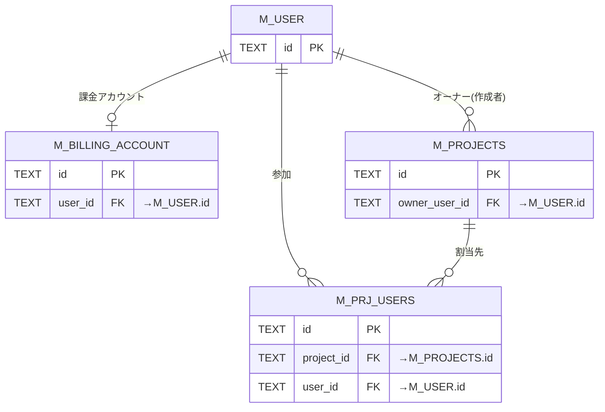

**(2) 認証 — セッション**

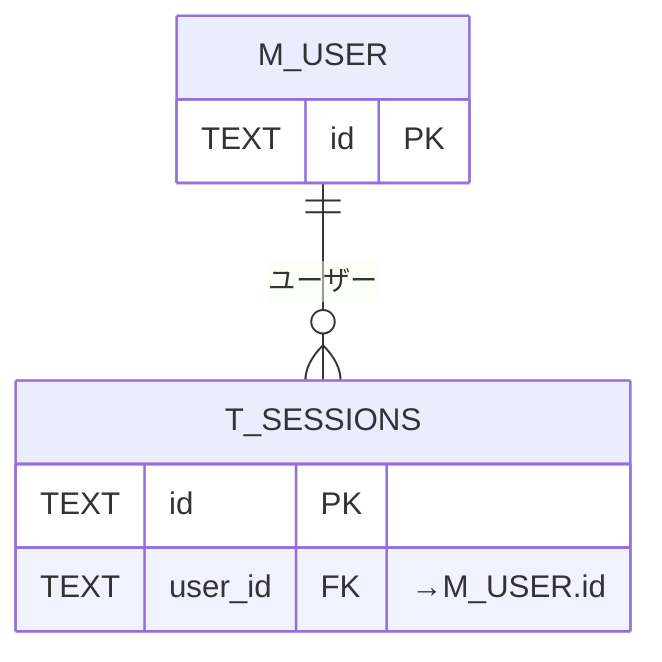

**(3) 認証 — トークン**

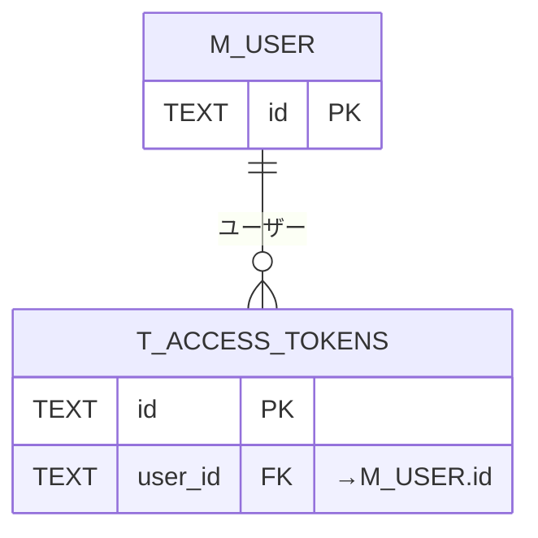

**(4) 認証 — 規約同意**

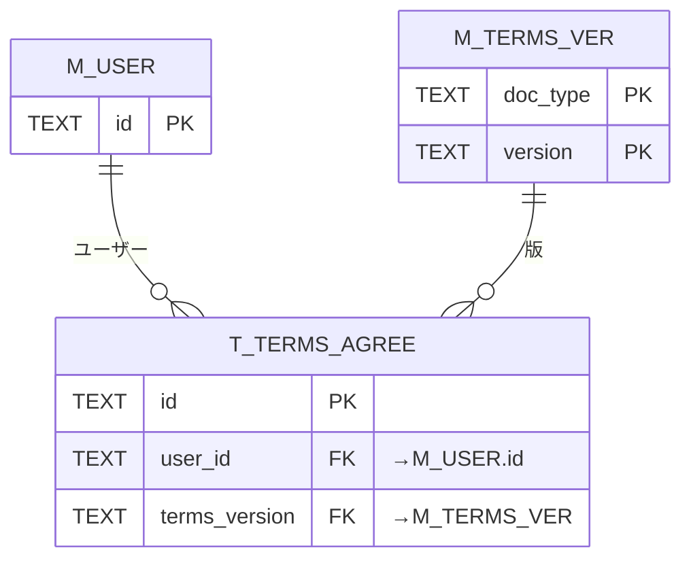

**(5) プロジェクト・ウィジェット**

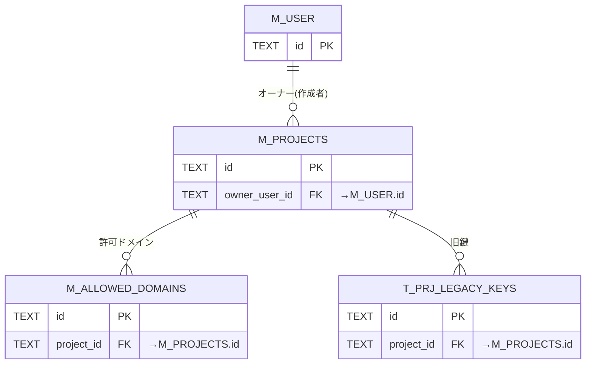

**(6) FAQ**

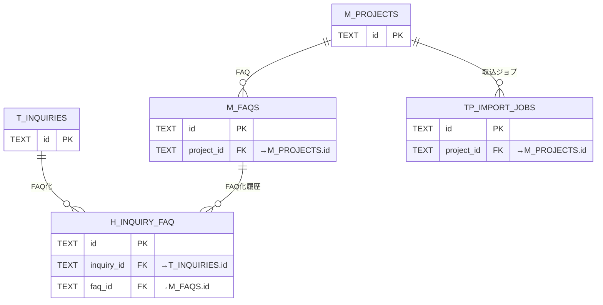

**(7) 質問ログ・参照 FAQ**

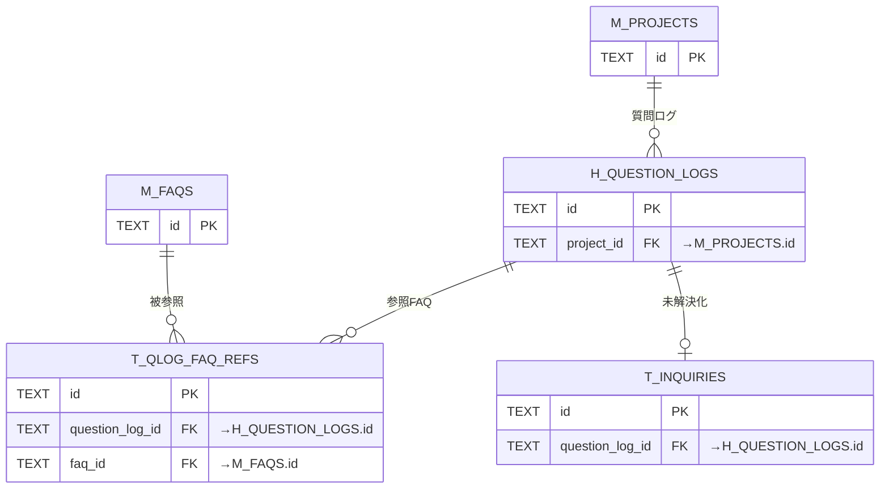

**(8) 未解決質問**

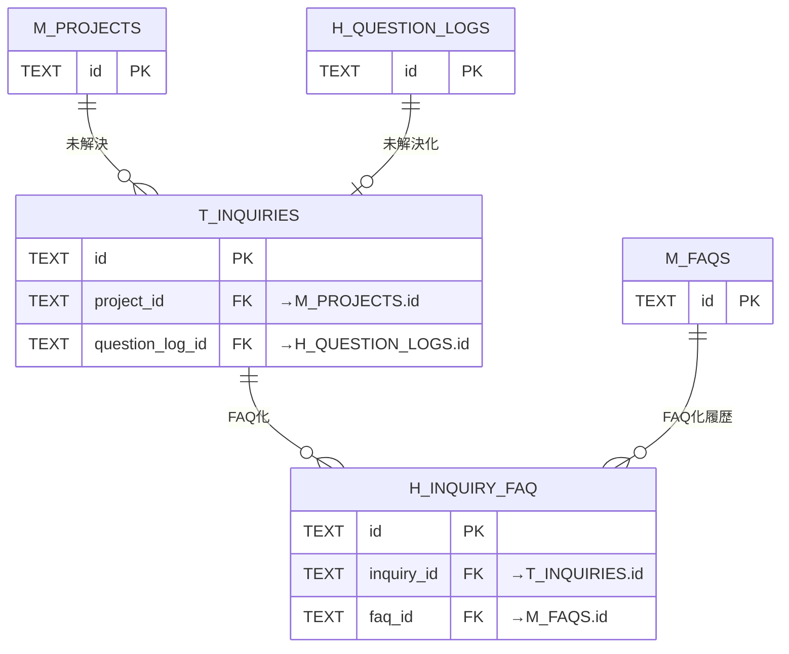

**(9) 利用量・課金・上限**

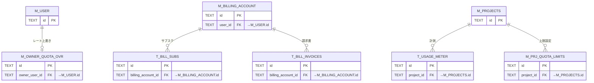

**(10) お知らせ・通知**

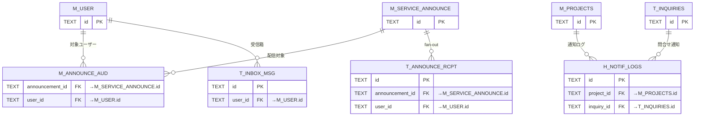

**(11) 退会・データ管理**

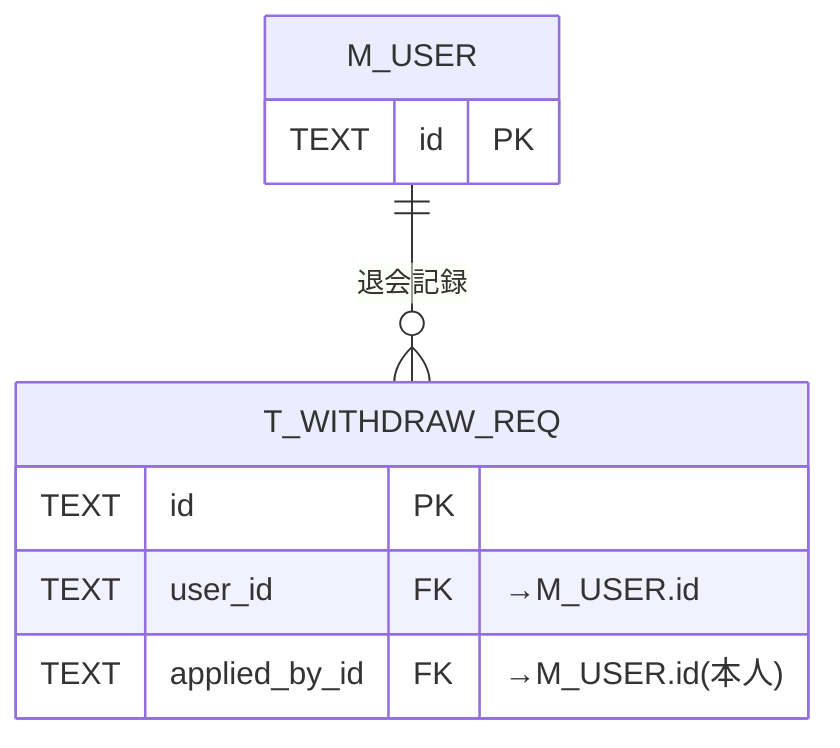

**(12) システム・ログ・運用**

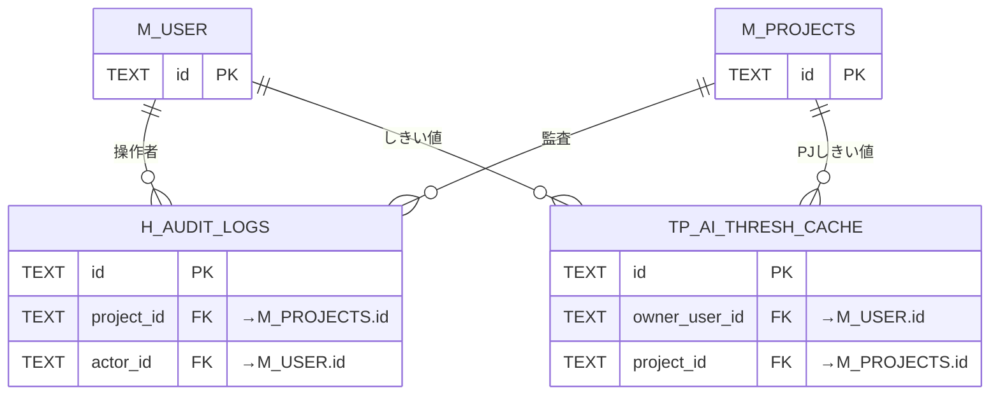

## 4.テーブル↔API / 業務UC 対応

テーブルを読み書きする API と参照する業務ユースケースの対応は [トレーサビリティ一覧](../../00_traceability/index.md#matrix-main) の「データベース」列に一元化しました。各テーブルページの「トレーサビリティ」節からも該当 TR を辿れます。

## 5.読み順

1. 本ページ §2 テーブル一覧でドメイン全体像を把握する。
2. §3 ER 図で親子(オーナー `M_USER` → `M_PROJECTS`(owner_user_id) → 各テーブル、課金は `M_USER` → `M_BILLING_ACCOUNT`)を確認する。
3. テーブルの利用 API / 業務UC は [トレーサビリティ一覧](../../00_traceability/index.md#matrix-main) で確認する。
4. 各テーブルページ(`TBL-NNN.md`)で 項目 / カラム定義 / 制約 / インデックス / コード値 を確認する。
<!-- /p5-cross -->

## 6.命名・分類規約

| 接頭辞 | 分類             | 用途                 |
|--------|------------------|----------------------|
| `M_`   | マスタ           | マスタ・設定         |
| `T_`   | トランザクション | トランザクション     |
| `H_`   | 履歴             | 履歴・ログ(追記専用) |
| `TP_`  | ワーク           | ワーク・派生         |

### 6.1 共通データ規約(全テーブル共通)

各テーブルのカラム定義は本規約に従う。各テーブルページの「桁数」「制約」欄では、本規約と異なる場合のみ個別に明記する。

| 区分 | 規約 |
|---|---|
| 識別子(`id` / `*_id` の主キー・外部キー) | ULID(26 文字・Crockford Base32 の `TEXT`)。桁数欄は `26`。 |
| 日時(`*_at`) | ISO 8601 拡張形式・UTC・秒精度の文字列(例 `2026-06-24T08:00:00Z`)を `TEXT` で保持。表示時に JST へ変換(NFR 準拠)。 |
| 真偽 | `INTEGER` の `0` / `1`(`valid` など)。 |
| 文字列の桁 | 桁数欄に上限文字数を明記する。可変テキストは対応するバリデーション・業務ルール(RULE)に準拠(例: FAQ は質問 500 / 回答 5,000 文字 = [RULE-011](../../../01_requirements/01_business_requirement/08_rule.md#RULE-011))。 |
| パスワードハッシュ(`password_hash`) | Argon2id のエンコード文字列(`TEXT`・最大 255 文字)。平文は保持しない。 |
| メール HMAC(`email_hmac`) | HMAC-SHA256 の Hex 表現(`TEXT`・64 文字)。 |
| JSON カラム(`settings` / `meta` / `metadata` / `alert_thresholds` 等) | JSON 文字列を `TEXT` に格納し、内部のキー・型・既定値・制約を当該テーブルページで定義する。 |
| コード値カラム(`status` / `*_code` / `*_type` 等) | 取りうる値を当該テーブルページの「コード値・区分値」で列挙する。 |
