# データベース設計書

**メインシステムのデータベース(Cloudflare D1 / SQLite)全 32 テーブルを機能ドメイン別に定義する設計書です。** 全ユーザーは `M_USER`、契約は `M_CONTRACT`(オーナー判定 + プロジェクトの親)で管理します。各テーブルの詳細はテーブル名のリンクから辿れます。

*版数 v3.6 ・ 更新 2026-06-21 ・ テーブル数 32 ・ 独立設計書*

## 1.データストア構成

D1
<h4>Cloudflare D1(SQLite)</h4>
全 32 テーブル。契約境界は <code>contract_id</code>(<code>M_CONTRACT.id</code>)で表す。

KV
<h4>Workers KV</h4>
セッション / トークン / レート制限のキャッシュ。

R2
<h4>R2 オブジェクト</h4>
CSV 添付・ウィジェット静的アセット。

## 2.テーブル一覧

全 32 テーブルを 7 ドメインに分類しています。テーブル名は個別ページ(概要 / カラム定義 / インデックス / コード値)へのリンクです。

#### 認証・アカウント・契約 (7)

全ユーザーの認証(M_USER)、契約とオーナー判定(M_CONTRACT)、プロジェクトメンバー割当、セッション・トークン・規約。

| 物理名 | 論理名 | 分類 / 保持 | 保持期間 | 概要 |
|----|----|----|----|----|
| [`M_USER`](TBL-001.md) | ユーザーマスタ | マスタ | 30日 | オーナー・メンバーを含む全ユーザーの認証情報を一元保持。 |
| [`M_CONTRACT`](TBL-002.md) | 契約マスタ | マスタ | 30日 | 契約を管理。id が契約境界キー、user_id でオーナーを判定。プロジェクトの親。 |
| [`M_PRJ_USERS`](TBL-003.md) | プロジェクトメンバー(割当) | マスタ | 30日 | ユーザーをプロジェクトへ割り当て(役割差は持たない)。 |
| [`T_SESSIONS`](TBL-013.md) | セッション | トランザクション | 30日 | 複数デバイス対応のログインセッション。 |
| [`T_ACCESS_TOKENS`](TBL-014.md) | アクセストークン | トランザクション | 30日 | 招待・パスワード再設定・メール確認などの短期トークン。 |
| [`M_TERMS_VER`](TBL-012.md) | 規約版数 | マスタ | 30日 | 利用規約・プライバシーポリシーの版。 |
| [`T_TERMS_AGREE`](TBL-024.md) | 規約同意 | トランザクション | 30日 | 利用者ごとの規約同意履歴。 |
#### プロジェクト・ウィジェット (3)

FAQ プロジェクト本体(契約の子)、許可ドメイン、ウィジェット鍵。

| 物理名 | 論理名 | 分類 / 保持 | 保持期間 | 概要 |
|----|----|----|----|----|
| [`M_PROJECTS`](TBL-004.md) | プロジェクト | マスタ | 30日 | FAQ プロジェクトとウィジェット設定。契約(M_CONTRACT)の子テーブル。 |
| [`M_ALLOWED_DOMAINS`](TBL-005.md) | 許可ドメイン | マスタ | 30日 | ウィジェット埋め込みを許可するドメイン。 |
| [`T_PRJ_LEGACY_KEYS`](TBL-015.md) | レガシー API キー | トランザクション | 30日 | 鍵ローテーション時に旧キーを 24 時間だけ有効化。 |
#### FAQ・質問・未解決 (6)

FAQ 本体と全文検索、質問ログ、参照 FAQ、未解決質問、FAQ 化履歴。

| 物理名 | 論理名 | 分類 / 保持 | 保持期間 | 概要 |
|----|----|----|----|----|
| [`M_FAQS`](TBL-006.md) | FAQ | マスタ | 30日 | FAQ 本体(質問・回答・公開状態)。契約境界は project_id で導出。 |
| [`TP_FAQ_FTS`](TBL-030.md) | FAQ 全文検索 | ワーク | 30日 | FTS5 仮想テーブル(trigram)。 |
| [`H_QUESTION_LOGS`](TBL-025.md) | 質問ログ | 履歴 | 1年 | ウィジェット利用者の質問と AI 推論結果。 |
| [`T_QLOG_FAQ_REFS`](TBL-016.md) | 参照 FAQ(M:N) | トランザクション | 1年 | 質問ログと参照 FAQ の中間テーブル。 |
| [`T_INQUIRIES`](TBL-017.md) | 未解決質問 | トランザクション | 30日 | FAQ 登録前の未解決質問。 |
| [`H_INQUIRY_FAQ`](TBL-029.md) | 未解決質問 FAQ 化履歴 | 履歴 | 1年 | 未解決質問から FAQ への移行履歴(データコピー方式)。 |
#### 利用量・課金・上限 (6)

利用量計測、サブスク・請求書(7 年保持)、利用上限・無料枠、課金 Webhook 受信ログ。

| 物理名 | 論理名 | 分類 / 保持 | 保持期間 | 概要 |
|----|----|----|----|----|
| [`T_USAGE_METER`](TBL-020.md) | 利用量計測 | トランザクション 課金7年 | 7年 | 質問数・FAQ 件数をプロジェクト単位で計測し契約単位で集計。 |
| [`T_BILL_SUBS`](TBL-018.md) | 課金サブスクリプション | トランザクション 課金7年 | 7年 | Stripe サブスクと連動。 |
| [`T_BILL_INVOICES`](TBL-019.md) | 請求書 | トランザクション 課金7年 | 7年 | 月次請求書(電子帳簿保存法 7 年)。 |
| [`T_BILLING_WEBHOOK_LOG`](TBL-032.md) | 課金Webhook受信ログ | トランザクション 課金 | 7年 | 課金プロバイダ通知の受信・検証・取込状態を記録(重複検出・失敗再処理)。 |
| [`M_PRJ_QUOTA_LIMITS`](TBL-009.md) | プロジェクト別利用設定 | マスタ | 30日 | 質問数の月次上限・無料枠・アラート。 |
| [`M_OWNER_QUOTA_OVR`](TBL-008.md) | 契約別レート上書き | マスタ | 30日 | 契約単位のレート制限上書き(contract 単位)。 |
#### お知らせ・通知 (5)

運営お知らせ、配信対象、受信者集計、受信箱、メール通知ログ。

| 物理名 | 論理名 | 分類 / 保持 | 保持期間 | 概要 |
|----|----|----|----|----|
| [`M_SERVICE_ANNOUNCE`](TBL-010.md) | お知らせ(Control Plane) | マスタ | 30日 | お知らせ本体。 |
| [`M_ANNOUNCE_AUD`](TBL-011.md) | お知らせ配信対象(M:N) | マスタ | 30日 | 配信先を限定指定。 |
| [`T_ANNOUNCE_RCPT`](TBL-021.md) | お知らせ受信者 | トランザクション | 30日 | 実配信先・配信集計・監査。 |
| [`T_INBOX_MSG`](TBL-022.md) | 受信箱(Tenant Plane) | トランザクション | 30日 | 利用者が受け取る通知の既読状態。 |
| [`H_NOTIF_LOGS`](TBL-026.md) | 通知ログ | 履歴 | 1年 | メール通知の送信履歴。 |
#### 退会・データ管理 (1)

退会申請(90 日猶予)とデータ削除モード。

| 物理名 | 論理名 | 分類 / 保持 | 保持期間 | 概要 |
|----|----|----|----|----|
| [`T_WITHDRAW_REQ`](TBL-023.md) | 退会申請 | トランザクション | 30日 | 退会申請レコード(90 日猶予)。 |
#### システム・ログ・運用 (4)

監査ログ、エラーログ、メールサプレス、AI しきい値キャッシュ。

| 物理名 | 論理名 | 分類 / 保持 | 保持期間 | 概要 |
|----|----|----|----|----|
| [`H_AUDIT_LOGS`](TBL-027.md) | 監査ログ | 履歴 一部課金 | 7年 | メイン側 API 操作ログ。 |
| [`H_ERROR_LOGS`](TBL-028.md) | エラーログ | 履歴 | 1年 | サーバーエラー記録。 |
| [`M_EMAIL_SUPPRESS`](TBL-007.md) | メールサプレスリスト | マスタ | 30日 | バウンス・苦情アドレス(全契約横断)。 |
| [`TP_AI_THRESH_CACHE`](TBL-031.md) | AI しきい値キャッシュ | ワーク | 30日 | 3 階層しきい値の永続キャッシュ。 |

> [!NOTE]
> **保持期間**は論理削除(ログ系は記録)から物理削除までの保持基準です。基本は **30 日**、システムログ(質問ログ・参照FAQ・通知ログ・エラーログ・FAQ化履歴)は **1 年**、課金・請求関連(利用量計測・サブスク・請求書・課金Webhook受信ログ・課金関連監査を含む監査ログ)は法令対応で **7 年** とします。物理削除は [SYS-029](../01_system/SYS-029.md#SYS-029) が保持期間を判定して実施します。

## 3.ER 図(親子関係)

全 32 テーブルの親子関係を、機能ドメイン別の ER 図で示します。

**(1) アカウント・契約・メンバー**

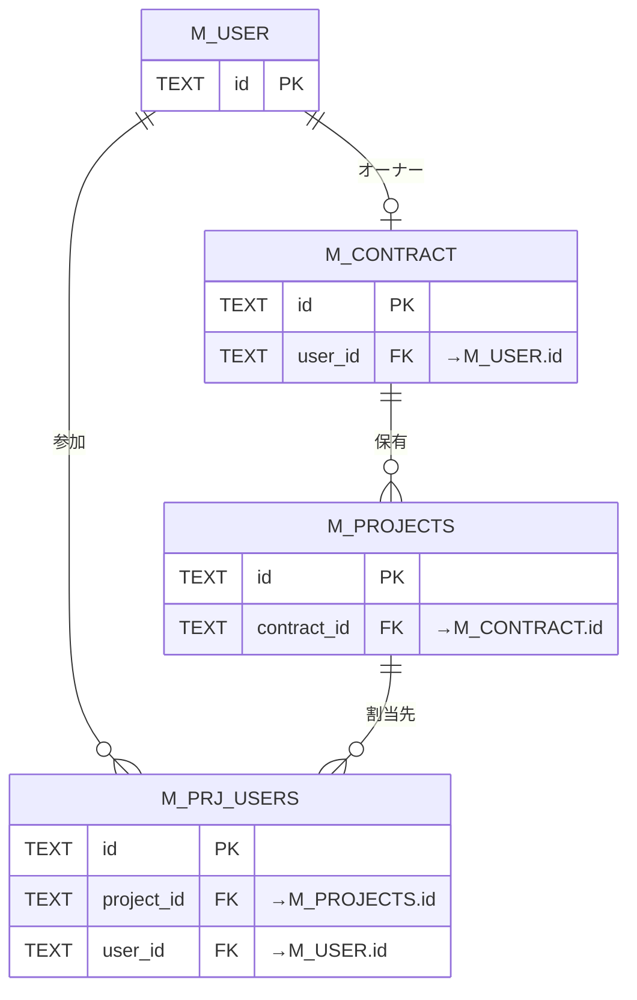

**(2) 認証 — セッション**

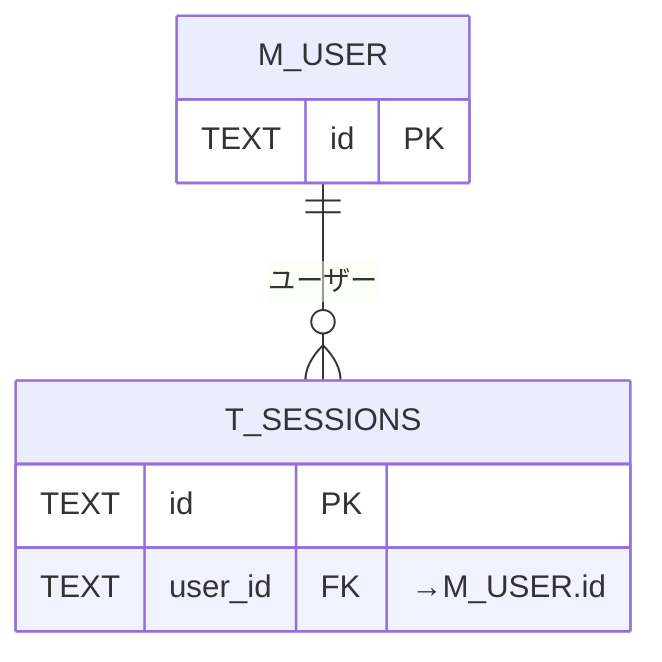

**(3) 認証 — トークン**

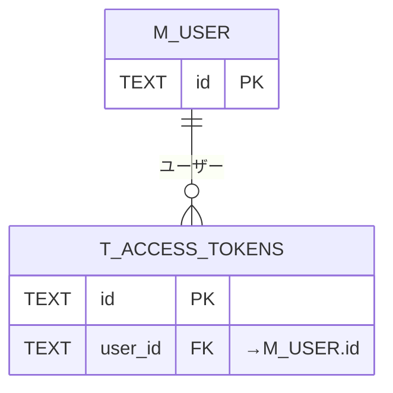

**(4) 認証 — 規約同意**

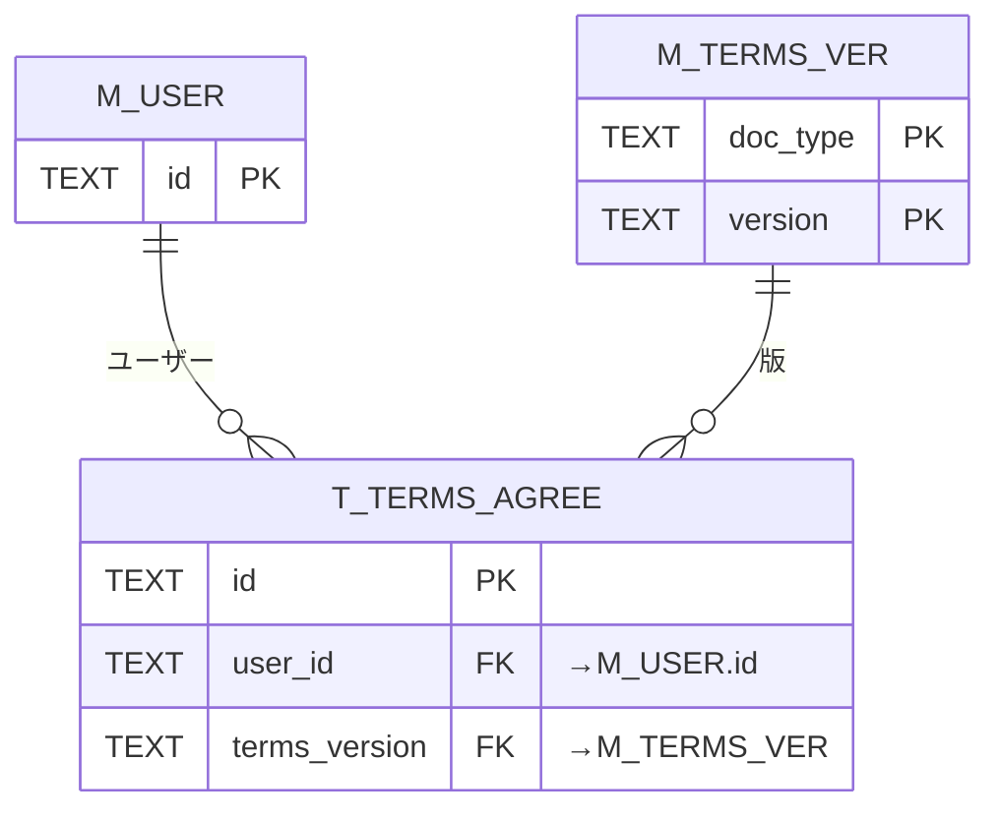

**(5) プロジェクト・ウィジェット**

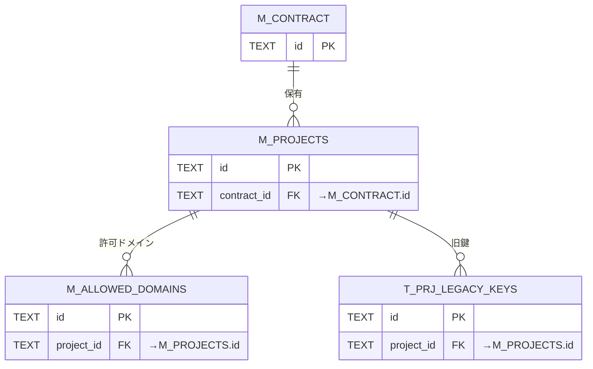

**(6) FAQ**

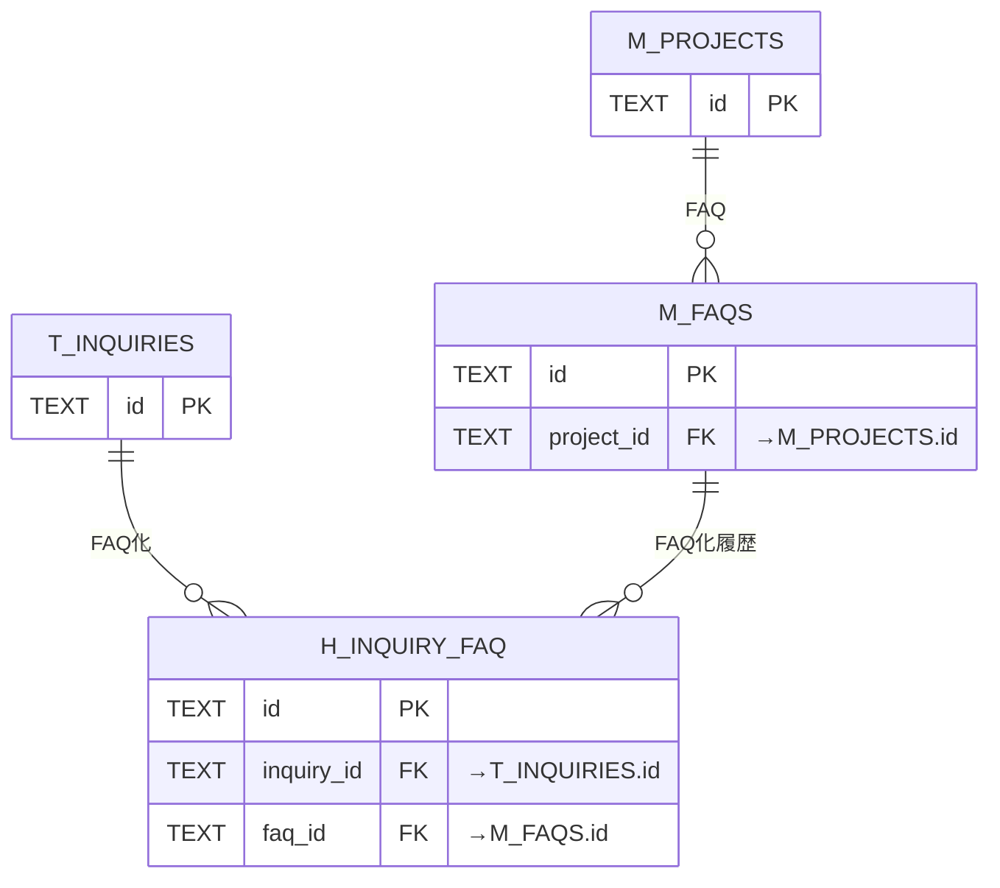

**(7) 質問ログ・参照 FAQ**

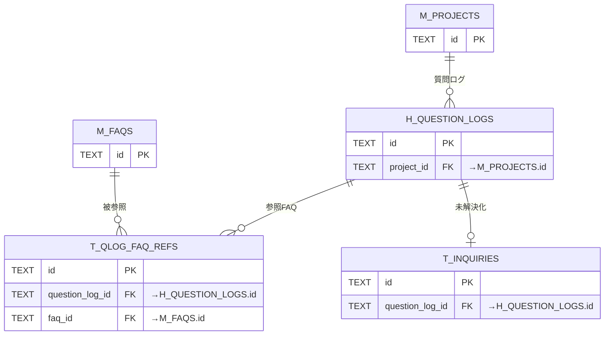

**(8) 未解決質問**

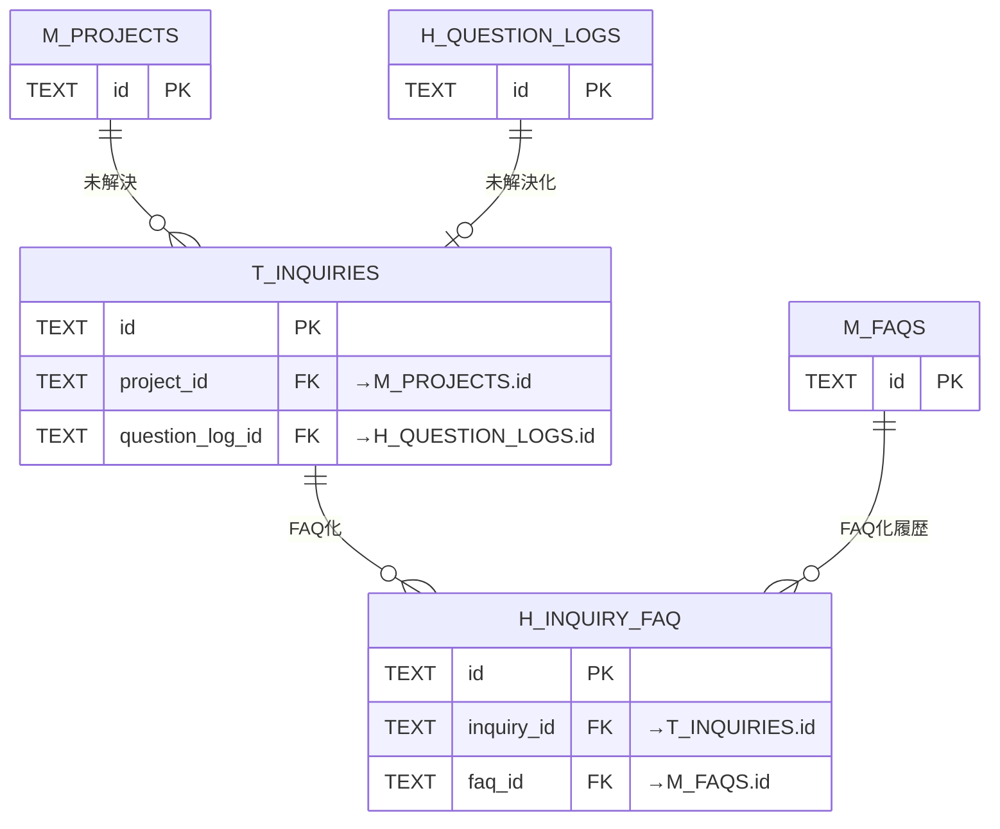

**(9) 利用量・課金・上限**

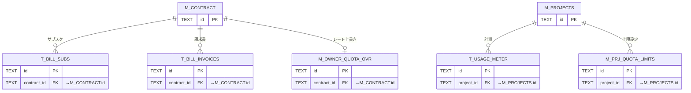

**(10) お知らせ・通知**

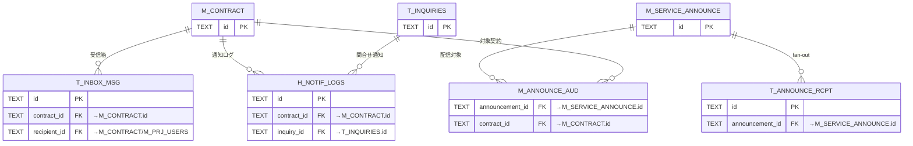

**(11) 退会・データ管理**

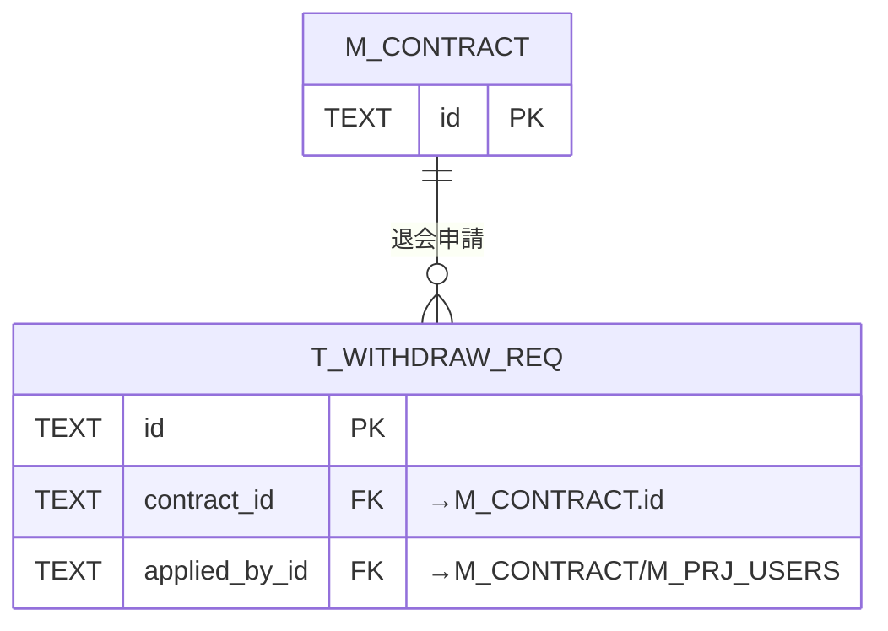

**(12) システム・ログ・運用**

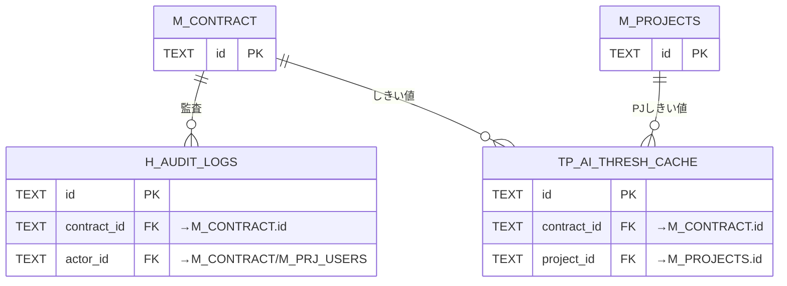

<!-- p5-cross -->
## 4.テーブル↔API / 業務UC 対応表(逆引き)

各テーブルを読み書きする API と、参照する業務ユースケースの逆引きです。API は `## 利用テーブル`、UC は `関連テーブルID` から決定論的に集計しています。個別の対応は各テーブルページの「項目」セクションを参照してください。

| テーブル | API 数 | 利用API | 対応業務UC |
|---|---:|---|---|
| [`M_USER`](#TBL-001) | 3 | [API-001](../03_apis/API-001.md#API-001) [API-008](../03_apis/API-008.md#API-008) [API-021](../03_apis/API-021.md#API-021) | 4 件(例 [UC-002](../../../01_requirements/04_business_usecases/UC-002.md#UC-002) [UC-017](../../../01_requirements/04_business_usecases/UC-017.md#UC-017) [UC-006](../../../01_requirements/04_business_usecases/UC-006.md#UC-006)…) |
| [`M_CONTRACT`](#TBL-002) | 13 | [API-001](../03_apis/API-001.md#API-001) [API-002](../03_apis/API-002.md#API-002) [API-004](../03_apis/API-004.md#API-004) [API-005](../03_apis/API-005.md#API-005) [API-006](../03_apis/API-006.md#API-006) [API-007](../03_apis/API-007.md#API-007) [API-010](../03_apis/API-010.md#API-010) [API-012](../03_apis/API-012.md#API-012) [API-013](../03_apis/API-013.md#API-013) [API-014](../03_apis/API-014.md#API-014) [API-015](../03_apis/API-015.md#API-015) [API-037](../03_apis/API-037.md#API-037) [API-056](../03_apis/API-056.md#API-056) | 19 件(例 [UC-001](../../../01_requirements/04_business_usecases/UC-001.md#UC-001) [UC-002](../../../01_requirements/04_business_usecases/UC-002.md#UC-002)…) |
| [`M_PRJ_USERS`](#TBL-003) | 15 | [API-002](../03_apis/API-002.md#API-002) [API-004](../03_apis/API-004.md#API-004) [API-005](../03_apis/API-005.md#API-005) [API-007](../03_apis/API-007.md#API-007) [API-008](../03_apis/API-008.md#API-008) [API-010](../03_apis/API-010.md#API-010) [API-012](../03_apis/API-012.md#API-012) [API-013](../03_apis/API-013.md#API-013) [API-017](../03_apis/API-017.md#API-017) [API-018](../03_apis/API-018.md#API-018) [API-020](../03_apis/API-020.md#API-020) [API-021](../03_apis/API-021.md#API-021) [API-022](../03_apis/API-022.md#API-022) [API-023](../03_apis/API-023.md#API-023) [API-024](../03_apis/API-024.md#API-024) | 21 件(例 [UC-001](../../../01_requirements/04_business_usecases/UC-001.md#UC-001) [UC-004](../../../01_requirements/04_business_usecases/UC-004.md#UC-004)…) |
| [`T_SESSIONS`](#TBL-013) | 5 | [API-002](../03_apis/API-002.md#API-002) [API-003](../03_apis/API-003.md#API-003) [API-010](../03_apis/API-010.md#API-010) [API-018](../03_apis/API-018.md#API-018) [API-023](../03_apis/API-023.md#API-023) | 5 件(例 [UC-001](../../../01_requirements/04_business_usecases/UC-001.md#UC-001) [UC-005](../../../01_requirements/04_business_usecases/UC-005.md#UC-005)…) |
| [`T_ACCESS_TOKENS`](#TBL-014) | 15 | [API-001](../03_apis/API-001.md#API-001) [API-004](../03_apis/API-004.md#API-004) [API-005](../03_apis/API-005.md#API-005) [API-006](../03_apis/API-006.md#API-006) [API-007](../03_apis/API-007.md#API-007) [API-008](../03_apis/API-008.md#API-008) [API-009](../03_apis/API-009.md#API-009) [API-010](../03_apis/API-010.md#API-010) [API-011](../03_apis/API-011.md#API-011) [API-012](../03_apis/API-012.md#API-012) [API-013](../03_apis/API-013.md#API-013) [API-018](../03_apis/API-018.md#API-018) [API-021](../03_apis/API-021.md#API-021) [API-023](../03_apis/API-023.md#API-023) [API-024](../03_apis/API-024.md#API-024) | 6 件(例 [UC-019](../../../01_requirements/04_business_usecases/UC-019.md#UC-019) [UC-021](../../../01_requirements/04_business_usecases/UC-021.md#UC-021)…) |
| [`M_TERMS_VER`](#TBL-012) | 0 | — | 3 件(例 [UC-011](../../../01_requirements/04_business_usecases/UC-011.md#UC-011) [UC-013](../../../01_requirements/04_business_usecases/UC-013.md#UC-013) [UC-012](../../../01_requirements/04_business_usecases/UC-012.md#UC-012)) |
| [`T_TERMS_AGREE`](#TBL-024) | 2 | [API-001](../03_apis/API-001.md#API-001) [API-008](../03_apis/API-008.md#API-008) | 5 件(例 [UC-011](../../../01_requirements/04_business_usecases/UC-011.md#UC-011) [UC-013](../../../01_requirements/04_business_usecases/UC-013.md#UC-013)…) |
| [`M_PROJECTS`](#TBL-004) | 8 | [API-007](../03_apis/API-007.md#API-007) [API-009](../03_apis/API-009.md#API-009) [API-011](../03_apis/API-011.md#API-011) [API-016](../03_apis/API-016.md#API-016) [API-017](../03_apis/API-017.md#API-017) [API-018](../03_apis/API-018.md#API-018) [API-019](../03_apis/API-019.md#API-019) [API-037](../03_apis/API-037.md#API-037) | 12 件(例 [UC-014](../../../01_requirements/04_business_usecases/UC-014.md#UC-014) [UC-016](../../../01_requirements/04_business_usecases/UC-016.md#UC-016) [UC-015](../../../01_requirements/04_business_usecases/UC-015.md#UC-015)…) |
| [`M_ALLOWED_DOMAINS`](#TBL-005) | 4 | [API-016](../03_apis/API-016.md#API-016) [API-017](../03_apis/API-017.md#API-017) [API-018](../03_apis/API-018.md#API-018) [API-037](../03_apis/API-037.md#API-037) | 4 件(例 [UC-014](../../../01_requirements/04_business_usecases/UC-014.md#UC-014) [UC-016](../../../01_requirements/04_business_usecases/UC-016.md#UC-016) [UC-015](../../../01_requirements/04_business_usecases/UC-015.md#UC-015)…) |
| [`T_PRJ_LEGACY_KEYS`](#TBL-015) | 0 | — | 2 件(例 [UC-040](../../../01_requirements/04_business_usecases/UC-040.md#UC-040) [UC-041](../../../01_requirements/04_business_usecases/UC-041.md#UC-041)) |
| [`M_FAQS`](#TBL-006) | 12 | [API-016](../03_apis/API-016.md#API-016) [API-018](../03_apis/API-018.md#API-018) [API-025](../03_apis/API-025.md#API-025) [API-026](../03_apis/API-026.md#API-026) [API-027](../03_apis/API-027.md#API-027) [API-028](../03_apis/API-028.md#API-028) [API-030](../03_apis/API-030.md#API-030) [API-031](../03_apis/API-031.md#API-031) [API-033](../03_apis/API-033.md#API-033) [API-038](../03_apis/API-038.md#API-038) [API-041](../03_apis/API-041.md#API-041) [API-042](../03_apis/API-042.md#API-042) | 13 件(例 [UC-031](../../../01_requirements/04_business_usecases/UC-031.md#UC-031) [UC-024](../../../01_requirements/04_business_usecases/UC-024.md#UC-024)…) |
| [`TP_FAQ_FTS`](#TBL-030) | 1 | [API-031](../03_apis/API-031.md#API-031) | 6 件(例 [UC-024](../../../01_requirements/04_business_usecases/UC-024.md#UC-024) [UC-027](../../../01_requirements/04_business_usecases/UC-027.md#UC-027)…) |
| [`H_QUESTION_LOGS`](#TBL-025) | 5 | [API-018](../03_apis/API-018.md#API-018) [API-032](../03_apis/API-032.md#API-032) [API-038](../03_apis/API-038.md#API-038) [API-039](../03_apis/API-039.md#API-039) [API-040](../03_apis/API-040.md#API-040) | 1 件(例 [UC-031](../../../01_requirements/04_business_usecases/UC-031.md#UC-031)) |
| [`T_QLOG_FAQ_REFS`](#TBL-016) | 0 | — | — |
| [`T_INQUIRIES`](#TBL-017) | 7 | [API-018](../03_apis/API-018.md#API-018) [API-034](../03_apis/API-034.md#API-034) [API-035](../03_apis/API-035.md#API-035) [API-036](../03_apis/API-036.md#API-036) [API-038](../03_apis/API-038.md#API-038) [API-039](../03_apis/API-039.md#API-039) [API-040](../03_apis/API-040.md#API-040) | 12 件(例 [UC-030](../../../01_requirements/04_business_usecases/UC-030.md#UC-030)…) |
| [`H_INQUIRY_FAQ`](#TBL-029) | 0 | — | — |
| [`T_USAGE_METER`](#TBL-020) | 6 | [API-038](../03_apis/API-038.md#API-038) [API-040](../03_apis/API-040.md#API-040) [API-041](../03_apis/API-041.md#API-041) [API-042](../03_apis/API-042.md#API-042) [API-043](../03_apis/API-043.md#API-043) [API-046](../03_apis/API-046.md#API-046) | 10 件(例 [UC-033](../../../01_requirements/04_business_usecases/UC-033.md#UC-033) [UC-036](../../../01_requirements/04_business_usecases/UC-036.md#UC-036)…) |
| [`T_BILL_SUBS`](#TBL-018) | 2 | [API-043](../03_apis/API-043.md#API-043) [API-045](../03_apis/API-045.md#API-045) | 5 件(例 [UC-036](../../../01_requirements/04_business_usecases/UC-036.md#UC-036) [UC-037](../../../01_requirements/04_business_usecases/UC-037.md#UC-037) [UC-038](../../../01_requirements/04_business_usecases/UC-038.md#UC-038)…) |
| [`T_BILL_INVOICES`](#TBL-019) | 2 | [API-044](../03_apis/API-044.md#API-044) [API-060](../03_apis/API-060.md#API-060) | 3 件(例 [UC-037](../../../01_requirements/04_business_usecases/UC-037.md#UC-037) [UC-059](../../../01_requirements/04_business_usecases/UC-059.md#UC-059)) |
| [`T_BILLING_WEBHOOK_LOG`](#TBL-032) | 1 | [API-060](../03_apis/API-060.md#API-060) | 1 件(例 [UC-061](../../../01_requirements/04_business_usecases/UC-061.md#UC-061)) |
| [`M_PRJ_QUOTA_LIMITS`](#TBL-009) | 2 | [API-046](../03_apis/API-046.md#API-046) [API-047](../03_apis/API-047.md#API-047) | 8 件(例 [UC-036](../../../01_requirements/04_business_usecases/UC-036.md#UC-036) [UC-034](../../../01_requirements/04_business_usecases/UC-034.md#UC-034) [UC-035](../../../01_requirements/04_business_usecases/UC-035.md#UC-035)…) |
| [`M_OWNER_QUOTA_OVR`](#TBL-008) | 0 | — | — |
| [`M_SERVICE_ANNOUNCE`](#TBL-010) | 0 | — | 10 件(例 [UC-045](../../../01_requirements/04_business_usecases/UC-045.md#UC-045)…) |
| [`M_ANNOUNCE_AUD`](#TBL-011) | 0 | — | — |
| [`T_ANNOUNCE_RCPT`](#TBL-021) | 0 | — | 10 件(例 [UC-045](../../../01_requirements/04_business_usecases/UC-045.md#UC-045)…) |
| [`T_INBOX_MSG`](#TBL-022) | 4 | [API-048](../03_apis/API-048.md#API-048) [API-049](../03_apis/API-049.md#API-049) [API-050](../03_apis/API-050.md#API-050) [API-051](../03_apis/API-051.md#API-051) | 6 件(例 [UC-059](../../../01_requirements/04_business_usecases/UC-059.md#UC-059) [UC-064](../../../01_requirements/04_business_usecases/UC-064.md#UC-064) [UC-065](../../../01_requirements/04_business_usecases/UC-065.md#UC-065)…) |
| [`H_NOTIF_LOGS`](#TBL-026) | 5 | [API-011](../03_apis/API-011.md#API-011) [API-021](../03_apis/API-021.md#API-021) [API-024](../03_apis/API-024.md#API-024) [API-040](../03_apis/API-040.md#API-040) [API-059](../03_apis/API-059.md#API-059) | 7 件(例 [UC-063](../../../01_requirements/04_business_usecases/UC-063.md#UC-063) [UC-059](../../../01_requirements/04_business_usecases/UC-059.md#UC-059) [UC-064](../../../01_requirements/04_business_usecases/UC-064.md#UC-064)…) |
| [`T_WITHDRAW_REQ`](#TBL-023) | 1 | [API-056](../03_apis/API-056.md#API-056) | 2 件(例 [UC-023](../../../01_requirements/04_business_usecases/UC-023.md#UC-023) [UC-071](../../../01_requirements/04_business_usecases/UC-071.md#UC-071)) |
| [`H_AUDIT_LOGS`](#TBL-027) | 5 | [API-008](../03_apis/API-008.md#API-008) [API-009](../03_apis/API-009.md#API-009) [API-018](../03_apis/API-018.md#API-018) [API-050](../03_apis/API-050.md#API-050) [API-059](../03_apis/API-059.md#API-059) | 3 件(例 [UC-063](../../../01_requirements/04_business_usecases/UC-063.md#UC-063) [UC-071](../../../01_requirements/04_business_usecases/UC-071.md#UC-071) [UC-075](../../../01_requirements/04_business_usecases/UC-075.md#UC-075)) |
| [`H_ERROR_LOGS`](#TBL-028) | 0 | — | — |
| [`M_EMAIL_SUPPRESS`](#TBL-007) | 1 | [API-059](../03_apis/API-059.md#API-059) | 1 件(例 [UC-063](../../../01_requirements/04_business_usecases/UC-063.md#UC-063)) |
| [`TP_AI_THRESH_CACHE`](#TBL-031) | 0 | — | — |

## 5.読み順

1. 本ページ §2 テーブル一覧でドメイン全体像を把握する。
2. §3 ER 図で親子(契約境界 `M_CONTRACT` → `M_PROJECTS` → 各テーブル)を確認する。
3. §4 対応表で対象テーブルの利用 API / 業務UC を逆引きする。
4. 各テーブルページ(`TBL-NNN.md`)で 項目 / カラム定義 / 制約 / インデックス / コード値 を確認する。
<!-- /p5-cross -->

## 6.命名・分類規約

| 接頭辞 | 分類             | 用途                 |
|--------|------------------|----------------------|
| `M_`   | マスタ           | マスタ・設定         |
| `T_`   | トランザクション | トランザクション     |
| `H_`   | 履歴             | 履歴・ログ(追記専用) |
| `TP_`  | ワーク           | ワーク・派生         |
