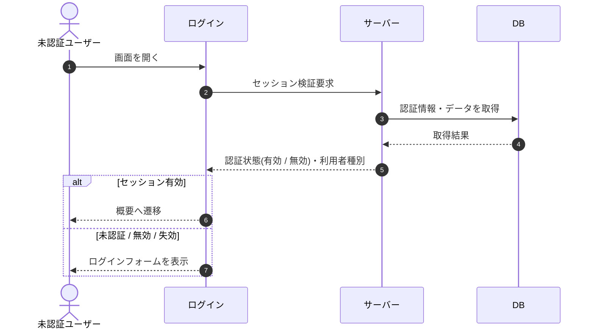

# SEQ-001: 初期表示

> **このページは、業務ユースケース UC-001（初期表示）のシーケンス図を定義します。**

| ID | 業務ユースケースID | イベント(画面ID EVT-NN) | テーブルID |
|----|----|----|----|
| SEQ-001 | [UC-001](../../01_requirements/04_business_usecases/UC-001.md#UC-001) | SCR-001 EVT-01 | [TBL-001](../02_backend/04_database/TBL-001.md#TBL-001) ・ [TBL-002](../02_backend/04_database/TBL-002.md#TBL-002) ・ [TBL-003](../02_backend/04_database/TBL-003.md#TBL-003) ・ [TBL-004](../02_backend/04_database/TBL-004.md#TBL-004) ・ [TBL-005](../02_backend/04_database/TBL-005.md#TBL-005) ・ [TBL-006](../02_backend/04_database/TBL-006.md#TBL-006) ・ [TBL-009](../02_backend/04_database/TBL-009.md#TBL-009) ・ [TBL-012](../02_backend/04_database/TBL-012.md#TBL-012) ・ [TBL-013](../02_backend/04_database/TBL-013.md#TBL-013) ・ [TBL-015](../02_backend/04_database/TBL-015.md#TBL-015) ・ [TBL-018](../02_backend/04_database/TBL-018.md#TBL-018) ・ [TBL-020](../02_backend/04_database/TBL-020.md#TBL-020) ・ [TBL-024](../02_backend/04_database/TBL-024.md#TBL-024) |

## 概要

ログインフォームを表示し、既認証セッションが有効な場合は概要へリダイレクトする軽量ユースケース。セッションが無い・無効・失効済みの場合はログインフォームを表示する。

## シーケンス図

## 例外フロー

- セッションが失効済み・検証失敗の場合はリダイレクトせず、ログインフォームを表示する。

## 備考

- 本図は基本設計レベルの抽象度(ユーザー / 画面 / サーバー、システム起点は外部システム・スケジューラ・バッチを加える)で記述する。DB 操作は DB アクターへのメッセージで表し、テーブル別 CRUD は本図に書かず 関連テーブル 欄で示す。
- 図の出典は業務ユースケース [UC-001](../../01_requirements/04_business_usecases/UC-001.md#UC-001)。画面イベントとの対応は UC-001 を参照。
