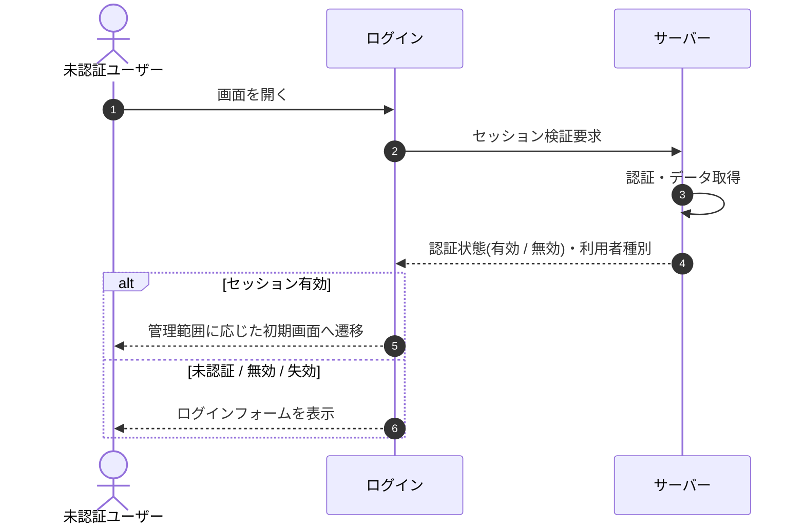

# SEQ-001: 初期表示

> **このページは、業務ユースケース UC-001（初期表示）のシーケンス図を定義します。**

## 項目

| 項目 | 内容 |
|---|---|
| SEQ ID | `SEQ-001` |
| 対応業務ユースケース | [UC-001](../../01_requirements/04_business_usecases/UC-001.md#UC-001) |
| 業務要件 (BR) | [BR-001](../../01_requirements/01_business_requirement/01_account-br.md#BR-001) ・ [BR-003](../../01_requirements/01_business_requirement/01_account-br.md#BR-003) ・ [BR-006](../../01_requirements/01_business_requirement/01_account-br.md#BR-006) |
| 機能要件 (FR) | [FR-004](../../01_requirements/02_functional_requirement/01_account-fr.md#FR-004) |
| 画面イベント (EVT) | EVT-001 |
| 関連画面 | [SCR-001](../01_frontend/01_screens/SCR-001.md#SCR-001) |
| 関連 API | [API-002](../02_backend/03_apis/API-002.md#API-002) |
| 関連テーブル | [TBL-002](../02_backend/04_database/TBL-002.md#TBL-002) ・ [TBL-003](../02_backend/04_database/TBL-003.md#TBL-003) ・ [TBL-013](../02_backend/04_database/TBL-013.md#TBL-013) |
| エラー (ERR) | [ERR-003](../05_errors/ERR-003.md#ERR-003) ・ [ERR-004](../05_errors/ERR-004.md#ERR-004) ・ [ERR-005](../05_errors/ERR-005.md#ERR-005) ・ [ERR-006](../05_errors/ERR-006.md#ERR-006) |
| メッセージ (MSG) | — |

## 概要

ログインフォームを表示し、既認証セッションが有効な場合は利用者種別を判定して管理範囲に応じた初期画面へリダイレクトする軽量ユースケース。セッションが無い・無効・失効済みの場合はログインフォームを表示する。

## シーケンス図

## 例外フロー

- セッションが失効済み・検証失敗の場合はリダイレクトせず、ログインフォームを表示する。

## 備考

- 本図は基本設計レベルの抽象度(ユーザー / 画面 / サーバー、システム起点は外部システム・スケジューラ・バッチを加える)で記述する。DB 操作はサーバー自己メッセージで表し、テーブル別 CRUD は本図に書かず 関連テーブル 欄で示す。
- 図の出典は業務ユースケース [UC-001](../../01_requirements/04_business_usecases/UC-001.md#UC-001)。画面イベントとの対応は UC-001 を参照。
