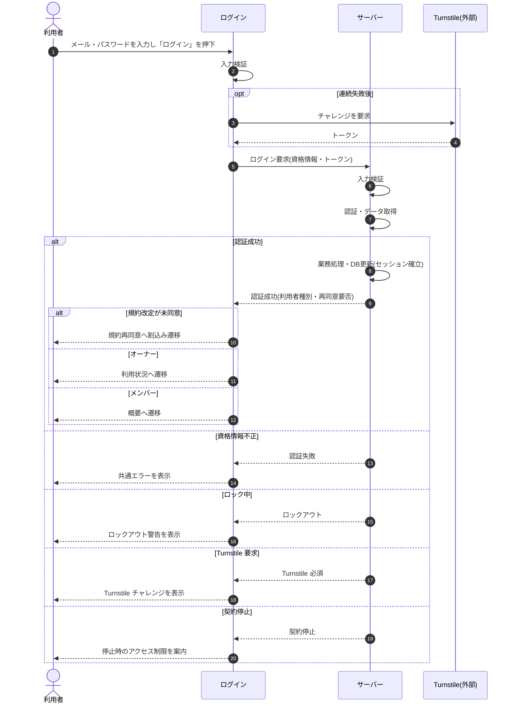

<!-- portal-top -->
[設計ポータル](../../README.md) ／ [基本設計](../index.md) ／ [シーケンス設計](index.md) ／ **SEQ-002: 「ログイン」を押下**
<!-- /portal-top -->

# SEQ-002: 「ログイン」を押下

> **このページは、業務ユースケース UC-001（「ログイン」を押下）のシーケンス図を定義します。**

*版数 v2.0 ・ 更新 2026-06-23 ・ ステータス ドラフト*

## 項目

| 項目 | 内容 |
|---|---|
| SEQ ID | `SEQ-002` |
| 対応業務ユースケース | [UC-001](../../01_requirements/04_business_usecases/UC-001.md#UC-001) |
| 業務要件 (BR) | 要確認 |
| 機能要件 (FR) | [FR-004](../../01_requirements/02_FunctionalRequirement/01_account-fr.md#FR-004) ・ [FR-007](../../01_requirements/02_FunctionalRequirement/01_account-fr.md#FR-007) |
| 画面イベント (EVT) | [EVT-004](../01_frontend/02_screen_events/EVT-004.md#EVT-004) |
| 関連画面 | [SCR-001](../01_frontend/01_screens/SCR-001.md#SCR-001) ・ [SCR-012](../01_frontend/01_screens/SCR-012.md#SCR-012) ・ [SCR-020](../01_frontend/01_screens/SCR-020.md#SCR-020) ・ [SCR-021](../01_frontend/01_screens/SCR-021.md#SCR-021) |
| 関連 API | [API-002](../02_backend/03_apis/API-002.md#API-002) |
| 関連テーブル | [TBL-002](../02_backend/04_database/TBL-002.md#TBL-002) ・ [TBL-003](../02_backend/04_database/TBL-003.md#TBL-003) ・ [TBL-013](../02_backend/04_database/TBL-013.md#TBL-013) |
| エラー (ERR) | [ERR-003](../05_errors/ERR-003.md#ERR-003) ・ [ERR-004](../05_errors/ERR-004.md#ERR-004) ・ [ERR-005](../05_errors/ERR-005.md#ERR-005) ・ [ERR-006](../05_errors/ERR-006.md#ERR-006) |
| メッセージ (MSG) | 要確認 |

## 概要

入力を再検証し、必要時は Turnstile を提示したうえでログインを実行する。成功時はセッションを確立し、管理範囲・規約再同意要否に応じて遷移し、失敗時はセッション未確立のまま共通エラーまたはロックアウト警告を表示する。

## シーケンス図

## 例外フロー

- 資格情報不正: 共通エラーを表示する。メールアドレスの存在有無を区別しない文言とし、失敗試行として計上する([ERR-003](../05_errors/ERR-003.md#ERR-003))。
- ロック中: ロックアウト警告を表示し、一定時間の試行を抑止する。時間経過または管理者解除で復旧する([ERR-004](../05_errors/ERR-004.md#ERR-004))。
- Turnstile 要求: Turnstile チャレンジを表示し、トークン取得後に再送信を促す([ERR-005](../05_errors/ERR-005.md#ERR-005))。
- 契約停止: セッションを確立せず、停止時のアクセス制限ルールに従う旨を案内する([ERR-006](../05_errors/ERR-006.md#ERR-006))。

## 備考

- 本図は基本設計レベルの抽象度(ユーザー / 画面 / サーバー、システム起点は外部システム・スケジューラ・バッチを加える)で記述する。DB 操作はサーバー自己メッセージで表し、テーブル別 CRUD は本図に書かず 関連テーブル 欄で示す。
- 図の出典は業務ユースケース [UC-001](../../01_requirements/04_business_usecases/UC-001.md#UC-001)。画面イベントとの対応は UC-001 を参照。

---

<!-- portal-bottom -->
[← シーケンス設計](index.md) ・ [基本設計](../index.md) ・ [↑ 設計ポータル](../../README.md)
<!-- /portal-bottom -->
