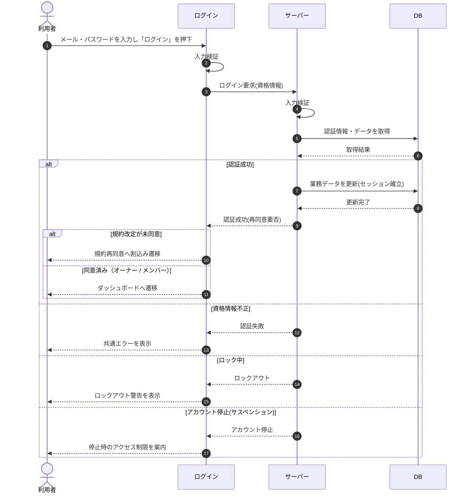

# SEQ-002: 「ログイン」を押下

> **このページは、業務ユースケース UC-001（「ログイン」を押下）のシーケンス図を定義します。**

| ID | 業務ユースケースID | イベント(画面ID EVT-NN) | テーブルID |
|----|----|----|----|
| SEQ-002 | [UC-001](../../01_requirements/04_business_usecases/UC-001.md#UC-001) | SCR-001 EVT-02 | [TBL-001](../02_backend/04_database/TBL-001.md#TBL-001) ・ [TBL-002](../02_backend/04_database/TBL-002.md#TBL-002) ・ [TBL-003](../02_backend/04_database/TBL-003.md#TBL-003) ・ [TBL-004](../02_backend/04_database/TBL-004.md#TBL-004) ・ [TBL-005](../02_backend/04_database/TBL-005.md#TBL-005) ・ [TBL-006](../02_backend/04_database/TBL-006.md#TBL-006) ・ [TBL-009](../02_backend/04_database/TBL-009.md#TBL-009) ・ [TBL-012](../02_backend/04_database/TBL-012.md#TBL-012) ・ [TBL-013](../02_backend/04_database/TBL-013.md#TBL-013) ・ [TBL-015](../02_backend/04_database/TBL-015.md#TBL-015) ・ [TBL-018](../02_backend/04_database/TBL-018.md#TBL-018) ・ [TBL-020](../02_backend/04_database/TBL-020.md#TBL-020) ・ [TBL-024](../02_backend/04_database/TBL-024.md#TBL-024) |

## 概要

入力を再検証してログインを実行する。成功時はセッションを確立し、規約再同意要否に応じて(未同意時は規約再同意へ割込み、それ以外はダッシュボードへ)遷移し、失敗時はセッション未確立のまま共通エラーまたはロックアウト警告を表示する。アカウントが停止中(サスペンション)の場合はセッションを確立せず停止時のアクセス制限を案内する。

## シーケンス図

## 例外フロー

- 資格情報不正: 共通エラーを表示する。メールアドレスの存在有無を区別しない文言とし、失敗試行として計上する([ERR-002](../05_errors/ERR-002.md#ERR-002))。
- ロック中: ロックアウト警告を表示し、一定時間の試行を抑止する。時間経過または権限者の解除で復旧する([ERR-003](../05_errors/ERR-003.md#ERR-003))。
- アカウント停止(サスペンション): セッションを確立せず、停止時のアクセス制限ルールに従う旨を案内する([ERR-004](../05_errors/ERR-004.md#ERR-004))。

## 備考

- 本図は基本設計レベルの抽象度(ユーザー / 画面 / サーバー、システム起点は外部システム・スケジューラ・バッチを加える)で記述する。DB 操作は DB アクターへのメッセージで表し、テーブル別 CRUD は本図に書かず 関連テーブル 欄で示す。
- 図の出典は業務ユースケース [UC-001](../../01_requirements/04_business_usecases/UC-001.md#UC-001)。画面イベントとの対応は UC-001 を参照。
