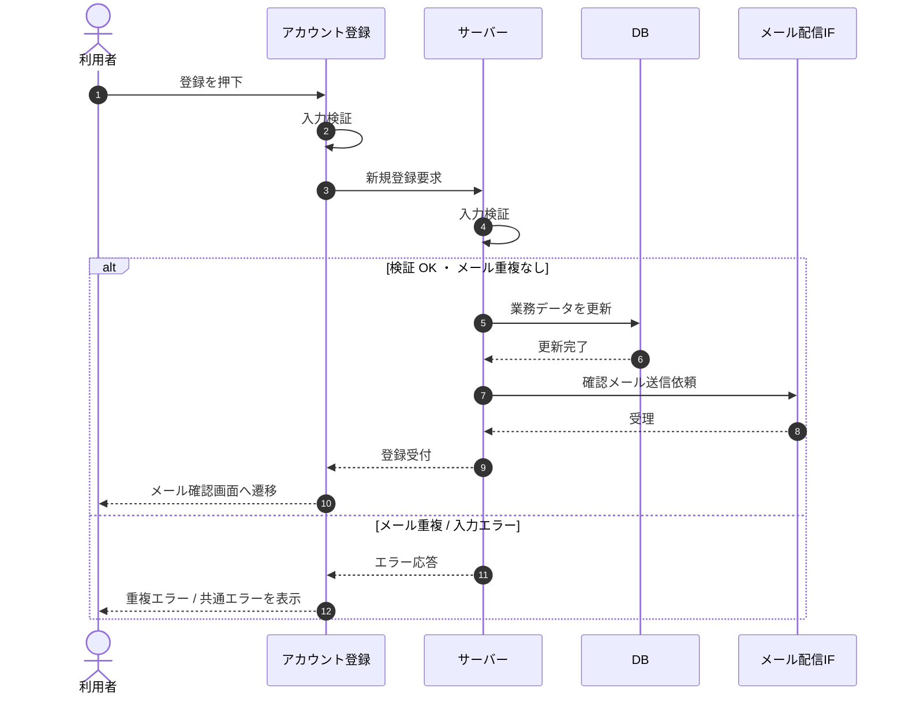

# SEQ-003: 「登録して確認メールを送信する」を押下

> **このページは、業務ユースケース UC-002（「登録して確認メールを送信する」を押下）のシーケンス図を定義します。**

| ID | 業務ユースケースID | イベント(画面ID EVT-NN) | テーブルID |
|----|----|----|----|
| SEQ-003 | [UC-002](../../01_requirements/04_business_usecases/UC-002.md#UC-002) | SCR-002 EVT-05 | [TBL-001](../02_backend/04_database/TBL-001.md#TBL-001) ・ [TBL-012](../02_backend/04_database/TBL-012.md#TBL-012) ・ [TBL-014](../02_backend/04_database/TBL-014.md#TBL-014) ・ [TBL-024](../02_backend/04_database/TBL-024.md#TBL-024) |

## 概要

利用者が登録ボタンを押下すると、全項目を再検証して新規登録要求を送る。サーバーは検証・重複確認のうえ利用者アカウント(M_USER)を作成し、登録時点の規約版を参照して同意履歴(T_TERMS_AGREE)とメール確認トークン(T_ACCESS_TOKENS)を登録する。成功時は確認メールを送信してメール確認画面へ遷移する。課金アカウントやプロジェクトは作成しない。

## シーケンス図

## 例外フロー

- 入力検証エラー: 送信を中止し、該当フィールド直下にエラーを表示する。
- メール重複: 該当フィールドにエラーメッセージを表示し、アカウントを作成しない。
- その他失敗: フォーム上部に共通エラーメッセージを表示する。

## 備考

- 本図は基本設計レベルの抽象度(ユーザー / 画面 / サーバー、システム起点は外部システム・スケジューラ・バッチを加える)で記述する。DB 操作は DB アクターへのメッセージで表し、テーブル別 CRUD は本図に書かず 関連テーブル 欄で示す。
- 図の出典は業務ユースケース [UC-002](../../01_requirements/04_business_usecases/UC-002.md#UC-002)。画面イベントとの対応は UC-002 を参照。
