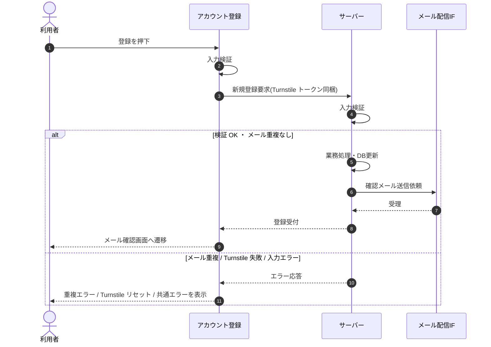

<!-- portal-top -->
[設計ポータル](../../README.md) ／ [基本設計](../index.md) ／ [シーケンス設計](index.md) ／ **SEQ-003: 「登録して確認メールを送信する」を押下**
<!-- /portal-top -->

# SEQ-003: 「登録して確認メールを送信する」を押下

> **このページは、業務ユースケース UC-002（「登録して確認メールを送信する」を押下）のシーケンス図を定義します。**

*版数 v2.0 ・ 更新 2026-06-23 ・ ステータス ドラフト*

## 項目

| 項目 | 内容 |
|---|---|
| SEQ ID | `SEQ-003` |
| 対応業務ユースケース | [UC-002](../../01_requirements/04_business_usecases/UC-002.md#UC-002) |
| 業務要件 (BR) | [BR-001](../../01_requirements/01_business_requirement/01_account-br.md#BR-001) ・ [BR-010](../../01_requirements/01_business_requirement/01_account-br.md#BR-010) |
| 機能要件 (FR) | [FR-001](../../01_requirements/02_functional_requirement/01_account-fr.md#FR-001) ・ [FR-003](../../01_requirements/02_functional_requirement/01_account-fr.md#FR-003) ・ [FR-149](../../01_requirements/02_functional_requirement/06_security-fr.md#FR-149) ・ [FR-145](../../01_requirements/02_functional_requirement/06_security-fr.md#FR-145) ・ [FR-150](../../01_requirements/02_functional_requirement/06_security-fr.md#FR-150) |
| 画面イベント (EVT) | [EVT-016](../01_frontend/02_screen_events/EVT-016.md#EVT-016) |
| 関連画面 | [SCR-002](../01_frontend/01_screens/SCR-002.md#SCR-002) ・ [SCR-018](../01_frontend/01_screens/SCR-018.md#SCR-018) |
| 関連 API | [API-001](../02_backend/03_apis/API-001.md#API-001) |
| 関連テーブル | [TBL-001](../02_backend/04_database/TBL-001.md#TBL-001) ・ [TBL-002](../02_backend/04_database/TBL-002.md#TBL-002) |
| エラー (ERR) | [ERR-001](../05_errors/ERR-001.md#ERR-001) ・ [ERR-002](../05_errors/ERR-002.md#ERR-002) |
| メッセージ (MSG) | [MSG-001](../06_messages/MSG-001.md#MSG-001) |

## 概要

利用者が登録ボタンを押下すると、全項目を再検証し Turnstile トークンを添えて新規登録要求を送る。サーバーは検証・重複確認のうえ利用者と契約を作成して確認メールを送信し、成功時はメール確認画面へ遷移する。

## シーケンス図

## 例外フロー

- 入力検証エラー: 送信を中止し、該当フィールド直下にエラーを表示する。
- メール重複: 該当フィールドにエラーメッセージを表示し、アカウントを作成しない。
- Turnstile 検証失敗: フォーム上部にエラーを表示し、Turnstile ウィジェットをリセットする。
- その他失敗: フォーム上部に共通エラーメッセージを表示する。

## 備考

- 本図は基本設計レベルの抽象度(ユーザー / 画面 / サーバー、システム起点は外部システム・スケジューラ・バッチを加える)で記述する。DB 操作はサーバー自己メッセージで表し、テーブル別 CRUD は本図に書かず 関連テーブル 欄で示す。
- 図の出典は業務ユースケース [UC-002](../../01_requirements/04_business_usecases/UC-002.md#UC-002)。画面イベントとの対応は UC-002 を参照。

---

<!-- portal-bottom -->
[← シーケンス設計](index.md) ・ [基本設計](../index.md) ・ [↑ 設計ポータル](../../README.md)
<!-- /portal-bottom -->
