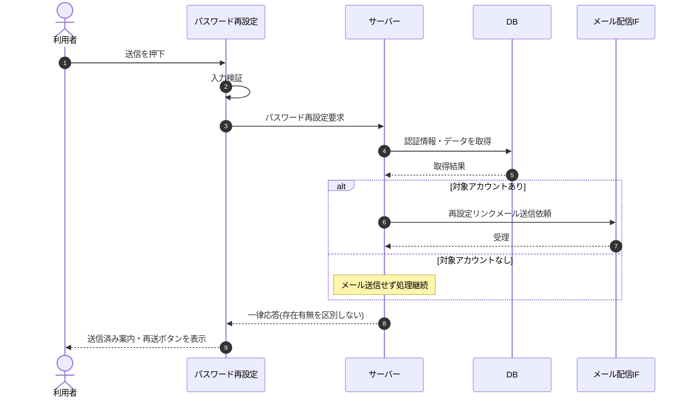

# SEQ-004: 「再設定リンクを送信」を押下

> **このページは、業務ユースケース UC-004（「再設定リンクを送信」を押下）のシーケンス図を定義します。**

| ID | 業務ユースケースID | イベント(画面ID EVT-NN) | テーブルID |
|----|----|----|----|
| SEQ-004 | [UC-004](../../01_requirements/04_business_usecases/UC-004.md#UC-004) | SCR-003 EVT-02 | [TBL-002](../02_backend/04_database/TBL-002.md#TBL-002) ・ [TBL-003](../02_backend/04_database/TBL-003.md#TBL-003) ・ [TBL-014](../02_backend/04_database/TBL-014.md#TBL-014) |

## 概要

メールアドレスの形式を検証してパスワード再設定要求をサーバーへ送信し、対象アカウントが存在する場合のみ再設定リンクメールを送る。サーバーは存在有無を区別しない一律応答を返し、画面は送信済み案内と再送ボタンを表示する。

## シーケンス図

## 例外フロー

- 形式不正: 入力欄直下にエラーメッセージを表示し、要求を中断する。
- 要求失敗: 送信済み案内へ遷移せず、エラーを表示する(列挙攻撃対策のため対象有無は明かさない)。

## 備考

- 本図は基本設計レベルの抽象度(ユーザー / 画面 / サーバー、システム起点は外部システム・スケジューラ・バッチを加える)で記述する。DB 操作は DB アクターへのメッセージで表し、テーブル別 CRUD は本図に書かず 関連テーブル 欄で示す。
- 図の出典は業務ユースケース [UC-004](../../01_requirements/04_business_usecases/UC-004.md#UC-004)。画面イベントとの対応は UC-004 を参照。
