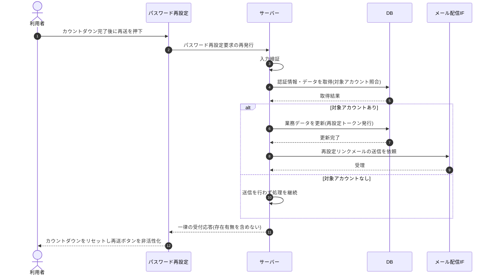

# SEQ-005: 「メールを再送信する」を押下

> **このページは、業務ユースケース UC-004（「メールを再送信する」を押下）のシーケンス図を定義します。**

| ID | シーケンス名 |
|----|----|
| SEQ-005 | 「メールを再送信する」を押下 |

| 関連項目 | 内容 |
|----|----| 
| 業務ユースケース | [UC-004](../../01_requirements/04_business_usecases/UC-004.md#UC-004) |
| イベント | [SCR-003 EVT-03](../01_frontend/01_screens/SCR-003.md#SCR-003) |
| 関連画面 | [SCR-003](../01_frontend/01_screens/SCR-003.md#SCR-003) |
| 関連API | [API-004](../02_backend/03_apis/API-004.md#API-004) |
| テーブル | [TBL-002](../02_backend/04_database/TBL-002.md#TBL-002) / [TBL-003](../02_backend/04_database/TBL-003.md#TBL-003) |
| エラー(ERR) | — |
| メッセージ(MSG) | [MSG-002](../06_messages/MSG-002.md#MSG-002) |

## 概要

レート制限の解除後に利用者がパスワード再設定要求を再発行し、対象アカウントが存在する場合のみ再設定メールを再送するシーケンス。応答受取後はカウントダウンをリセットし、再送ボタンを再び非活性にする。

## シーケンス図

## 備考

- 本図は基本設計レベルの抽象度(ユーザー / 画面 / サーバー、システム起点は外部システム・スケジューラ・バッチを加える)で記述する。DB 操作は DB アクターへのメッセージで表し、テーブル別 CRUD は本図に書かず 関連テーブル 欄で示す。
- 図の出典は業務ユースケース [UC-004](../../01_requirements/04_business_usecases/UC-004.md#UC-004)。画面イベントとの対応は UC-004 を参照。
