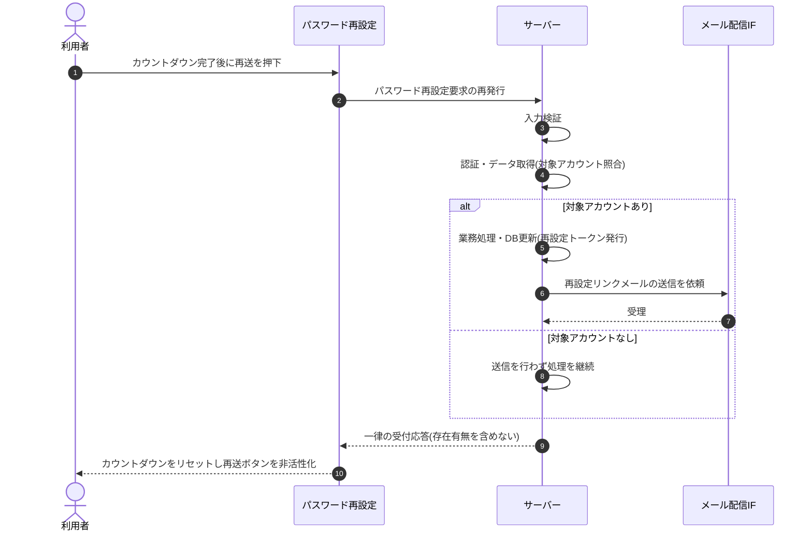

<!-- portal-top -->
[設計ポータル](../../README.md) ／ [基本設計](../index.md) ／ [シーケンス設計](index.md) ／ **SEQ-005: 「メールを再送信する」を押下**
<!-- /portal-top -->

# SEQ-005: 「メールを再送信する」を押下

> **このページは、業務ユースケース UC-004（「メールを再送信する」を押下）のシーケンス図を定義します。**

*版数 v2.0 ・ 更新 2026-06-23 ・ ステータス ドラフト*

## 項目

| 項目 | 内容 |
|---|---|
| SEQ ID | `SEQ-005` |
| 対応業務ユースケース | [UC-004](../../01_requirements/04_business_usecases/UC-004.md#UC-004) |
| 業務要件 (BR) | 要確認 |
| 機能要件 (FR) | [FR-004](../../01_requirements/02_FunctionalRequirement/01_account-fr.md#FR-004) |
| 画面イベント (EVT) | [EVT-021](../01_frontend/02_screen_events/EVT-021.md#EVT-021) |
| 関連画面 | [SCR-003](../01_frontend/01_screens/SCR-003.md#SCR-003) |
| 関連 API | [API-004](../02_backend/03_apis/API-004.md#API-004) |
| 関連テーブル | [TBL-002](../02_backend/04_database/TBL-002.md#TBL-002) ・ [TBL-003](../02_backend/04_database/TBL-003.md#TBL-003) |
| エラー (ERR) | — |
| メッセージ (MSG) | 要確認 |

## 概要

レート制限の解除後に利用者がパスワード再設定要求を再発行し、対象アカウントが存在する場合のみ再設定メールを再送するシーケンス。応答受取後はカウントダウンをリセットし、再送ボタンを再び非活性にする。

## シーケンス図

## 備考

- 本図は基本設計レベルの抽象度(ユーザー / 画面 / サーバー、システム起点は外部システム・スケジューラ・バッチを加える)で記述する。DB 操作はサーバー自己メッセージで表し、テーブル別 CRUD は本図に書かず 関連テーブル 欄で示す。
- 図の出典は業務ユースケース [UC-004](../../01_requirements/04_business_usecases/UC-004.md#UC-004)。画面イベントとの対応は UC-004 を参照。

---

<!-- portal-bottom -->
[← シーケンス設計](index.md) ・ [基本設計](../index.md) ・ [↑ 設計ポータル](../../README.md)
<!-- /portal-bottom -->
