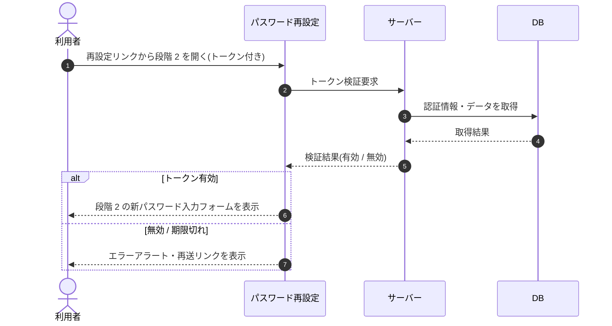

# SEQ-006: 初期表示(段階 2)

> **このページは、業務ユースケース UC-005（初期表示(段階 2)）のシーケンス図を定義します。**

## 項目

| 項目 | 内容 |
|---|---|
| SEQ ID | `SEQ-006` |
| トレーサビリティID | [TR-005](../00_traceability/index.md#TR-005) |
| 画面イベント (EVT) | EVT-014 |
| 関連画面 | [SCR-003](../01_frontend/01_screens/SCR-003.md#SCR-003) |
| 関連 API | [API-010](../02_backend/03_apis/API-010.md#API-010) |
| 関連テーブル | [TBL-002](../02_backend/04_database/TBL-002.md#TBL-002) ・ [TBL-003](../02_backend/04_database/TBL-003.md#TBL-003) |
| エラー (ERR) | [ERR-001](../05_errors/ERR-001.md#ERR-001) ・ [ERR-006](../05_errors/ERR-006.md#ERR-006) ・ [ERR-007](../05_errors/ERR-007.md#ERR-007) ・ [ERR-008](../05_errors/ERR-008.md#ERR-008) |
| メッセージ (MSG) | — |

## 概要

再設定リンクの URL トークンを検証し、有効時は新パスワード入力フォームを表示する。無効 / 期限切れ時はエラーアラートと再送リンクを表示する。

## シーケンス図

## 例外フロー

- トークンが期限切れ: エラーアラートと再送リンクを表示する。
- トークンが使用済み: エラーアラートと再送リンクを表示する。
- トークンが存在しない: エラーアラートと再送リンクを表示する。

## 備考

- 本図は基本設計レベルの抽象度(ユーザー / 画面 / サーバー、システム起点は外部システム・スケジューラ・バッチを加える)で記述する。DB 操作は DB アクターへのメッセージで表し、テーブル別 CRUD は本図に書かず 関連テーブル 欄で示す。
- 図の出典は業務ユースケース [UC-005](../../01_requirements/04_business_usecases/UC-005.md#UC-005)。画面イベントとの対応は UC-005 を参照。
