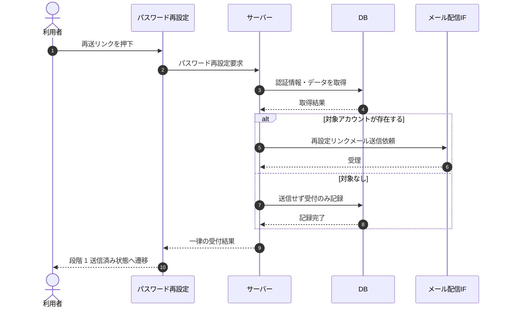

# SEQ-007: 「再送する」を押下(段階 2 エラー時)

> **このページは、業務ユースケース UC-004（「再送する」を押下(段階 2 エラー時)）のシーケンス図を定義します。**

| ID | 業務ユースケースID | イベント(画面ID EVT-NN) | テーブルID |
|----|----|----|----|
| SEQ-007 | [UC-004](../../01_requirements/04_business_usecases/UC-004.md#UC-004) | SCR-003 EVT-05 | [TBL-002](../02_backend/04_database/TBL-002.md#TBL-002) ・ [TBL-003](../02_backend/04_database/TBL-003.md#TBL-003) ・ [TBL-014](../02_backend/04_database/TBL-014.md#TBL-014) |

## 概要

段階 2 のトークンエラー画面から再設定要求をサーバーへ発行し、応答受取後に段階 1 の送信済み状態へ復帰する。アカウントの存在有無に関わらず一律の受付結果を返し、該当する場合のみ再設定リンクメールを送信する。

## シーケンス図

## 例外フロー

- 要求に失敗した場合、段階 1 送信済み状態へ遷移せず、エラーを表示する。

## 備考

- 本図は基本設計レベルの抽象度(ユーザー / 画面 / サーバー、システム起点は外部システム・スケジューラ・バッチを加える)で記述する。DB 操作は DB アクターへのメッセージで表し、テーブル別 CRUD は本図に書かず 関連テーブル 欄で示す。
- 図の出典は業務ユースケース [UC-004](../../01_requirements/04_business_usecases/UC-004.md#UC-004)。画面イベントとの対応は UC-004 を参照。
