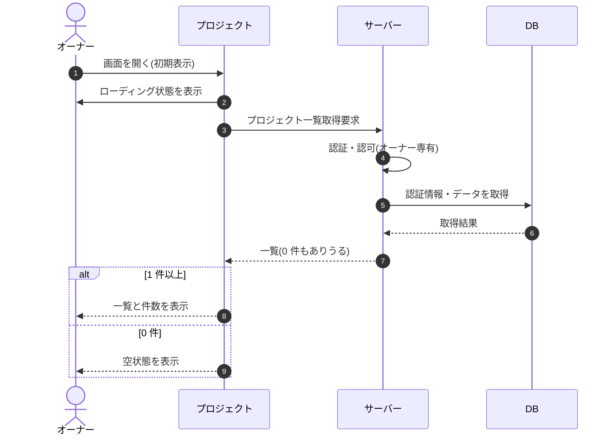

# SEQ-009: 初期表示

> **このページは、業務ユースケース UC-014（初期表示）のシーケンス図を定義します。**

## 項目

| 項目 | 内容 |
|---|---|
| SEQ ID | `SEQ-009` |
| 対応業務ユースケース | [UC-014](../../01_requirements/04_business_usecases/UC-014.md#UC-014) |
| 業務要件 (BR) | [BR-018](../../01_requirements/01_business_requirement/01_account-br.md#BR-018) |
| 機能要件 (FR) | [FR-037](../../01_requirements/02_functional_requirement/01_account-fr.md#FR-037) |
| 画面イベント (EVT) | EVT-028 |
| 関連画面 | [SCR-004](../01_frontend/01_screens/SCR-004.md#SCR-004) |
| 関連 API | [API-016](../02_backend/03_apis/API-016.md#API-016) |
| 関連テーブル | [TBL-004](../02_backend/04_database/TBL-004.md#TBL-004) ・ [TBL-005](../02_backend/04_database/TBL-005.md#TBL-005) |
| エラー (ERR) | — |
| メッセージ (MSG) | — |

## 概要

オーナーがプロジェクト画面を開くと、契約配下のプロジェクト一覧を取得して件数とともに表示する。取得中はローディング状態、0 件のときは空状態を表示する。

## シーケンス図

## 備考

- 本図は基本設計レベルの抽象度(ユーザー / 画面 / サーバー、システム起点は外部システム・スケジューラ・バッチを加える)で記述する。DB 操作は DB アクターへのメッセージで表し、テーブル別 CRUD は本図に書かず 関連テーブル 欄で示す。
- 図の出典は業務ユースケース [UC-014](../../01_requirements/04_business_usecases/UC-014.md#UC-014)。画面イベントとの対応は UC-014 を参照。
