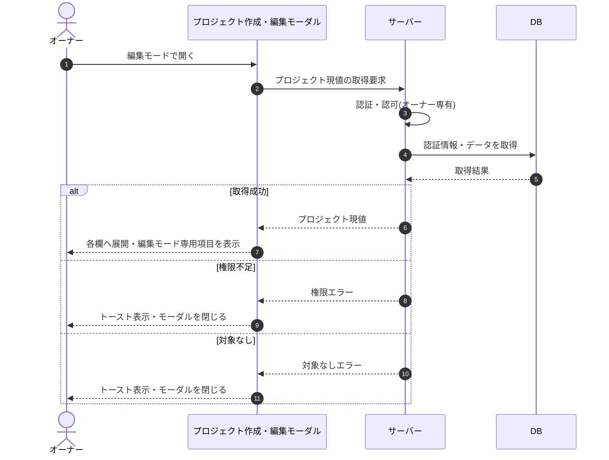

# SEQ-010: 初期表示(編集モード)

> **このページは、業務ユースケース UC-016（初期表示(編集モード)）のシーケンス図を定義します。**

## 項目

| 項目 | 内容 |
|---|---|
| SEQ ID | `SEQ-010` |
| トレーサビリティID | [TR-016](../00_traceability/index.md#TR-016) |
| 画面イベント (EVT) | EVT-025 |
| 関連画面 | [SCR-005](../01_frontend/01_screens/SCR-005.md#SCR-005) |
| 関連 API | [API-018](../02_backend/03_apis/API-018.md#API-018) |
| 関連テーブル | [TBL-004](../02_backend/04_database/TBL-004.md#TBL-004) ・ [TBL-005](../02_backend/04_database/TBL-005.md#TBL-005) |
| エラー (ERR) | [ERR-015](../05_errors/ERR-015.md#ERR-015) ・ [ERR-017](../05_errors/ERR-017.md#ERR-017) |
| メッセージ (MSG) | — |

## 概要

オーナーがプロジェクト作成・編集モーダルを編集モードで開くと、対象プロジェクトの現値を取得して各欄へ展開し、編集モード専用項目を表示する。取得に失敗した場合はトーストを表示しモーダルを閉じる。

## シーケンス図

## 例外フロー

- 認可判定でオーナー以外と判定された場合、権限エラーを返しトーストを表示してモーダルを閉じる。
- 対象プロジェクトが存在しない場合、対象なしエラーを返しトーストを表示してモーダルを閉じる。

## 備考

- 本図は基本設計レベルの抽象度(ユーザー / 画面 / サーバー、システム起点は外部システム・スケジューラ・バッチを加える)で記述する。DB 操作は DB アクターへのメッセージで表し、テーブル別 CRUD は本図に書かず 関連テーブル 欄で示す。
- 図の出典は業務ユースケース [UC-016](../../01_requirements/04_business_usecases/UC-016.md#UC-016)。画面イベントとの対応は UC-016 を参照。
