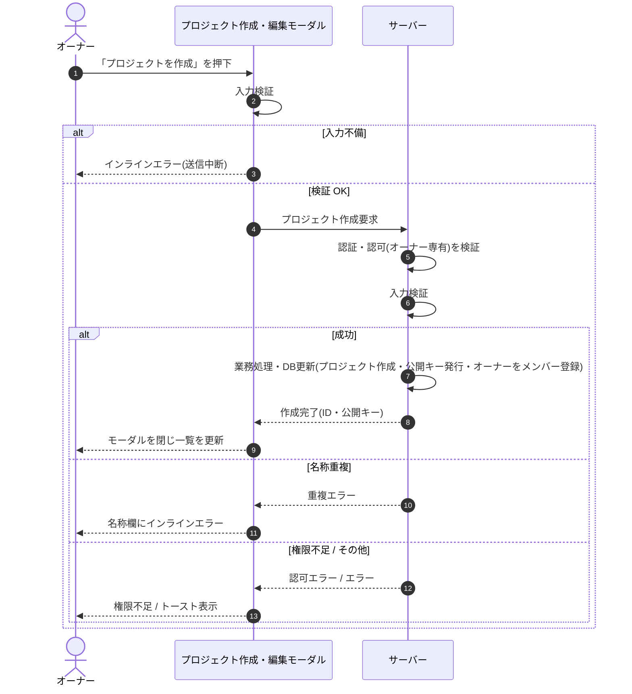

<!-- portal-top -->
[設計ポータル](../../README.md) ／ [基本設計](../index.md) ／ [シーケンス設計](index.md) ／ **SEQ-011: 「プロジェクトを作成」を押下**
<!-- /portal-top -->

# SEQ-011: 「プロジェクトを作成」を押下

> **このページは、業務ユースケース UC-015（「プロジェクトを作成」を押下）のシーケンス図を定義します。**

*版数 v2.0 ・ 更新 2026-06-23 ・ ステータス ドラフト*

## 項目

| 項目 | 内容 |
|---|---|
| SEQ ID | `SEQ-011` |
| 対応業務ユースケース | [UC-015](../../01_requirements/04_business_usecases/UC-015.md#UC-015) |
| 業務要件 (BR) | [BR-018](../../01_requirements/01_BusinessRequirement/01_account-br.md#BR-018) ・ [BR-019](../../01_requirements/01_BusinessRequirement/01_account-br.md#BR-019) ・ [BR-021](../../01_requirements/01_BusinessRequirement/01_account-br.md#BR-021) ・ [BR-023](../../01_requirements/01_BusinessRequirement/01_account-br.md#BR-023) ・ [BR-024](../../01_requirements/01_BusinessRequirement/01_account-br.md#BR-024) |
| 機能要件 (FR) | [FR-037](../../01_requirements/02_FunctionalRequirement/01_account-fr.md#FR-037) |
| 画面イベント (EVT) | [EVT-038](../01_frontend/02_screen_events/EVT-038.md#EVT-038) |
| 関連画面 | [SCR-005](../01_frontend/01_screens/SCR-005.md#SCR-005) |
| 関連 API | [API-017](../02_backend/03_apis/API-017.md#API-017) |
| 関連テーブル | [TBL-003](../02_backend/04_database/TBL-003.md#TBL-003) ・ [TBL-004](../02_backend/04_database/TBL-004.md#TBL-004) ・ [TBL-005](../02_backend/04_database/TBL-005.md#TBL-005) |
| エラー (ERR) | [ERR-001](../05_errors/ERR-001.md#ERR-001) ・ [ERR-017](../05_errors/ERR-017.md#ERR-017) ・ [ERR-018](../05_errors/ERR-018.md#ERR-018) |
| メッセージ (MSG) | — |

## 概要

オーナーがプロジェクト作成・編集モーダルで入力したプロジェクトを新規作成し、作成者オーナーをメンバーとして自動登録、ウィジェット公開キーを発行する。成功時はモーダルを閉じて一覧を更新し、失敗時は遷移せずエラーを表示する。

## シーケンス図

## 例外フロー

- 入力不備（プロジェクト名・許可ドメインの必須違反）: 送信を中断し該当欄にインラインエラーを表示する。
- 名称重複: サーバーが重複を検知し、名称欄にインラインエラーを表示する。
- 権限不足（オーナー以外）: 認可エラーとなり、権限不足を表示して作成しない。

## 備考

- 本図は基本設計レベルの抽象度(ユーザー / 画面 / サーバー、システム起点は外部システム・スケジューラ・バッチを加える)で記述する。DB 操作はサーバー自己メッセージで表し、テーブル別 CRUD は本図に書かず 関連テーブル 欄で示す。
- 図の出典は業務ユースケース [UC-015](../../01_requirements/04_business_usecases/UC-015.md#UC-015)。画面イベントとの対応は UC-015 を参照。

---

<!-- portal-bottom -->
[← シーケンス設計](index.md) ・ [基本設計](../index.md) ・ [↑ 設計ポータル](../../README.md)
<!-- /portal-bottom -->
