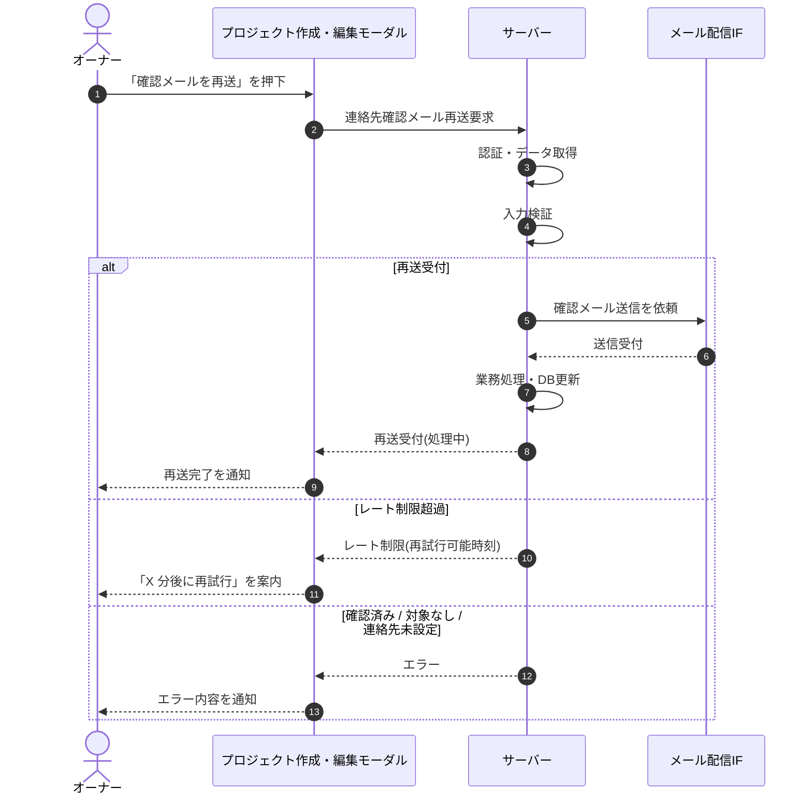

<!-- portal-top -->
[設計ポータル](../../README.md) ／ [基本設計](../index.md) ／ [シーケンス設計](index.md) ／ **SEQ-013: 「確認メールを再送」を押下**
<!-- /portal-top -->

# SEQ-013: 「確認メールを再送」を押下

> **このページは、業務ユースケース UC-016（「確認メールを再送」を押下）のシーケンス図を定義します。**

*版数 v2.0 ・ 更新 2026-06-23 ・ ステータス ドラフト*

## 項目

| 項目 | 内容 |
|---|---|
| SEQ ID | `SEQ-013` |
| 対応業務ユースケース | [UC-016](../../01_requirements/04_business_usecases/UC-016.md#UC-016) |
| 業務要件 (BR) | 要確認 |
| 機能要件 (FR) | [FR-037](../../01_requirements/02_FunctionalRequirement/01_account-fr.md#FR-037) |
| 画面イベント (EVT) | [EVT-040](../01_frontend/02_screen_events/EVT-040.md#EVT-040) |
| 関連画面 | [SCR-005](../01_frontend/01_screens/SCR-005.md#SCR-005) |
| 関連 API | [API-011](../02_backend/03_apis/API-011.md#API-011) |
| 関連テーブル | [TBL-004](../02_backend/04_database/TBL-004.md#TBL-004) |
| エラー (ERR) | [ERR-011](../05_errors/ERR-011.md#ERR-011) ・ [ERR-012](../05_errors/ERR-012.md#ERR-012) ・ [ERR-013](../05_errors/ERR-013.md#ERR-013) ・ [ERR-014](../05_errors/ERR-014.md#ERR-014) |
| メッセージ (MSG) | 要確認 |

## 概要

オーナーがプロジェクト作成・編集モーダルで「確認メールを再送」を押下すると、連絡先メールアドレスへ確認メールを再送する。成功時は再送完了を通知し、レート制限時は再試行可能な時刻を案内する。

## シーケンス図

## 例外フロー

- レート制限超過時は、次回再送が可能になるまでの待ち時間を案内し再送を受け付けない。
- 連絡先メールが既に確認済みの場合は再送せずエラーを通知する。
- 対象プロジェクトが存在しない場合はエラーを通知する。
- 連絡先メールが未設定の場合はエラーを通知する。

## 備考

- 本図は基本設計レベルの抽象度(ユーザー / 画面 / サーバー、システム起点は外部システム・スケジューラ・バッチを加える)で記述する。DB 操作はサーバー自己メッセージで表し、テーブル別 CRUD は本図に書かず 関連テーブル 欄で示す。
- 図の出典は業務ユースケース [UC-016](../../01_requirements/04_business_usecases/UC-016.md#UC-016)。画面イベントとの対応は UC-016 を参照。

---

<!-- portal-bottom -->
[← シーケンス設計](index.md) ・ [基本設計](../index.md) ・ [↑ 設計ポータル](../../README.md)
<!-- /portal-bottom -->
