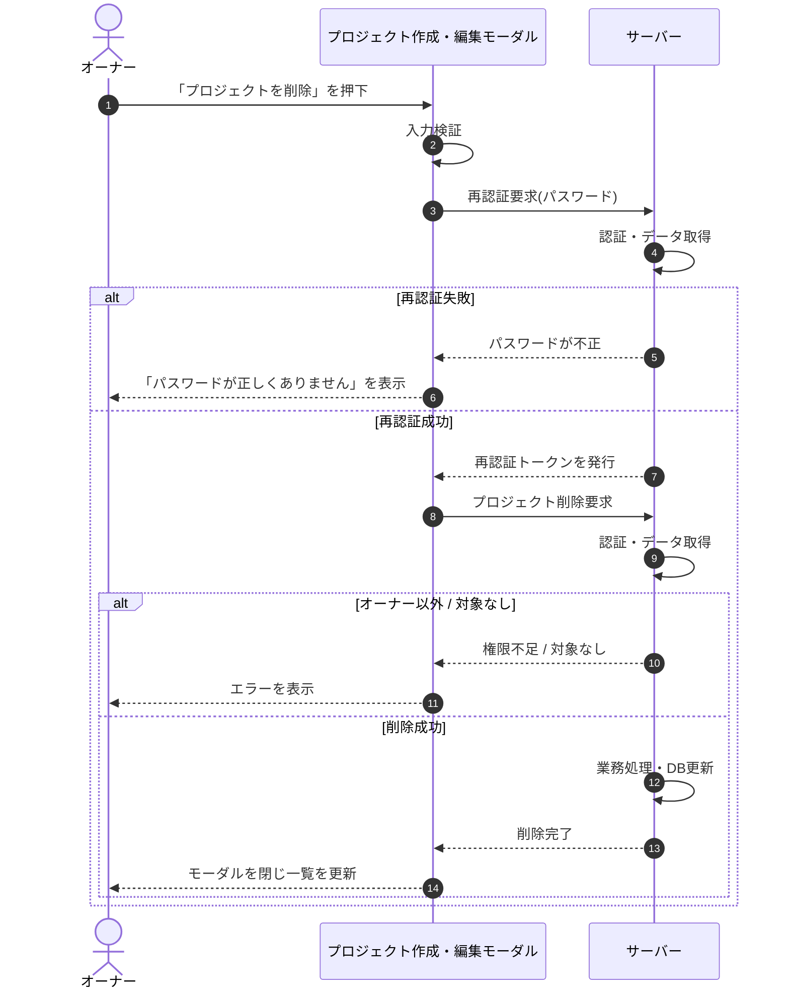

# SEQ-014: 「プロジェクトを削除」を押下

> **このページは、業務ユースケース UC-017（「プロジェクトを削除」を押下）のシーケンス図を定義します。**

*版数 v2.0 ・ 更新 2026-06-23 ・ ステータス ドラフト*

## 項目

| 項目 | 内容 |
|---|---|
| SEQ ID | `SEQ-014` |
| 対応業務ユースケース | [UC-017](../../01_requirements/04_business_usecases/UC-017.md#UC-017) |
| 業務要件 (BR) | [BR-017](../../01_requirements/01_business_requirement/01_account-br.md#BR-017) ・ [BR-018](../../01_requirements/01_business_requirement/01_account-br.md#BR-018) ・ [BR-020](../../01_requirements/01_business_requirement/01_account-br.md#BR-020) ・ [BR-026](../../01_requirements/01_business_requirement/01_account-br.md#BR-026) |
| 機能要件 (FR) | [FR-037](../../01_requirements/02_functional_requirement/01_account-fr.md#FR-037) |
| 画面イベント (EVT) | [EVT-042](../01_frontend/02_screen_events/EVT-042.md#EVT-042) |
| 関連画面 | [SCR-005](../01_frontend/01_screens/SCR-005.md#SCR-005) |
| 関連 API | [API-005](../02_backend/03_apis/API-005.md#API-005) ・ [API-018](../02_backend/03_apis/API-018.md#API-018) |
| 関連テーブル | [TBL-001](../02_backend/04_database/TBL-001.md#TBL-001) ・ [TBL-003](../02_backend/04_database/TBL-003.md#TBL-003) ・ [TBL-004](../02_backend/04_database/TBL-004.md#TBL-004) |
| エラー (ERR) | [ERR-007](../05_errors/ERR-007.md#ERR-007) ・ [ERR-017](../05_errors/ERR-017.md#ERR-017) ・ [ERR-019](../05_errors/ERR-019.md#ERR-019) |
| メッセージ (MSG) | — |

## 概要

オーナーが削除確認名称の一致とパスワード再認証を経てプロジェクトを論理削除する。メンバー割当を解除し、他に有効割当を持たないメンバーのアカウントを無効化したうえで、モーダルを閉じて一覧を更新する。

## シーケンス図

## 例外フロー

- 再認証でパスワードが一致しない場合、削除を中断しエラーメッセージを表示する。
- 操作者がオーナーでない場合、認可エラーとして削除を拒否する。
- 対象プロジェクトが存在しない場合、対象なしとしてエラーを表示する。

## 詳細設計への移管候補

| 内容 | 移管先候補 | 理由 |
|---|---|---|
| 関連データ(許可ドメイン / FAQ / 未解決質問 / 質問ログ)への論理削除伝播 | 詳細設計 | 基本設計ではサーバー内の業務処理に集約し、対象テーブル別の伝播手順は詳細化しないため |
| 他プロジェクトに有効割当を持たないメンバーのアカウント無効化判定 | 詳細設計 | 割当件数の評価ロジックと無効化条件は詳細設計で定義するため |
| 90 日後の物理削除バッチによる匿名化・連鎖削除 | 詳細設計 | 本同期フローの対象外であり、バッチ側の設計で扱うため |

## 備考

- 本図は基本設計レベルの抽象度(ユーザー / 画面 / サーバー、システム起点は外部システム・スケジューラ・バッチを加える)で記述する。DB 操作はサーバー自己メッセージで表し、テーブル別 CRUD は本図に書かず 関連テーブル 欄で示す。
- 図の出典は業務ユースケース [UC-017](../../01_requirements/04_business_usecases/UC-017.md#UC-017)。画面イベントとの対応は UC-017 を参照。
